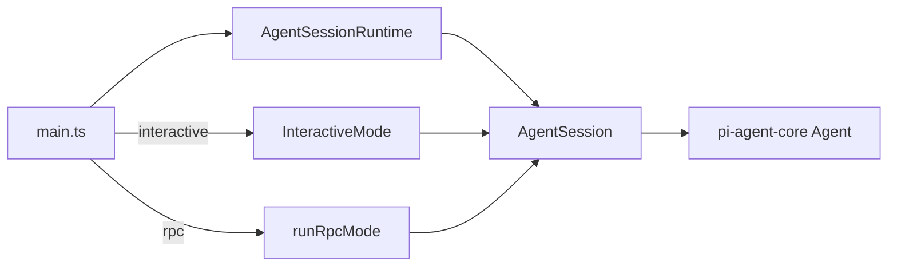
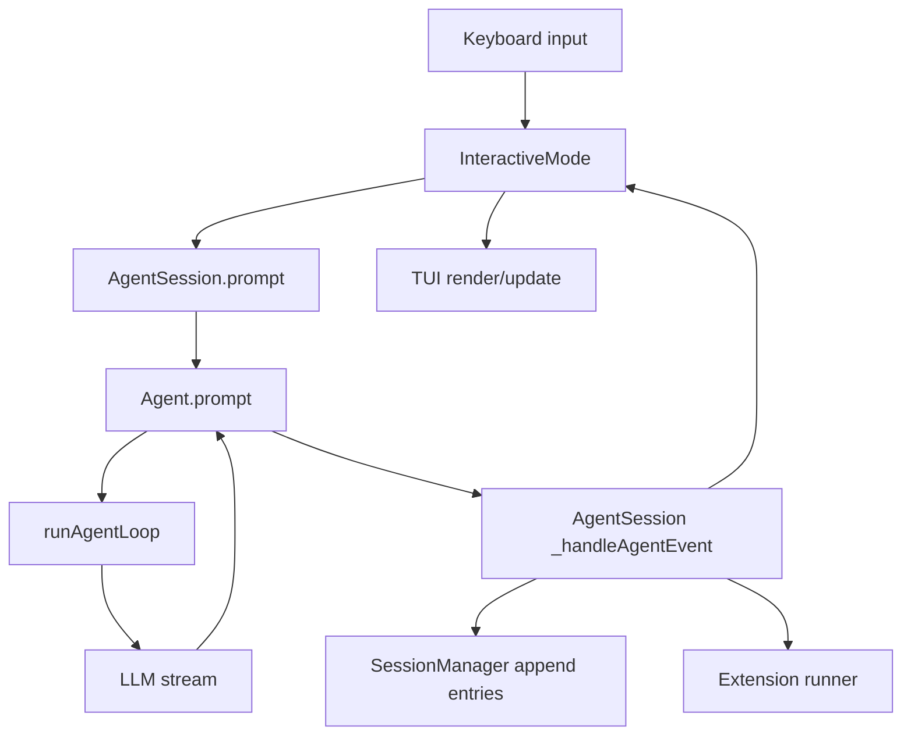
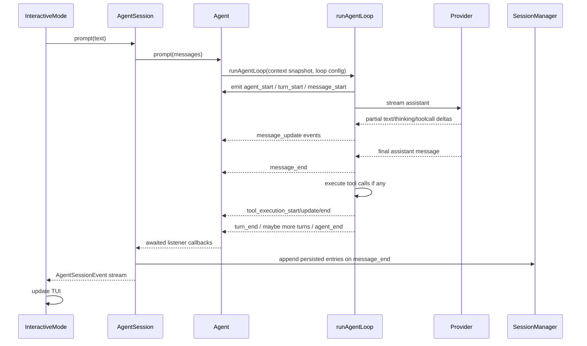
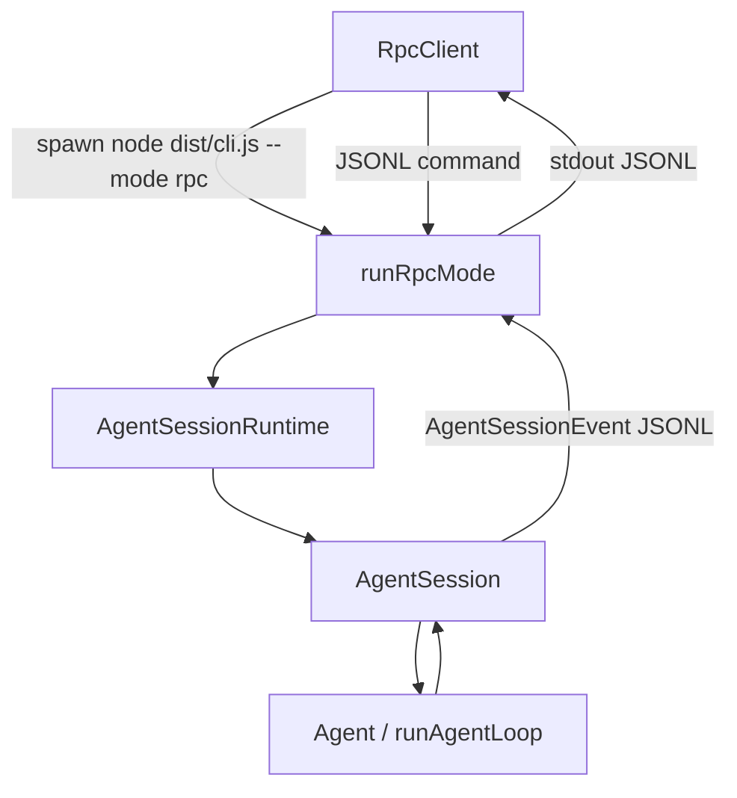
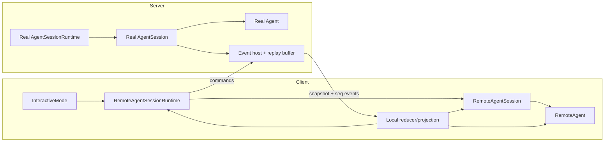
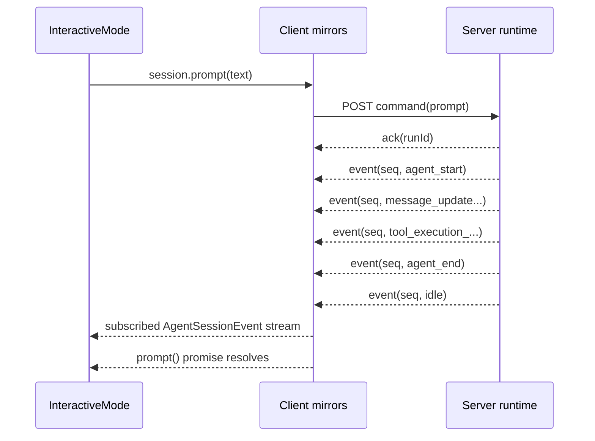
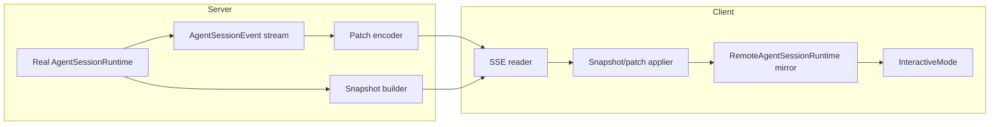
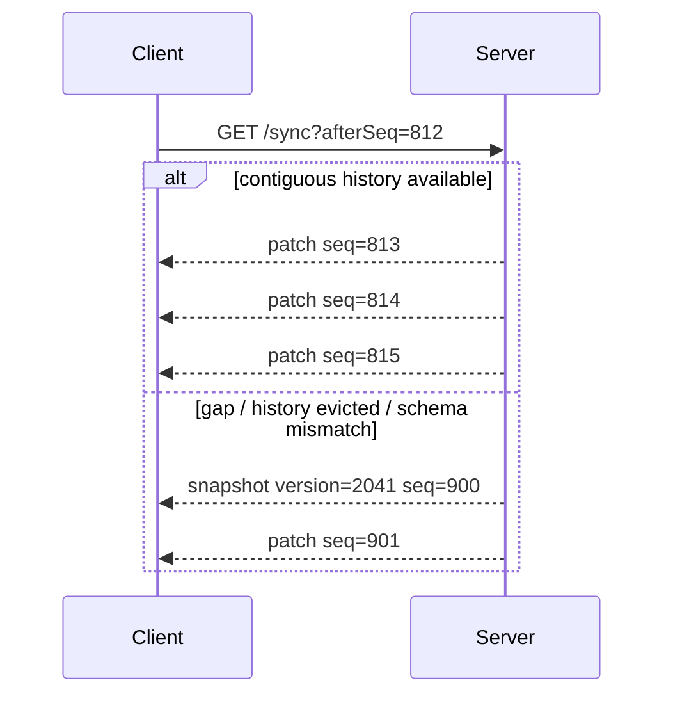
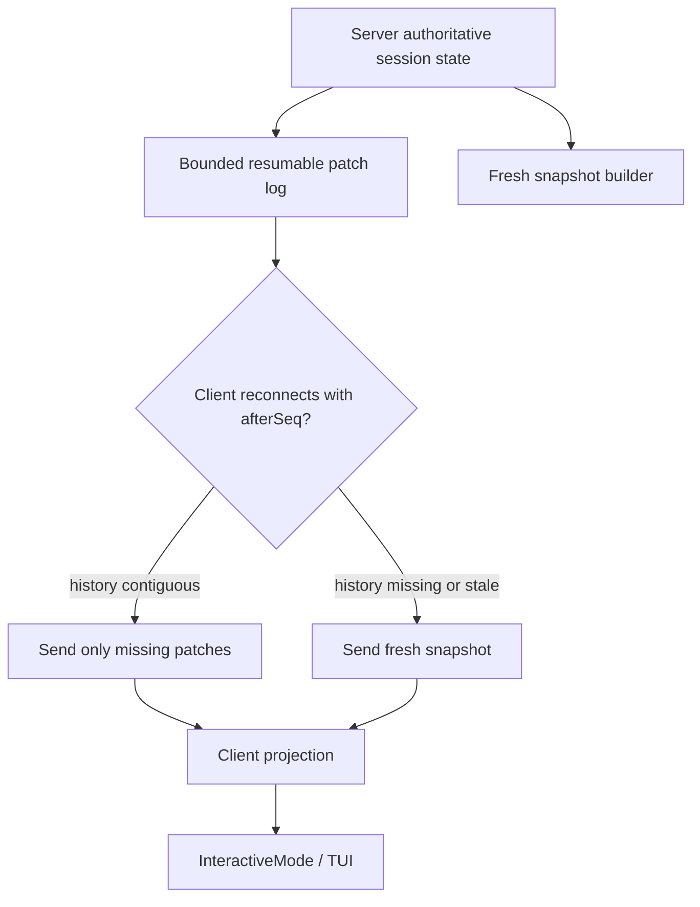

# QA

## How agent loop, runtime, and session fit together in interactive mode, and how that relates to RPC mode

### 1. Short answer

- Interactive mode does not have its own agent loop. Real loop lives in `@mariozechner/pi-agent-core` `Agent` and `runAgentLoop(...)`. TUI layer only submits prompts and renders session events. Confirmed in `/home/coder/.cache/checkouts/github.com/badlogic/pi-mono/packages/agent/src/agent-loop.ts:95-116`, `/home/coder/.cache/checkouts/github.com/badlogic/pi-mono/packages/agent/src/agent.ts:374-399`, `/home/coder/.cache/checkouts/github.com/badlogic/pi-mono/packages/coding-agent/src/modes/interactive/interactive-mode.ts:2610-2613`.
- `AgentSession` is glue layer between low-level `Agent` and product behavior. It subscribes to all agent events, serializes processing, forwards extension/UI events, persists messages to session storage, and adds higher-level features like queue tracking, retry, compaction, bash, model/thinking management. Confirmed in `/home/coder/.cache/checkouts/github.com/badlogic/pi-mono/packages/coding-agent/src/core/agent-session.ts:327-335`, `/home/coder/.cache/checkouts/github.com/badlogic/pi-mono/packages/coding-agent/src/core/agent-session.ts:452-585`.
- `AgentSessionRuntime` owns current `AgentSession` plus cwd-bound services and is responsible for replacing them on `new`, `resume`, `fork`, and import flows. Interactive mode and RPC mode both sit on top of this same runtime abstraction. Confirmed in `/home/coder/.cache/checkouts/github.com/badlogic/pi-mono/packages/coding-agent/src/core/agent-session-runtime.ts:22-35`, `/home/coder/.cache/checkouts/github.com/badlogic/pi-mono/packages/coding-agent/src/core/agent-session-runtime.ts:67-77`, `/home/coder/.cache/checkouts/github.com/badlogic/pi-mono/packages/coding-agent/src/core/agent-session-runtime.ts:175-231`, `/home/coder/.cache/checkouts/github.com/badlogic/pi-mono/packages/coding-agent/src/core/agent-session-runtime.ts:382-400`.
- RPC mode is not separate execution engine. It is same `AgentSessionRuntime` and `AgentSession`, exposed over JSONL stdin/stdout. Confirmed in `/home/coder/.cache/checkouts/github.com/badlogic/pi-mono/packages/coding-agent/src/main.ts:673-711`, `/home/coder/.cache/checkouts/github.com/badlogic/pi-mono/packages/coding-agent/src/modes/rpc/rpc-mode.ts:310-349`, `/home/coder/.cache/checkouts/github.com/badlogic/pi-mono/packages/coding-agent/src/modes/rpc/rpc-mode.ts:379-446`.

### 2. How it works

#### Startup and mode selection

- CLI resolves app mode first. `--mode rpc` forces RPC; otherwise TTY decides between interactive and print. Confirmed in `/home/coder/.cache/checkouts/github.com/badlogic/pi-mono/packages/coding-agent/src/main.ts:96-109`.
- After that, CLI creates one `AgentSessionRuntime` via `createAgentSessionRuntime(...)`. Only host mode changes afterward: `runRpcMode(runtime)` for RPC, `new InteractiveMode(runtime)` for TUI. Confirmed in `/home/coder/.cache/checkouts/github.com/badlogic/pi-mono/packages/coding-agent/src/main.ts:608-711`.

#### Session restore before any run

- Session state is reconstructed from `SessionManager.buildSessionContext()`. That returns resolved `messages`, `thinkingLevel`, and restored model lineage from append-only session entries. Confirmed in `/home/coder/.cache/checkouts/github.com/badlogic/pi-mono/packages/coding-agent/src/core/session-manager.ts:315-421`.
- During agent creation, SDK passes `sessionId`, queue modes, `transformContext`, and stream function into `new Agent(...)`. If session already exists, it restores `agent.state.messages = existingSession.messages`; otherwise it persists initial model/thinking entries. Confirmed in `/home/coder/.cache/checkouts/github.com/badlogic/pi-mono/packages/coding-agent/src/core/sdk.ts:214-230`, `/home/coder/.cache/checkouts/github.com/badlogic/pi-mono/packages/coding-agent/src/core/sdk.ts:320-390`.

#### Interactive mode: who owns what

- `InteractiveMode` owns TUI objects and always reaches current session through `runtimeHost.session`. It also registers two runtime callbacks:
  - `setBeforeSessionInvalidate(...)` for synchronous UI teardown before old session dies.
  - `setRebindSession(...)` so runtime can force UI to bind new session after session replacement.
    Confirmed in `/home/coder/.cache/checkouts/github.com/badlogic/pi-mono/packages/coding-agent/src/modes/interactive/interactive-mode.ts:323-378`.
- Rebinding means: unsubscribe old listener, re-apply runtime settings, bind extensions against new session, subscribe to session events again, then refresh model/title state. Confirmed in `/home/coder/.cache/checkouts/github.com/badlogic/pi-mono/packages/coding-agent/src/modes/interactive/interactive-mode.ts:1554-1563`.
- Interactive mode subscribes to `AgentSessionEvent`, not raw agent-core events. Confirmed in `/home/coder/.cache/checkouts/github.com/badlogic/pi-mono/packages/coding-agent/src/modes/interactive/interactive-mode.ts:2610-2613`.

#### Prompt path in interactive mode

- `InteractiveMode` submits through `session.prompt(...)`, including queued `steer` behavior when streaming. Confirmed in `/home/coder/.cache/checkouts/github.com/badlogic/pi-mono/packages/coding-agent/src/modes/interactive/interactive-mode.ts:2581-2593`.
- `AgentSession.prompt(...)` does product-layer preflight:
  - execute slash extension commands immediately,
  - emit extension input interception,
  - expand skill and prompt-template syntax,
  - if already streaming, queue as `steer` or `followUp`,
  - validate model/auth,
  - build user plus extension/custom messages,
  - call `this.agent.prompt(messages)`.
    Confirmed in `/home/coder/.cache/checkouts/github.com/badlogic/pi-mono/packages/coding-agent/src/core/agent-session.ts:965-1108`.

#### Actual agent loop

- `Agent.prompt(...)` snapshots current state, builds loop config, and calls `runAgentLoop(...)`. `Agent.continue()` does same with `runAgentLoopContinue(...)`. Confirmed in `/home/coder/.cache/checkouts/github.com/badlogic/pi-mono/packages/agent/src/agent.ts:312-399`.
- Loop shape:
  - emit `agent_start`, `turn_start`, prompt `message_start/message_end`
  - inner loop streams assistant response
  - execute tool calls
  - emit `turn_end`
  - inject steering messages before next assistant turn
  - when model would stop, outer loop checks follow-up queue and can continue
  - finally emit `agent_end`
    Confirmed in `/home/coder/.cache/checkouts/github.com/badlogic/pi-mono/packages/agent/src/agent-loop.ts:95-245`.
- Assistant streaming is incremental. Partial assistant message is inserted into context on stream `start`, updated on deltas, then replaced by final message on `done/error`. Confirmed in `/home/coder/.cache/checkouts/github.com/badlogic/pi-mono/packages/agent/src/agent-loop.ts:248-345`.

#### Why `AgentSession` matters instead of wiring TUI directly to `Agent`

- `Agent` only owns run state and listener dispatch. It updates in-memory `messages`, `streamingMessage`, `pendingToolCalls`, and `errorMessage`, then awaits listeners. Confirmed in `/home/coder/.cache/checkouts/github.com/badlogic/pi-mono/packages/agent/src/agent.ts:438-542`.
- `AgentSession` adds serialized event processing through `_agentEventQueue`, so persistence/extensions/retry logic run in event order even though underlying listener callback starts synchronously. Confirmed in `/home/coder/.cache/checkouts/github.com/badlogic/pi-mono/packages/coding-agent/src/core/agent-session.ts:452-467`.
- On each `message_end`, `AgentSession` persists user/assistant/toolResult/custom messages into `SessionManager`. On `agent_end`, it may trigger retry or compaction. Confirmed in `/home/coder/.cache/checkouts/github.com/badlogic/pi-mono/packages/coding-agent/src/core/agent-session.ts:528-585`.
- `AgentSession` also translates raw `AgentEvent` into extension events and emits extra session-level events like `queue_update`, `thinking_level_changed`, `compaction_*`, `auto_retry_*`. Confirmed in `/home/coder/.cache/checkouts/github.com/badlogic/pi-mono/packages/coding-agent/src/core/agent-session.ts:119-139`, `/home/coder/.cache/checkouts/github.com/badlogic/pi-mono/packages/coding-agent/src/core/agent-session.ts:633-705`.

#### Persistence model

- `SessionManager` stores session as append-only JSONL tree. Every entry gets `id`, `parentId`, and timestamp. Leaf pointer marks current branch head. Confirmed in `/home/coder/.cache/checkouts/github.com/badlogic/pi-mono/packages/coding-agent/src/core/session-manager.ts:44-167`, `/home/coder/.cache/checkouts/github.com/badlogic/pi-mono/packages/coding-agent/src/core/session-manager.ts:658-668`.
- Appending a message/model/thinking/compaction/custom entry advances leaf and persists entry. Confirmed in `/home/coder/.cache/checkouts/github.com/badlogic/pi-mono/packages/coding-agent/src/core/session-manager.ts:821-963`.
- Restoring context is not raw file replay. `buildSessionContext(...)` walks root-to-leaf path, reconstructs effective model/thinking, materializes compaction summaries, branch summaries, and custom messages into `AgentMessage[]`. Confirmed in `/home/coder/.cache/checkouts/github.com/badlogic/pi-mono/packages/coding-agent/src/core/session-manager.ts:315-421`.

#### Session replacement at runtime

- `AgentSessionRuntime` is session owner used by hosts. `switchSession`, `newSession`, `fork`, and import all:
  - emit extension pre-switch hook,
  - tear down current session,
  - create new runtime via stored factory,
  - apply new `session + services`,
  - call rebind callback so host reconnects.
    Confirmed in `/home/coder/.cache/checkouts/github.com/badlogic/pi-mono/packages/coding-agent/src/core/agent-session-runtime.ts:149-173`, `/home/coder/.cache/checkouts/github.com/badlogic/pi-mono/packages/coding-agent/src/core/agent-session-runtime.ts:175-319`.

### 3. Key code paths

#### Interactive path

- Mode select and runtime creation: `/home/coder/.cache/checkouts/github.com/badlogic/pi-mono/packages/coding-agent/src/main.ts:96-109`, `/home/coder/.cache/checkouts/github.com/badlogic/pi-mono/packages/coding-agent/src/main.ts:608-711`
- Agent construction and transcript restore: `/home/coder/.cache/checkouts/github.com/badlogic/pi-mono/packages/coding-agent/src/core/sdk.ts:214-230`, `/home/coder/.cache/checkouts/github.com/badlogic/pi-mono/packages/coding-agent/src/core/sdk.ts:320-390`
- TUI host bound to swappable runtime: `/home/coder/.cache/checkouts/github.com/badlogic/pi-mono/packages/coding-agent/src/modes/interactive/interactive-mode.ts:323-378`
- Interactive rebind after session switch/fork/new: `/home/coder/.cache/checkouts/github.com/badlogic/pi-mono/packages/coding-agent/src/modes/interactive/interactive-mode.ts:1554-1563`
- Interactive session event subscription: `/home/coder/.cache/checkouts/github.com/badlogic/pi-mono/packages/coding-agent/src/modes/interactive/interactive-mode.ts:2610-2613`
- Prompt preflight and submit: `/home/coder/.cache/checkouts/github.com/badlogic/pi-mono/packages/coding-agent/src/core/agent-session.ts:965-1108`
- Core loop entry: `/home/coder/.cache/checkouts/github.com/badlogic/pi-mono/packages/agent/src/agent.ts:374-399`
- Core loop implementation: `/home/coder/.cache/checkouts/github.com/badlogic/pi-mono/packages/agent/src/agent-loop.ts:155-345`
- Session event queue, persistence, retry/compaction gate: `/home/coder/.cache/checkouts/github.com/badlogic/pi-mono/packages/coding-agent/src/core/agent-session.ts:452-585`
- Append-only persistence and branch context rebuild: `/home/coder/.cache/checkouts/github.com/badlogic/pi-mono/packages/coding-agent/src/core/session-manager.ts:315-421`, `/home/coder/.cache/checkouts/github.com/badlogic/pi-mono/packages/coding-agent/src/core/session-manager.ts:801-963`

#### RPC path

- Same runtime creation, different host path: `/home/coder/.cache/checkouts/github.com/badlogic/pi-mono/packages/coding-agent/src/main.ts:673-675`
- RPC server binds current session, subscribes to session events, and JSONL-serializes them to stdout: `/home/coder/.cache/checkouts/github.com/badlogic/pi-mono/packages/coding-agent/src/modes/rpc/rpc-mode.ts:306-349`
- `prompt` command calls same `session.prompt(...)`; success response is emitted only after preflight accepts. Streaming events still come separately from session subscription: `/home/coder/.cache/checkouts/github.com/badlogic/pi-mono/packages/coding-agent/src/modes/rpc/rpc-mode.ts:379-400`
- `new_session`, `switch_session`, `fork`, `clone` go through same `runtimeHost` replacement APIs and then rebind RPC session subscription: `/home/coder/.cache/checkouts/github.com/badlogic/pi-mono/packages/coding-agent/src/modes/rpc/rpc-mode.ts:418-446`, `/home/coder/.cache/checkouts/github.com/badlogic/pi-mono/packages/coding-agent/src/modes/rpc/rpc-mode.ts:563-588`
- RPC protocol surface: `/home/coder/.cache/checkouts/github.com/badlogic/pi-mono/packages/coding-agent/src/modes/rpc/rpc-types.ts:19-69`, `/home/coder/.cache/checkouts/github.com/badlogic/pi-mono/packages/coding-agent/src/modes/rpc/rpc-types.ts:91-206`
- RPC client spawns `node dist/cli.js --mode rpc`, writes JSONL commands, matches `response` by request id, and treats all other stdout JSON as streamed events: `/home/coder/.cache/checkouts/github.com/badlogic/pi-mono/packages/coding-agent/src/modes/rpc/rpc-client.ts:65-103`, `/home/coder/.cache/checkouts/github.com/badlogic/pi-mono/packages/coding-agent/src/modes/rpc/rpc-client.ts:453-502`
- RPC client `waitForIdle()` resolves on streamed `agent_end`, same semantic as interactive host observing session events: `/home/coder/.cache/checkouts/github.com/badlogic/pi-mono/packages/coding-agent/src/modes/rpc/rpc-client.ts:397-447`

### 4. Notes / caveats

- Important semantic: `agent_end` means loop stopped emitting more agent events, but `Agent.waitForIdle()` does not resolve until all awaited listeners settle and `finishRun()` clears runtime-owned state. So persistence/UI/extension work is part of run completion. Confirmed in `/home/coder/.cache/checkouts/github.com/badlogic/pi-mono/packages/agent/src/agent.ts:209-218`, `/home/coder/.cache/checkouts/github.com/badlogic/pi-mono/packages/agent/src/agent.ts:438-460`, `/home/coder/.cache/checkouts/github.com/badlogic/pi-mono/packages/agent/src/agent.ts:488-542`.
- Session file flushing is delayed until first assistant message exists. `_persist(...)` keeps entries in memory first, then flushes whole accumulated transcript once assistant appears. So user-only starts are not immediately durable on disk. Confirmed in `/home/coder/.cache/checkouts/github.com/badlogic/pi-mono/packages/coding-agent/src/core/session-manager.ts:801-819`.
- Session replacement invalidates old extension context. Host must rebind. Interactive mode does this through `runtimeHost.setRebindSession(...)`; RPC mode does same through local `rebindSession()`. Confirmed in `/home/coder/.cache/checkouts/github.com/badlogic/pi-mono/packages/coding-agent/src/modes/interactive/interactive-mode.ts:342-347`, `/home/coder/.cache/checkouts/github.com/badlogic/pi-mono/packages/coding-agent/src/modes/interactive/interactive-mode.ts:1554-1563`, `/home/coder/.cache/checkouts/github.com/badlogic/pi-mono/packages/coding-agent/src/modes/rpc/rpc-mode.ts:306-349`.
- No separate “RPC session model” exists. RPC server/client only wrap same `AgentSession` API and same event stream. Confirmed in `/home/coder/.cache/checkouts/github.com/badlogic/pi-mono/packages/coding-agent/src/modes/rpc/rpc-mode.ts:379-446`, `/home/coder/.cache/checkouts/github.com/badlogic/pi-mono/packages/coding-agent/src/modes/rpc/rpc-client.ts:453-502`.

## Server-Driven Interactive Architecture

### 1. Short answer

- Best design is not new `InteractiveMode`. Best design is local surrogate objects: `RemoteAgentSessionRuntime`, `RemoteAgentSession`, `RemoteAgent`, plus small readonly mirrors for `SessionManager` and `ResourceLoader`. TUI stays local. All real agent work stays server-side. Recommendation.
- Do not try to “send an `AgentSessionRuntime` over network”. Instead, make client object graph look like upstream runtime while server remains authority. Recommendation.
- Use snapshot + ordered event stream + command channel. Snapshot hydrates local mirror. Event stream keeps it current. Commands mutate only server runtime. Recommendation.
- Use current RPC mode as starting point, but extend it. Raw RPC JSONL proves server-authoritative runtime is viable, but current RPC extension UI bridge is too weak for full interactive parity because it cannot transport arbitrary TUI component factories, custom header/footer, or raw terminal input hooks. Confirmed in `/home/coder/.cache/checkouts/github.com/badlogic/pi-mono/packages/coding-agent/src/modes/rpc/rpc-mode.ts:126-220`.

### 2. Confirmed constraints from upstream Pi

- `InteractiveMode` is not generic over a tiny interface. It reaches through `runtimeHost.session` into `sessionManager`, `settingsManager`, `resourceLoader`, `agent`, `modelRegistry`, queue state, and many mutating methods. Confirmed in `/home/coder/.cache/checkouts/github.com/badlogic/pi-mono/packages/coding-agent/src/modes/interactive/interactive-mode.ts:323-378`, `/home/coder/.cache/checkouts/github.com/badlogic/pi-mono/packages/coding-agent/src/modes/interactive/interactive-mode.ts:1454-1495`, `/home/coder/.cache/checkouts/github.com/badlogic/pi-mono/packages/coding-agent/src/modes/interactive/interactive-mode.ts:1598-1620`, `/home/coder/.cache/checkouts/github.com/badlogic/pi-mono/packages/coding-agent/src/modes/interactive/interactive-mode.ts:3725-3795`.
- `InteractiveMode` already handles session replacement via `setBeforeSessionInvalidate(...)` and `setRebindSession(...)`. That is exactly hook point remote runtime should preserve. Confirmed in `/home/coder/.cache/checkouts/github.com/badlogic/pi-mono/packages/coding-agent/src/modes/interactive/interactive-mode.ts:342-347`, `/home/coder/.cache/checkouts/github.com/badlogic/pi-mono/packages/coding-agent/src/modes/interactive/interactive-mode.ts:1554-1563`.
- `InteractiveMode` renders from `AgentSessionEvent` subscription, not by pulling state on every frame. Confirmed in `/home/coder/.cache/checkouts/github.com/badlogic/pi-mono/packages/coding-agent/src/modes/interactive/interactive-mode.ts:2610-2613`.
- RPC mode already proves same `AgentSessionRuntime` can live headless on server while client only sends commands and consumes events. Confirmed in `/home/coder/.cache/checkouts/github.com/badlogic/pi-mono/packages/coding-agent/src/modes/rpc/rpc-mode.ts:306-349`, `/home/coder/.cache/checkouts/github.com/badlogic/pi-mono/packages/coding-agent/src/modes/rpc/rpc-mode.ts:379-446`.

### 3. Recommended design

#### Server side

- Hold one real upstream `AgentSessionRuntime` per connected or resumable client session. Server owns all tools, bash, auth, providers, compaction, retries, persistence, extensions, and branch/session switching. Recommendation.
- Add transport-facing session host around each runtime:
  - `bootstrap()` returns full snapshot.
  - `subscribe(afterSeq)` returns ordered events.
  - `command(...)` executes prompt, steer, follow-up, abort, model changes, bash, compact, session switch, extension UI responses.
  - `dispose()` tears down server runtime when policy says so.
    Recommendation.
- Maintain monotonic per-session event sequence. Every emitted client-visible event gets `seq`. Recommendation.
- Persist event log separately from `session.jsonl`, or at least keep replay buffer for reconnect. `session.jsonl` alone is not enough because many remote-visible states are ephemeral: `message_update`, `tool_execution_update`, queue state, extension UI requests, loader state. Inference from `/home/coder/.cache/checkouts/github.com/badlogic/pi-mono/packages/agent/src/agent-loop.ts:248-345`, `/home/coder/.cache/checkouts/github.com/badlogic/pi-mono/packages/coding-agent/src/core/agent-session.ts:452-585`.

#### Client side

- Build local mirror objects, not real runtime:
  - `RemoteAgentSessionRuntime`
  - `RemoteAgentSession`
  - `RemoteAgent`
  - `RemoteSessionManager` readonly mirror
  - `RemoteResourceLoader` readonly mirror
    Recommendation.
- These mirrors only do 3 things:
  - expose same surface `InteractiveMode` needs,
  - reduce incoming server events into local state,
  - translate method calls into server commands.
    Recommendation.
- `InteractiveMode` then runs mostly unchanged because it already consumes session events and runtime rebind hooks. Recommendation from upstream shape in `/home/coder/.cache/checkouts/github.com/badlogic/pi-mono/packages/coding-agent/src/modes/interactive/interactive-mode.ts:342-347`, `/home/coder/.cache/checkouts/github.com/badlogic/pi-mono/packages/coding-agent/src/modes/interactive/interactive-mode.ts:1554-1563`, `/home/coder/.cache/checkouts/github.com/badlogic/pi-mono/packages/coding-agent/src/modes/interactive/interactive-mode.ts:2610-2613`.

### 4. Transport shape

#### Best transport split

- `GET /session/:id/bootstrap`
  - returns snapshot with current session projection and `lastSeq`.
    Recommendation.
- `GET /session/:id/events?after=<seq>` via SSE
  - ordered server-to-client events.
  - reconnect with last applied `seq`.
    Recommendation.
- `POST /session/:id/command`
  - typed commands for prompt, abort, set model, compact, bash, session switch, extension UI responses.
    Recommendation.
- Optional `WS /session/:id/pty/:ptyId`
  - only if you later move shell/PTY streaming itself remote. Keep separate from agent event stream. Recommendation.

#### Why SSE first

- Pi event flow is mostly server-to-client append stream. `AgentSessionEvent` subscription maps naturally to SSE. Confirmed in `/home/coder/.cache/checkouts/github.com/badlogic/pi-mono/packages/coding-agent/src/modes/interactive/interactive-mode.ts:2610-2613`, `/home/coder/.cache/checkouts/github.com/badlogic/pi-mono/packages/coding-agent/src/modes/rpc/rpc-mode.ts:345-348`.
- Commands are request/response shaped. RPC mode already separates response ack from later event stream. Confirmed in `/home/coder/.cache/checkouts/github.com/badlogic/pi-mono/packages/coding-agent/src/modes/rpc/rpc-mode.ts:379-400`.
- WS only becomes necessary for bidirectional substreams with high frequency or binary payloads. Recommendation.

### 5. Snapshot contents

- Include durable state:
  - session id/path/name/cwd
  - message list
  - model/thinking level
  - auto-compaction/retry flags
  - tree/session metadata needed by selectors
    Recommendation.
- Include ephemeral runtime state:
  - `isStreaming`
  - current `streamingMessage`
  - pending tool calls
  - pending steering/follow-up queues
  - current compaction/retry/bash status
  - pending extension UI requests
    Recommendation based on upstream mutable agent/session state in `/home/coder/.cache/checkouts/github.com/badlogic/pi-mono/packages/agent/src/agent.ts:57-62`, `/home/coder/.cache/checkouts/github.com/badlogic/pi-mono/packages/agent/src/agent.ts:495-542`, `/home/coder/.cache/checkouts/github.com/badlogic/pi-mono/packages/coding-agent/src/core/agent-session.ts:255-278`, `/home/coder/.cache/checkouts/github.com/badlogic/pi-mono/packages/coding-agent/src/core/agent-session.ts:440-445`.
- Include resource snapshot for client UI:
  - themes
  - prompts
  - skills metadata
  - tool definitions needed for rendering
  - extension UI metadata/client bundle manifest
    Recommendation. `InteractiveMode` reads `session.resourceLoader` immediately for themes. Confirmed in `/home/coder/.cache/checkouts/github.com/badlogic/pi-mono/packages/coding-agent/src/modes/interactive/interactive-mode.ts:375-376`.

### 6. Mirror semantics on client

- `RemoteAgentSession.subscribe(listener)` should behave like upstream session subscription. It pushes reduced events from server stream to `InteractiveMode`. Recommendation.
- `RemoteAgent.waitForIdle()` should resolve only when mirrored run reaches post-`agent_end` idle. Upstream makes that stronger than raw `agent_end`. Confirmed in `/home/coder/.cache/checkouts/github.com/badlogic/pi-mono/packages/agent/src/agent.ts:209-218`, `/home/coder/.cache/checkouts/github.com/badlogic/pi-mono/packages/agent/src/agent.ts:438-460`.
- `RemoteAgentSession.prompt()` should preserve upstream semantics: resolve after server accepted prompt and run became idle, not merely after HTTP 200. Upstream prompt waits through agent run and retry flow. Confirmed in `/home/coder/.cache/checkouts/github.com/badlogic/pi-mono/packages/coding-agent/src/core/agent-session.ts:1106-1108`.
- `RemoteAgentSessionRuntime.newSession/fork/switchSession()` should replace local mirror snapshot, then trigger `setRebindSession(...)`. That matches current host contract. Confirmed in `/home/coder/.cache/checkouts/github.com/badlogic/pi-mono/packages/coding-agent/src/core/agent-session-runtime.ts:166-173`, `/home/coder/.cache/checkouts/github.com/badlogic/pi-mono/packages/coding-agent/src/core/agent-session-runtime.ts:175-231`.

### 7. Extensions

#### What current RPC mode proves

- Server-side extensions can already ask client for serialized UI interactions: select, confirm, input, notify, setStatus, setWidget as string lines, setTitle. Confirmed in `/home/coder/.cache/checkouts/github.com/badlogic/pi-mono/packages/coding-agent/src/modes/rpc/rpc-mode.ts:83-123`, `/home/coder/.cache/checkouts/github.com/badlogic/pi-mono/packages/coding-agent/src/modes/rpc/rpc-mode.ts:129-219`.

#### What current RPC mode does not cover

- Raw terminal input hooks are unsupported.
- Custom widget/component factories are unsupported.
- Custom header/footer/editor component transport is unsupported.
- Working indicator and hidden thinking label controls are unsupported over RPC bridge.
  Confirmed in `/home/coder/.cache/checkouts/github.com/badlogic/pi-mono/packages/coding-agent/src/modes/rpc/rpc-mode.ts:156-209`.

#### Best extension model

- Split extension capabilities into 2 planes:
  - server runtime plane: tools, auth, model hooks, compaction hooks, slash command logic, session mutation
  - client UI plane: renderers, themes, autocomplete, widget/component factories, editor integration
    Recommendation.
- Same extension package can ship both planes, but do not execute runtime hooks on client. Recommendation.
- For server-only extensions with no client bundle, degrade to serialized UI primitives exactly like RPC mode. Recommendation.
- For rich client UI extensions, send bundle manifest in bootstrap and load matching UI module client-side. Recommendation.

### 8. Settings split

- Not all settings should move server-side.
- Runtime-affecting settings should be authoritative on server:
  - model
  - thinking level
  - steering mode
  - follow-up mode
  - auto-compaction
  - transport if it changes provider behavior
    Recommendation.
- Pure TUI settings should remain client-local:
  - theme
  - image width
  - editor padding
  - hardware cursor
  - clear-on-shrink
  - changelog collapse
    Recommendation.
- Upstream settings selector already mixes both categories, so remote facade can preserve API while routing each setting to correct side. Confirmed in `/home/coder/.cache/checkouts/github.com/badlogic/pi-mono/packages/coding-agent/src/modes/interactive/interactive-mode.ts:3725-3795`.

### 9. Prior art from opencode

- Opencode has explicit single-writer sync/event-sourcing model for multi-device replay. They state goal is one writer, many syncing readers, with total ordering by incrementing sequence id. Confirmed in `/home/coder/.cache/checkouts/github.com/anomalyco/opencode/packages/opencode/src/sync/README.md:29-47`.
- They separate durable sync events from higher-level bus events, and automatically republish sync events as bus events for backwards compatibility. Confirmed in `/home/coder/.cache/checkouts/github.com/anomalyco/opencode/packages/opencode/src/sync/README.md:51-115`.
- They expose event history/replay endpoints, not only live stream. Confirmed in `/home/coder/.cache/checkouts/github.com/anomalyco/opencode/packages/opencode/src/server/routes/instance/sync.ts:30-150`.
- Their client architecture is snapshot/bootstrap plus event reduction into local store. `applyGlobalEvent(...)` and `applyDirectoryEvent(...)` reduce incoming events into local state instead of making UI talk directly to server on every read. Confirmed in `/home/coder/.cache/checkouts/github.com/anomalyco/opencode/packages/app/src/context/global-sync/event-reducer.ts:21-48`, `/home/coder/.cache/checkouts/github.com/anomalyco/opencode/packages/app/src/context/global-sync/event-reducer.ts:93-220`.
- Their SDK layer can either own SSE itself or accept injected event source. That is strong prior art for transport-decoupled UI. Confirmed in `/home/coder/.cache/checkouts/github.com/anomalyco/opencode/packages/opencode/src/cli/cmd/tui/context/sdk.tsx:8-124`, `/home/coder/.cache/checkouts/github.com/anomalyco/opencode/packages/opencode/src/cli/cmd/tui/thread.ts:50-58`.

### 10. Bottom line

- If goal is minimum churn, build remote surrogates for `AgentSessionRuntime` stack. Do not rewrite `InteractiveMode`.
- If goal is long-term clean architecture, add formal client projection protocol: `bootstrap`, `events`, `commands`, `extension_ui`, `resource_manifest`, `rebind`.
- Borrow opencode’s pattern, not its exact shape:
  - one writer
  - seq-ordered event log
  - replayable history
  - local reducer on client
  - optional injected event source
- Main extra work beyond current Pi RPC is extension/UI capability split and a richer snapshot/replay model.

## Current Repo Remote Implementation

### 1. Short answer

- Repo already proves core idea works: it runs stock upstream `InteractiveMode` against local remote-surrogate runtime objects instead of rewriting TUI. Confirmed in `/home/coder/dotai/agent/src/remote/client-interactive.ts:492-535`.
- Repo already has incremental transport for high-volume assistant and tool updates. Confirmed in `/home/coder/dotai/agent/src/remote/schemas-stream.ts:155-237`, `/home/coder/dotai/agent/src/remote/schemas-stream.ts:264-293`, `/home/coder/dotai/agent/src/remote/assistant-message-sync.ts:66-128`, `/home/coder/dotai/agent/src/remote/session/event-stream-ops.ts:170-244`.
- Client already reconstructs full local `AgentSessionEvent` shapes from those patches before feeding local session/runtime mirrors. Confirmed in `/home/coder/dotai/agent/src/remote/client/session/runtime-internals.ts:298-360`, `/home/coder/dotai/agent/src/remote/client/session/runtime-sync-support.ts:220-333`, `/home/coder/dotai/agent/src/remote/client/session/tool-sync-patches.ts:18-96`.
- Main architectural gap today: reconnect path is still snapshot-first rather than resumable patch-first, and some large/full payloads still cross wire. Confirmed in `/home/coder/dotai/agent/src/remote/routes/session-sync.ts:71-121`, `/home/coder/dotai/agent/src/remote/runtime-api/client.ts:614-633`, `/home/coder/dotai/agent/src/remote/schemas-stream.ts:340-365`.

### 2. What current implementation already gets right

#### It already uses runtime surrogates, not a rewritten TUI

- `runRemoteInteractiveMode(...)` builds `RemoteAgentSessionRuntime`, type-checks it against upstream runtime contract, then passes it directly into upstream `InteractiveMode`. Confirmed in `/home/coder/dotai/agent/src/remote/client-interactive.ts:492-535`.
- `RemoteAgentSessionRuntime.create(...)` authenticates, creates or attaches remote session, fetches snapshot, creates local `RemoteAgentSession`, and exposes `session`, `services`, `newSession`, `switchSession`, `fork`, `setRebindSession`, and `setBeforeSessionInvalidate`. Confirmed in `/home/coder/dotai/agent/src/remote/client/runtime.ts:53-104`, `/home/coder/dotai/agent/src/remote/client/runtime.ts:106-249`.

#### It already mirrors upstream state locally

- `RemoteAgentSession.create(...)` hydrates in-memory `SettingsManager`, `ModelRegistry`, `SessionManager`, and remote resource-loader view from snapshot, then starts background sync. Confirmed in `/home/coder/dotai/agent/src/remote/client/session.ts:50-135`.
- Snapshot application restores local mirror state for transcript, pending tool calls, streaming message, queue, retry/compaction flags, UI state, and durable extension state. Confirmed in `/home/coder/dotai/agent/src/remote/client/session/runtime-internals.ts:83-169`.
- Snapshot replay also replays live overlay back into local extension pipeline so client extensions see synthetic `message_start/message_update` and `tool_execution_start/update` on reconnect. Confirmed in `/home/coder/dotai/agent/src/remote/client/session/runtime-sync-support.ts:177-218`.

#### It already has typed incremental patch classes

- Assistant message sync is domain-specific, not raw JSON Patch. Server converts assistant deltas into compact sync events such as `text_delta`, `thinking_delta`, and `toolcall_delta`. Confirmed in `/home/coder/dotai/agent/src/remote/assistant-message-sync.ts:66-128`.
- Tool execution sync is also domain-specific: `tool_execution_output_delta`, `tool_execution_partial_patch`, fallback `tool_execution_update`, and final `tool_execution_end`. Confirmed in `/home/coder/dotai/agent/src/remote/schemas-stream.ts:264-293`, `/home/coder/dotai/agent/src/remote/session/event-stream-ops.ts:186-259`.
- Client reconstructs full local `message_update` and `tool_execution_update` events from those compact payloads. Confirmed in `/home/coder/dotai/agent/src/remote/client/session/runtime-sync-support.ts:335-517`, `/home/coder/dotai/agent/src/remote/client/session/tool-sync-patches.ts:18-96`.

### 3. Current protocol shape

- Server sync endpoint is `GET /v1/sessions/:sessionId/sync`. Confirmed in `/home/coder/dotai/agent/src/remote/README.md:1-18`.
- Server emits `server.connected`, then `snapshot`, then `patch` events on same SSE stream. Confirmed in `/home/coder/dotai/agent/src/remote/schemas-stream.ts:473-567`, `/home/coder/dotai/agent/src/remote/routes/session-sync.ts:77-121`.
- Client connects with `readSessionSync(...)`, parses SSE, validates `SessionSyncEventSchema`, and forwards each event into local reducer logic. Confirmed in `/home/coder/dotai/agent/src/remote/runtime-api/client.ts:614-633`, `/home/coder/dotai/agent/src/remote/runtime-api/sync.ts:6-38`.

### 4. Important limitations in current implementation

#### Reconnect is snapshot-first, not resumable patch-first

- Client `readSessionSync(...)` does plain `GET` on `/sync` with no `after`, cursor, or last-seq parameter. Confirmed in `/home/coder/dotai/agent/src/remote/runtime-api/client.ts:614-633`.
- Server sync handler always loads fresh snapshot and sends it immediately after `server.connected`. Confirmed in `/home/coder/dotai/agent/src/remote/routes/session-sync.ts:71-95`.
- Inference: on unstable/mobile links, reconnect cost is bounded and correct, but not minimal. Large snapshots will be resent even when client only missed a few tail patches.

#### Coalescing exists only in narrow pre-snapshot race window

- Server buffers replaceable patches only while snapshot is still loading and SSE controller is not yet ready. Confirmed in `/home/coder/dotai/agent/src/remote/routes/session-sync.ts:53-64`, `/home/coder/dotai/agent/src/remote/routes/session-sync.ts:149-174`.
- Replace-key metadata exists for assistant message updates, tool execution updates, queue updates, retry/compaction status, and replaceable extension custom events. Confirmed in `/home/coder/dotai/agent/src/remote/session-sync-metadata.ts:37-88`.
- Once stream is live, server enqueues every patch immediately. No ongoing transport-level coalescing or throttling is applied. Confirmed in `/home/coder/dotai/agent/src/remote/routes/session-sync.ts:57-64`.
- Inference: this is good for exact live fidelity, but not ideal for metered/mobile links when many replaceable updates arrive quickly.

#### Some large events are still shipped as full payloads

- `agent.lifecycle` patch still carries full `agent_end.messages`, full `turn_end.message`, full `turn_end.toolResults`, and full `message_start/message_end.message`. Confirmed in `/home/coder/dotai/agent/src/remote/schemas-stream.ts:340-365`, `/home/coder/dotai/agent/src/remote/session/event-stream-ops.ts:261-315`.
- `session.state` patch can also carry full `resources`, `availableModels`, `sessionStats`, and settings blobs. Confirmed in `/home/coder/dotai/agent/src/remote/schemas-stream.ts:394-420`.
- Inference: most network savings already come from assistant/tool incremental sync, but final lifecycle payloads can still be heavy, especially around big tool results or long final assistant messages.

#### Assistant deltas carry offsets, but client currently ignores them

- Server computes `start` offsets for `text_delta` and `thinking_delta`. Confirmed in `/home/coder/dotai/agent/src/remote/assistant-message-sync.ts:62-103`.
- Client assistant patch application reconstructs text/thinking by blindly appending `event.delta`; it does not validate `event.start`. Confirmed in `/home/coder/dotai/agent/src/remote/client/session/runtime-sync-support.ts:455-487`.
- By contrast, tool-output delta apply path does validate `start` before appending. Confirmed in `/home/coder/dotai/agent/src/remote/client/session/tool-sync-patches.ts:38-56`, `/home/coder/dotai/agent/src/remote/client/session/tool-sync-patches.ts:98-101`.
- Inference: assistant delta path is more fragile than tool delta path if duplicate, reordered, or skipped patches are ever introduced by future transport changes.

#### Resource patch application looks incomplete on live clients

- Server has explicit `resources` field inside `session.state` patch payload schema. Confirmed in `/home/coder/dotai/agent/src/remote/schemas-stream.ts:394-420`.
- Reload path publishes a session-state patch that includes `resources`. Confirmed in `/home/coder/dotai/agent/src/remote/session/registry-management.ts:184-194`, `/home/coder/dotai/agent/src/remote/session/session-state-patch.ts:27-63`.
- Generic client patch reducer forwards `patch.resources` into `setRemoteResources(...)`. Confirmed in `/home/coder/dotai/agent/src/remote/client/session-patches.ts:136-145`.
- Current live patch application only uses that callback to update remote modes snapshot, not to rebuild remote skills/prompts/themes/system-prompt resource-loader view. Confirmed in `/home/coder/dotai/agent/src/remote/client/session/runtime-internals.ts:383-387`.
- Snapshot application does rebuild full remote resource-loader. Confirmed in `/home/coder/dotai/agent/src/remote/client/session/setup-base.ts:371-378`, `/home/coder/dotai/agent/src/remote/client/session/runtime-internals.ts:124-125`.
- Confirmed fact plus inference: live clients can miss non-mode resource changes until next full snapshot/reload path rehydrates the loader.

#### Legacy SSE control-offset code is still present but inactive

- SSE parser still defines `control` events with `streamNextOffset`, `streamCursor`, `upToDate`, and `streamClosed`. Confirmed in `/home/coder/dotai/agent/src/remote/sse.ts:9-42`.
- Sync reader ignores everything except `data` events. Confirmed in `/home/coder/dotai/agent/src/remote/runtime-api/sync.ts:31-37`.
- Server sync route only emits `event: data` frames plus comment heartbeats, not `event: control`. Confirmed in `/home/coder/dotai/agent/src/remote/routes/session-sync.ts:20-31`, `/home/coder/dotai/agent/src/remote/routes/session-sync.ts:90-121`.
- Confirmed fact: control-offset machinery is currently dead code.

#### Patch envelope lacks uniform per-patch sequence

- Top-level `patch` event schema contains `type`, `sessionId`, `version`, and `patch`, but no envelope-level `sequence`. Confirmed in `/home/coder/dotai/agent/src/remote/schemas-stream.ts:556-561`.
- `sequence` exists inside some payloads such as `command.accepted` and `session.state`, but not uniformly for every patch class. Confirmed in `/home/coder/dotai/agent/src/remote/schemas-stream.ts:374-392`, `/home/coder/dotai/agent/src/remote/schemas-stream.ts:394-420`.
- Command acceptance increments `record.queue.nextSequence`, so there is a command-sequencing concept on server. Confirmed in `/home/coder/dotai/agent/src/remote/session/command-acceptance.ts:54-62`, `/home/coder/dotai/agent/src/remote/session/command-acceptance.ts:121-130`.
- Inference: transport today can reconstruct latest correct state via snapshot, but cannot cheaply detect a hole in live patch stream without reconnecting.

### 5. What I would change next

#### Keep current architecture shape

- Keep stock `InteractiveMode`.
- Keep local mirror runtime/session objects.
- Keep domain-specific incremental patch types for assistant/tool events.

#### Change transport contract

- Replace snapshot-first reconnect with `GET /sync?afterSeq=<n>`.
- Add uniform envelope fields on every patch:
  - `seq`
  - `replaceKey?`
  - `coalescible: boolean`
  - `snapshotVersion`
- Only send full snapshot on:
  - first attach
  - gap detected
  - protocol/schema version mismatch
  - explicit reload/resync

#### Split patch domains more aggressively

- Keep `assistant.message` and `tool.execution` as they are.
- Split `agent.lifecycle` into lighter control markers where possible:
  - `agent_start`
  - `turn_start`
  - `message_start_ref`
  - `message_end_ref`
  - `turn_end_ref`
  - `agent_end_ref`
- Let refs point to transcript/message ids already present in mirrored state, instead of resending full message payloads.

#### Fix correctness gaps

- Use `start` offsets on assistant deltas client-side, same as tool deltas.
- When incremental apply fails, trigger targeted resync for active assistant/tool stream instead of silently drifting.
- When `session.state.resources` arrives, rebuild remote resource-loader view, not only mode snapshot.
- Remove dead SSE control-offset code or promote it into real resumable-stream control plane.

### 6. Bottom line

- Current repo is already much closer to desired architecture than upstream Pi RPC mode.
- Biggest win already landed: remote surrogate runtime + incremental assistant/tool patches.
- Biggest missing pieces for mobile/unstable links:
  - resumable patch stream
  - uniform per-patch sequence
  - live coalescing beyond snapshot race window
  - full resource patch application on client
  - assistant delta offset validation

## Unreliable Mobile Network Implications

### 1. Short answer

- Current remote design is materially better than `main` because it no longer sends full assistant/tool update payloads for every tiny change. Confirmed in `/home/coder/dotai/agent/src/remote/assistant-message-sync.ts:66-128`, `/home/coder/dotai/agent/src/remote/session/event-stream-ops.ts:170-244`.
- But current branch still implicitly assumes reconnect is cheap and immediate because sync recovery is snapshot-first and live patch stream is not resumable. Confirmed in `/home/coder/dotai/agent/src/remote/runtime-api/client.ts:614-633`, `/home/coder/dotai/agent/src/remote/routes/session-sync.ts:71-121`.
- On mobile, better assumption is: disconnects are normal, network changes are normal, client may be behind, and stale transient progress should be droppable. Recommendation.
- Best design is: server owns authoritative state plus bounded resumable patch history; client only owns currently viewed session projection; if client falls too far behind, server sends fresh snapshot and client discards stale transient backlog. Recommendation.

### 2. What changed relative to `main`

- Current branch clearly moved away from legacy stream-store-first design toward snapshot + patch sync stack. Evidence in current tree:
  - sync endpoint centered in `src/remote/routes/session-sync.ts`
  - client sync reader in `src/remote/runtime-api/sync.ts`
  - client mirror patch applier in `src/remote/client/session/runtime-internals.ts`
  - assistant delta encoder in `src/remote/assistant-message-sync.ts`
  - tool partial patch helpers in `src/remote/tool-output-text.ts`
- The important improvement is that assistant and tool hot paths now use incremental payloads instead of sending full event bodies every time. Confirmed in `/home/coder/dotai/agent/src/remote/schemas-stream.ts:155-237`, `/home/coder/dotai/agent/src/remote/schemas-stream.ts:264-293`.

### 3. Why old durable-stream behavior felt laggy

- Core issue was not only retention on server. It was also catch-up shape.
- If server finished run while client was still replaying huge backlog of transient events, client was spending CPU and memory reconstructing stale motion instead of converging to current truth. Inference from current architecture discussion and from snapshot/live split in `/home/coder/dotai/agent/src/remote/routes/session-sync.ts:189-240`.
- That is especially bad when payloads are full accumulated snapshots, because every replay step re-parses large JSON and triggers repeated local state churn. Confirmed hot full-payload classes still exist for lifecycle in `/home/coder/dotai/agent/src/remote/schemas-stream.ts:340-365`.

### 4. Better assumption set for remote interactive mode

- Client connection is unreliable.
- Client may switch Wi-Fi, LTE, 5G, captive portals, and NAT mappings mid-run.
- Client may be suspended by OS for seconds or minutes.
- Client may reconnect slower than server can produce patches.
- Client should not be required to preserve intentional durable transport state beyond current viewed session and last applied cursor/seq. Recommendation.

From those assumptions, design should prefer:

1. latest converged state over replaying stale progress
2. bounded patch history over infinite replay history
3. resumable patches when cheap, fresh snapshot when not
4. incremental domain patches over full event envelopes
5. render-friendly client projection over exact transport replay fidelity

### 5. What client should hold

- Only current local projection needed to drive `InteractiveMode`:
  - mirrored transcript/state
  - active streaming assistant partial
  - active tool partials
  - queued UI requests
  - last applied patch sequence
- It should not need to keep historical transport backlog. Recommendation.

### 6. What server should hold

- Authoritative session projection.
- Durable session history already committed.
- Bounded live patch history for resumable reconnect.
- Replaceable patch slots for high-volume domains.
- Optional full snapshot cache to avoid rebuilding from disk on every reconnect.

This is narrower and safer than old durable streams because server stores “enough to resume or replace”, not “everything ever emitted”. Recommendation.

### 7. Concrete bug in current branch under unreliable networks

- Client processes sync events strictly sequentially: SSE parser loop does `await input.onSyncEvent(payload)`. Confirmed in `/home/coder/dotai/agent/src/remote/runtime-api/sync.ts:31-37`.
- `handleSyncEvent(...)` then applies snapshot or patch, and patch handling can forward events into local extension pipeline. Confirmed in `/home/coder/dotai/agent/src/remote/client/session/runtime-internals.ts:268-360`, `/home/coder/dotai/agent/src/remote/client/session/setup-base.ts:697-720`.
- Inference: if network resumes and many patches arrive, client applies them one by one in-order and can become visually behind even though server is already idle.
- This is logically correct but UX-bad on mobile because client is replaying transport work instead of converging to latest state quickly.

### 8. Better recovery rule

- If client is only slightly behind and server still has contiguous patch history, replay missing patches.
- If client is far behind, or patch application budget is exceeded, abort replay and apply fresh snapshot.
- If patch class is replaceable and multiple queued updates target same semantic slot, skip older ones and apply newest only.
- If final durable event supersedes prior transient progress, do not replay stale transient chain.

That rule is what makes remote interactive mode feel smooth on unstable links. Recommendation.

### 9. Practical protocol shape for this

- Every patch gets top-level `seq`.
- Every replaceable patch gets stable `replaceKey`.
- Client reconnects with `afterSeq`.
- Server chooses one of two responses:
  - patch resume
  - fresh snapshot
- Server may also proactively compact outgoing stream for one slow client by replacing queued patches sharing same `replaceKey`.

### 10. Why this is easier to test and debug

- Snapshot path and patch path become separate, explicit behaviors.
- Bugs become classifiable:
  - snapshot build bug
  - patch encoding bug
  - patch apply bug
  - resume-gap bug
  - replaceable-coalescing bug
- That is much easier than debugging “replay every historical event and hope client catches up”. Recommendation.

### 11. Recommended next architecture rule

- Do not define success as “client can replay all missed events”.
- Define success as:
  - client converges quickly to current authoritative state
  - while connected, updates feel smooth
  - under disconnect/reconnect, stale transient work is skipped whenever safe

That is better fit for mobile remote interactive mode than old durable-stream semantics.
