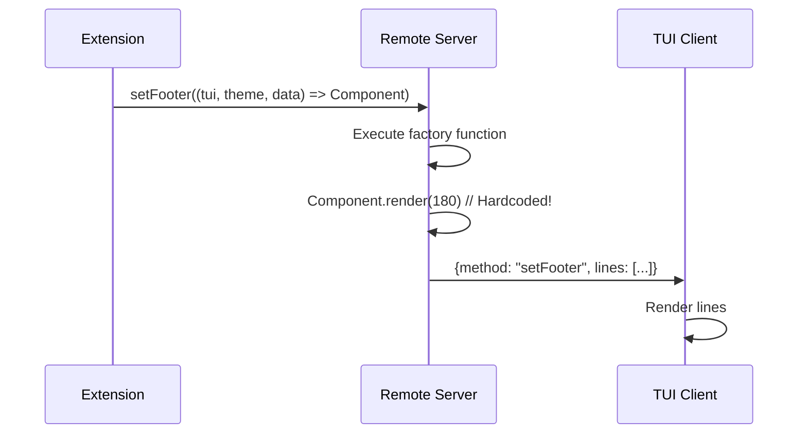
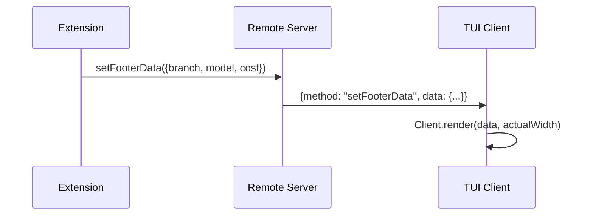
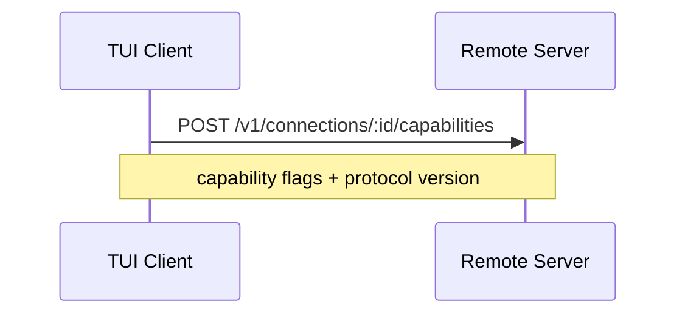

# Capability-Aware Extension Architecture

## Locked Decisions (Q&A)

This section is authoritative and supersedes conflicting exploratory content below.

1. Capabilities are feature flags advertised by client; no upstream type changes. Access via runtime helper backed by `Reflect`/`Symbol` metadata.
2. No backward compatibility or legacy mode.
3. Capabilities are registered with dedicated connection endpoint.
4. No resize channel. Client renders from data locally.
5. In remote mode, function factories (`setFooter(fn)`, `setHeader(fn)`, etc.) are removed/hard-fail. Server sends data/state only.
6. Unsupported interactive operations hard-fail with explicit error.
7. Client UI state is local-only per connection (`toolsExpanded`, theme, draft/editor text, widget collapse).
8. Host split is removed. Dual runtime model is used.
9. Commands are client-executed UI flows that call server for data/mutations.
10. Shortcuts execute on client only.
11. Tools may register on both sides, but execution is server-only. Client execute path is no-op; client can render.
12. Multi-client routing: broadcast updates; interactive requests resolve first-response-wins; resolved state is echoed to all clients.
13. KV model: session state via entries + global/per-user namespaced KV on server. Conflict policy is last-write-wins.
14. Initial KV has no TTL and no limits.
15. No trusted-client mode.
16. Custom protocol payloads send data/state only; no server-sent custom view contracts in v1.

---

## Executive Summary

This document proposes replacing the binary `server-bound` vs `ui-only` host split with a unified, capability-aware model aligned with upstream `pi-mono`. The upstream architecture does **not** use a host split. Instead, extensions check `ctx.hasUI` at runtime to adapt behavior.

The 180-column hardcoded terminal width is a symptom of a deeper architectural issue: attempting to serialize non-serializable functions over the network. This document proposes a declarative protocol where the server sends data and the client renders.

---

## 1. Current Architecture Problems

### 1.1 Host Classification Mismatch

Current manifest uses binary `host: "server-bound" | "ui-only"`:

```typescript
// src/extensions/definitions.ts:15-20
export interface GroupedExtensionDefinition {
  id: string;
  host: BundledExtensionHost; // "server-bound" | "ui-only"
  factory: ExtensionFactory;
}
```

**Problem:** This conflicts with upstream `pi-mono` which uses **runtime detection** via `ctx.hasUI`. Extensions like `files`, `review`, `coreui` are marked `server-bound` but rely on UI primitives that fail in remote server context.

### 1.2 Upstream Pattern (pi-mono)

Upstream uses a `noOpUIContext` stub and runtime `hasUI()` check:

```typescript
// pi-mono/packages/coding-agent/src/core/extensions/runner.ts:93-118
const noOpUIContext: ExtensionUIContext = {
  select: async () => undefined,
  confirm: async () => false,
  input: async () => undefined,
  notify: () => {},
  setWidget: () => {},
  setFooter: () => {},
  setHeader: () => {},
  custom: async () => undefined as never,
  // ... all methods stubbed
};

// runner.ts:198-200
hasUI(): boolean {
  return this.uiContext !== noOpUIContext;
}

// createContext() passes hasUI to extensions
return {
  ui: this.uiContext,
  hasUI: this.hasUI(),  // Extensions gate on this
  // ...
};
```

Extensions adapt at runtime:

```typescript
// src/extensions/handoff/launch.ts:127-131
async function handleHandoffCommand(...) {
  if (!ctx.hasUI) {
    ctx.ui.notify("handoff requires interactive mode", "error");
    return;
  }
  // ... interactive logic
}

// src/extensions/openusage/controller.ts:56-62
private onAlert(data: unknown): void {
  if (this.currentCtx?.hasUI !== true) {
    return;  // Gracefully skip - no error
  }
  const alert = parseAlertEvent(data);
  this.currentCtx.ui.notify(formatAlertMessage(alert), "warning");
}
```

### 1.3 The 180-Column Problem: Root Cause

The 180-column hardcode is a **symptom** of attempting to serialize non-serializable functions over the network.

```typescript
// src/remote/session/ui-context.ts:35
const renderWidth = 180; // HARDCODED

// src/remote/session/ui-context.ts:49-56
state.renderHeader = (): void => {
  input.publishUiEvent(input.record, {
    id: randomUUID(),
    method: "setHeader",
    // Component.render() happens on SERVER with WRONG width
    lines: state.headerComponent.render(renderWidth),
  });
};
```

**Why this design is wrong:**

- API `setFooter((tui, theme, data) => Component)` forces server-side rendering.
- Factory executes on server and returns non-serializable runtime object graph.
- `Component.render(width)` produces pre-rendered lines, which hard-codes server assumptions.
- Client should render from data; server should not pre-render.

### 1.4 UI Method Analysis

Complete audit of `ctx.ui.*` methods and their network serializability:

**Tier 1: Safely Serializable**

| Method                   | Signature                                                    | Network Pattern  |
| ------------------------ | ------------------------------------------------------------ | ---------------- |
| `select`                 | `(title, options, opts) => Promise<string \| undefined>`     | Request/Response |
| `confirm`                | `(title, message, opts) => Promise<boolean>`                 | Request/Response |
| `input`                  | `(title, placeholder, opts) => Promise<string \| undefined>` | Request/Response |
| `editor`                 | `(title, prefill?) => Promise<string \| undefined>`          | Request/Response |
| `notify`                 | `(message, type?) => void`                                   | Fire-and-forget  |
| `setStatus`              | `(key, text?) => void`                                       | Fire-and-forget  |
| `setWorkingMessage`      | `(message?) => void`                                         | Fire-and-forget  |
| `setHiddenThinkingLabel` | `(label?) => void`                                           | Fire-and-forget  |
| `setTitle`               | `(title) => void`                                            | Fire-and-forget  |
| `pasteToEditor`          | `(text) => void`                                             | Fire-and-forget  |
| `setEditorText`          | `(text) => void`                                             | Fire-and-forget  |
| `setToolsExpanded`       | `(expanded) => void`                                         | Fire-and-forget  |

**Tier 2: Problematic (Require Design Changes)**

| Method             | Problem                                          |
| ------------------ | ------------------------------------------------ |
| `getEditorText`    | Synchronous return requires blocking round-trip  |
| `getToolsExpanded` | Synchronous return requires blocking round-trip  |
| `getAllThemes`     | Returns objects; async would break API           |
| `getTheme`         | Returns Theme object; Theme has methods          |
| `theme`            | Property access; Theme has methods (fg, bg, etc) |

**Tier 3: Unserializable (Function Arguments)**

| Method               | Why It Fails                                                                          |
| -------------------- | ------------------------------------------------------------------------------------- |
| `setWidget`          | Content can be `(tui, theme) => Component` - function cannot serialize                |
| `setFooter`          | Factory is `(tui, theme, footerData) => Component` - function cannot serialize        |
| `setHeader`          | Factory is `(tui, theme) => Component` - function cannot serialize                    |
| `setEditorComponent` | Factory is `(tui, theme, keybindings) => EditorComponent` - function cannot serialize |
| `custom`             | Factory creates Component - function cannot serialize                                 |
| `onTerminalInput`    | Handler is callback - streaming is complex                                            |

---

## 2. Architecture Diagrams

### 2.1 Current (Broken) Flow



### 2.2 Proposed Declarative Flow



### 2.3 Capability Handshake



---

## 3. Proposed Architecture

### 3.1 Guiding Principles

1. Runtime detection over static host classification.
2. Server owns data/mutations; client owns rendering/input.
3. Broadcast session UI state; first response wins for interactive prompts.
4. Hard fail for unsupported interactive operations.

### 3.2 Capability Handshake Protocol

```typescript
export const ClientCapabilitiesSchema = Type.Object({
  protocolVersion: Type.Literal("1.0"),
  primitives: Type.Object({
    select: Type.Boolean(),
    confirm: Type.Boolean(),
    input: Type.Boolean(),
    editor: Type.Boolean(),
    custom: Type.Boolean(),
    setWidget: Type.Boolean(),
    setHeader: Type.Boolean(),
    setFooter: Type.Boolean(),
  }),
});
```

Capabilities are retrieved through helper in runtime context metadata, not upstream type mutation.

### 3.3 Remote UI Contract

- Server sends serializable data/state only.
- Client renders locally from data.
- No server-rendered header/footer lines.
- No resize sync protocol.

### 3.4 Hard Failure Rules

- Missing capability for interactive call => explicit error.
- Callers are expected to guard with `ctx.hasUI` + capability helper before invoking.

---

## 4. Migration Examples

### 4.1 Runtime UI Check

```typescript
const runFileBrowser = async (pi: ExtensionAPI, ctx: ExtensionContext): Promise<void> => {
  if (!ctx.hasUI) {
    ctx.ui.notify("Files requires interactive mode", "error");
    return;
  }
};
```

### 4.2 Command/Shortcut/Tool Runtime Split

- Commands: client executes UI flow, calls server APIs for data/mutations.
- Shortcuts: client-only.
- Tools: registered both sides allowed, execution server-only, client execute no-op.

---

## 5. Extension Migration Table

| Extension      | Migration Direction                                                              |
| -------------- | -------------------------------------------------------------------------------- |
| `coreui`       | remove server footer/header factory rendering; move to data-only server contract |
| `files`        | client-driven UI + server-backed data/mutations                                  |
| `review`       | migrate after coreui/files stabilization                                         |
| `prompt-stash` | client UI for browse/apply + server-backed persisted data                        |

---

## 6. Protocol Design

### 6.1 Fire-and-Forget

```typescript
interface NotifyOp {
  op: "notify";
  message: string;
  type?: "info" | "warning" | "error";
}
interface SetStatusOp {
  op: "setStatus";
  key: string;
  text?: string;
}
interface SetFooterDataOp {
  op: "setFooterData";
  data: Record<string, unknown>;
}
```

### 6.2 Request/Response

```typescript
interface SelectRequest {
  id: string;
  op: "select";
  title: string;
  options: string[];
}
interface SelectResponse {
  id: string;
  value?: string;
  cancelled?: boolean;
}
```

### 6.3 Multi-Client Request Resolution

- Request broadcast to all observers.
- First valid response resolves.
- Resolved outcome event broadcast to all observers.

---

## 7. Implementation Plan

1. Immediate crash-class fix: remove server pre-render path.
2. Add capabilities endpoint and runtime helper.
3. Remove host split.
4. Apply hard-fail semantics for unsupported interactive operations.
5. Migrate `coreui`, then `files`, then `review`.
6. Add global/per-user KV for extension data.

---

## 8. References

use `liberian` skill and load `badlogic/pi-mono` repo:

- Upstream API behavior: `packages/coding-agent/src/core/extensions/runner.ts`
- Current split: `src/extensions/definitions.ts`
- Current remote UI bridge: `src/remote/session/ui-context.ts`
