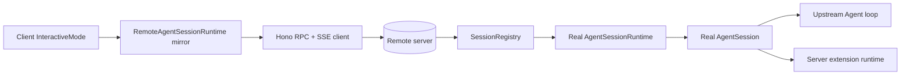

# Remote Event Sync Architecture

## Status

This document describes implemented remote sync architecture in this repo. It is not future-plan text.

Remote mode now runs stock upstream `InteractiveMode` on client against server-authoritative runtime. Client keeps only viewed-session projection plus resume/auth metadata. Reconnect path is snapshot-first, live patches are incremental, and server-side transient retention is bounded.

## Goals Met

- Stock upstream `InteractiveMode` remains remote UI host.
- Server owns runtime, tools, auth, providers, sessions, persistence, extension execution, and authoritative session state.
- Client owns local projection needed by `InteractiveMode`, local extension rendering, auth/session selection metadata, and reconnect loop.
- SSE sync is live-only plus authoritative snapshot bootstrap.
- Protocol is strict shared TypeBox contracts across HTTP/SSE boundaries.
- Reconnect treats network loss, lag, detach/attach, and server restart as normal cases.
- Server memory does not grow by retaining replay history for transient stream updates.

## Upstream Alignment

Remote architecture follows upstream Pi split:

- `InteractiveMode` is UI host only.
- `AgentSessionRuntime` and `AgentSession` semantics stay server-side.
- Client mirrors only surfaces `InteractiveMode` reads or mutates.

Relevant local entrypoints:

- [src/cli.ts](/home/coder/dotai/agent/src/cli.ts:1)
- [src/remote/client-interactive.ts](/home/coder/dotai/agent/src/remote/client-interactive.ts:1)
- [src/remote/client/runtime.ts](/home/coder/dotai/agent/src/remote/client/runtime.ts:1)
- [src/remote/session-registry.ts](/home/coder/dotai/agent/src/remote/session-registry.ts:1)
- [src/remote/runtime-factory.ts](/home/coder/dotai/agent/src/remote/runtime-factory.ts:1)

## Topology

## Server Model

### Session authority

`SessionRegistry` owns loaded session records, unloaded snapshot reads, presence, eviction, reconnect bootstrap, and command dispatch.

Primary files:

- [src/remote/session-registry.ts](/home/coder/dotai/agent/src/remote/session-registry.ts:1)
- [src/remote/session/registry-base.ts](/home/coder/dotai/agent/src/remote/session/registry-base.ts:1)
- [src/remote/session/registry-runtime-ops.ts](/home/coder/dotai/agent/src/remote/session/registry-runtime-ops.ts:1)
- [src/remote/session/registry-state-commands.ts](/home/coder/dotai/agent/src/remote/session/registry-state-commands.ts:1)

Each loaded `SessionRecord` stores current authoritative projection:

- transcript
- live streaming assistant overlay
- active tool executions
- queue depth and queued steer/follow-up text
- retry and compaction state
- bash state
- durable extension state
- pending extension UI requests
- resource/settings/model metadata
- interrupted runtime domains
- monotonic durable version
- presence map

See:

- [src/remote/session/types.ts](/home/coder/dotai/agent/src/remote/session/types.ts:1)
- [src/remote/session/command-registry.ts](/home/coder/dotai/agent/src/remote/session/command-registry.ts:1)

### No retained replay log

Server no longer retains unbounded per-session event history for reconnect. Reconnect bootstrap comes from fresh authoritative snapshot plus currently live patches.

Live fanout uses in-process event bus:

- [src/remote/live-events.ts](/home/coder/dotai/agent/src/remote/live-events.ts:1)

### Durable restart recovery

Interrupted runtime domains are persisted separately from transcript so restart recovery can mark queue/retry/compaction/bash/streaming as interrupted without replaying transient events.

Files:

- [src/remote/session/durable-runtime-state.ts](/home/coder/dotai/agent/src/remote/session/durable-runtime-state.ts:1)
- [src/remote/session/runtime-sync.ts](/home/coder/dotai/agent/src/remote/session/runtime-sync.ts:1)
- [src/remote/session/runtime-sync-snapshot.ts](/home/coder/dotai/agent/src/remote/session/runtime-sync-snapshot.ts:1)

## Client Model

Client runtime is surrogate object graph shaped for upstream `InteractiveMode`:

- `RemoteAgentSessionRuntime`
- remote session mirror
- remote session-manager mirror
- remote resource loader mirror
- local extension runner bridge

Files:

- [src/remote/client/runtime.ts](/home/coder/dotai/agent/src/remote/client/runtime.ts:1)
- [src/remote/client/session.ts](/home/coder/dotai/agent/src/remote/client/session.ts:1)
- [src/remote/client/session-manager-mirror.ts](/home/coder/dotai/agent/src/remote/client/session-manager-mirror.ts:1)
- [src/remote/client/session-resource-loader.ts](/home/coder/dotai/agent/src/remote/client/session-resource-loader.ts:1)
- [src/remote/client/session/local-extension-runner.ts](/home/coder/dotai/agent/src/remote/client/session/local-extension-runner.ts:1)

`InteractiveMode` stays unchanged at host boundary. Client runtime replays authoritative snapshot into local mirror, then applies incremental patches.

## Protocol

### Transport split

- Hono RPC for request/response commands and snapshots
- SSE for live sync stream only

Routes:

- [src/remote/routes.ts](/home/coder/dotai/agent/src/remote/routes.ts:1)
- [src/remote/routes/session-sync.ts](/home/coder/dotai/agent/src/remote/routes/session-sync.ts:1)
- [src/remote/runtime-api/client.ts](/home/coder/dotai/agent/src/remote/runtime-api/client.ts:1)

### Contracts

All remote payloads are shared TypeBox schemas.

Key schema files:

- [src/remote/schemas-core.ts](/home/coder/dotai/agent/src/remote/schemas-core.ts:1)
- [src/remote/schemas-stream.ts](/home/coder/dotai/agent/src/remote/schemas-stream.ts:1)
- [src/remote/schemas-session-runtime.ts](/home/coder/dotai/agent/src/remote/schemas-session-runtime.ts:1)
- [src/remote/typebox.ts](/home/coder/dotai/agent/src/remote/typebox.ts:1)

Top-level sync events:

- `server.connected`
- `snapshot`
- `patch`

No legacy stream offsets, backlog envelopes, or replay cursors remain on wire. Covered by [test/remote-sync-final-architecture.test.ts](/home/coder/dotai/agent/test/remote-sync-final-architecture.test.ts:253).

### Snapshot

`snapshot` is authoritative current truth for one session. It contains:

- durable transcript tail
- live overlay state
- pending tool calls
- queue state
- retry/compaction/bash/streaming status
- active tool executions
- pending UI requests and UI state
- durable extension state
- resource, settings, theme, model, session metadata
- interrupted runtime domain markers

Snapshot build path:

- [src/remote/session/runtime-sync-snapshot.ts](/home/coder/dotai/agent/src/remote/session/runtime-sync-snapshot.ts:1)
- [src/remote/session/unloaded-session-snapshot.ts](/home/coder/dotai/agent/src/remote/session/unloaded-session-snapshot.ts:1)

### Incremental patches

Hot updates are normalized into smaller patch classes instead of replaying full heavyweight upstream events.

Patch classes:

- `session.state`
- `assistant.message`
- `tool.execution`
- `queue.update`
- `retry.status`
- `compaction.status`
- `agent.lifecycle`
- `extension.custom`
- `extension.event`
- `extension.ui.request`
- `extension.ui.resolved`
- `command.accepted`
- `bash.start`
- `bash.chunk`
- `bash.end`
- `bash.flush`
- `extension.error`

Patch emission path:

- [src/remote/session/event-stream-ops.ts](/home/coder/dotai/agent/src/remote/session/event-stream-ops.ts:1)
- [src/remote/session/extension-event-stream.ts](/home/coder/dotai/agent/src/remote/session/extension-event-stream.ts:1)
- [src/remote/session/session-state-patch.ts](/home/coder/dotai/agent/src/remote/session/session-state-patch.ts:1)

Tool patches avoid repeated full payloads when possible:

- text append delta
- structured partial patch ops
- full partial result fallback only when needed

Files:

- [src/remote/tool-output-text.ts](/home/coder/dotai/agent/src/remote/tool-output-text.ts:1)
- [src/remote/client/session/tool-sync-patches.ts](/home/coder/dotai/agent/src/remote/client/session/tool-sync-patches.ts:1)

Assistant streaming patches use compact content-index deltas instead of full assistant message replay:

- [src/remote/assistant-message-sync.ts](/home/coder/dotai/agent/src/remote/assistant-message-sync.ts:1)

## Reconnect Semantics

### Attach sequence

1. Subscribe live event bus first.
2. Load authoritative snapshot.
3. Emit `server.connected`.
4. Emit `snapshot`.
5. Flush only buffered pre-snapshot patches not already covered by snapshot.
6. Continue live patch fanout.

Implementation:

- [src/remote/routes/session-sync.ts](/home/coder/dotai/agent/src/remote/routes/session-sync.ts:47)

### Why snapshot-first

Client convergence matters more than historical replay. Snapshot gets client usable immediately. Buffered transient patches only survive short pre-snapshot race window.

### Buffered pre-snapshot patch window

Before snapshot send completes, server keeps only bounded buffer of pending live patches. Replaceable updates coalesce by semantic key.

- hard cap: `128`
- replaceable updates overwrite prior buffered event
- snapshot-covered patches are discarded

Implementation:

- [src/remote/routes/session-sync.ts](/home/coder/dotai/agent/src/remote/routes/session-sync.ts:14)
- [src/remote/session-sync-metadata.ts](/home/coder/dotai/agent/src/remote/session-sync-metadata.ts:1)

This is bounded reconnect smoothing, not general replay.

### Client reconnect loop

Client polls SSE continuously. On disconnect:

- retry quickly for retryable transport/auth/network failures
- reauthenticate on `401`
- rebootstrap from snapshot after reconnect
- preserve only local metadata needed for reconnection

Implementation:

- [src/remote/client/session/runtime-internals.ts](/home/coder/dotai/agent/src/remote/client/session/runtime-internals.ts:194)
- [src/remote/client/session/runtime-sync-errors.ts](/home/coder/dotai/agent/src/remote/client/session/runtime-sync-errors.ts:1)

### Server restart recovery

After restart, durable transcript and durable runtime-domain state rebuild session snapshot. Streaming, retry, compaction, bash, and queue domains surface as `interrupted` until next authoritative runtime state clears them.

Covered by [test/remote-sync-final-architecture.test.ts](/home/coder/dotai/agent/test/remote-sync-final-architecture.test.ts:160).

## Memory Bounding

Bound strategy:

- no unbounded replay array
- no per-connection catch-up backlog
- only current session projection retained
- only bounded pre-snapshot patch buffer per connection
- replaceable extension custom events coalesce
- current active tool execution state replaces prior transient partials
- presence entries expire
- idle runtimes evict

Files:

- [src/remote/routes/session-sync.ts](/home/coder/dotai/agent/src/remote/routes/session-sync.ts:14)
- [src/remote/session/registry-presence.ts](/home/coder/dotai/agent/src/remote/session/registry-presence.ts:1)
- [src/remote/session/registry-management.ts](/home/coder/dotai/agent/src/remote/session/registry-management.ts:1)

## Extension Support

Server remains extension runtime authority.

- extension runner events stream as patches
- extension custom events split durable vs ephemeral vs replaceable sync behavior
- extension UI requests/responses bridge through explicit patch classes and command routes
- durable extension state is snapshot-backed
- ephemeral extension state is live-only

Files:

- [src/remote/event-bus-bridge.ts](/home/coder/dotai/agent/src/remote/event-bus-bridge.ts:1)
- [src/remote/session/extension-event-stream.ts](/home/coder/dotai/agent/src/remote/session/extension-event-stream.ts:1)
- [src/remote/session/ui-requests.ts](/home/coder/dotai/agent/src/remote/session/ui-requests.ts:1)
- [src/remote/session/commands-ui.ts](/home/coder/dotai/agent/src/remote/session/commands-ui.ts:1)

## Parity Surface

Remote path supports same interactive host flows exercised in tests:

- prompt flow
- assistant streaming
- tool start/update/end
- bash streaming lifecycle
- steer/follow-up/clear queue
- interrupt
- model and thinking changes
- remote settings and mode sync
- rename
- new/switch/fork flows
- tree navigation and summaries
- retry and compaction propagation
- extension UI request/response
- extension custom events
- resource/theme/model sync
- repeated attach/detach and multi-client convergence

Primary evidence:

- [test/remote-adapter-core.scenarios.ts](/home/coder/dotai/agent/test/remote-adapter-core.scenarios.ts:1)
- [test/remote-adapter-runtime.scenarios.ts](/home/coder/dotai/agent/test/remote-adapter-runtime.scenarios.ts:1)
- [test/modes-remote.test.ts](/home/coder/dotai/agent/test/modes-remote.test.ts:1)
- [test/remote-tool-sync-patches.test.ts](/home/coder/dotai/agent/test/remote-tool-sync-patches.test.ts:1)
- [test/remote-sync-final-architecture.test.ts](/home/coder/dotai/agent/test/remote-sync-final-architecture.test.ts:1)

## Validation Evidence

### Repo gates

Executed successfully:

- `npm run typecheck`
- `npm test`
- `npm run lint`
- `npm run format:check`

### Remote-specific tests

Executed successfully:

- `npm run test:remote`

This covers:

- snapshot-first reconnect
- multi-client live patch convergence
- durable vs ephemeral extension sync
- restart recovery for interrupted runtime domains
- bounded pre-snapshot buffering
- no legacy stream-offset protocol residue

### tmux e2e evidence

Session prefix used: `pi-remote-e2e`

Validated with real tmux panes:

- `scripts/remote-e2e-direct-tmux.sh up`
- tmux panes launch:
  - `npm run pi:server -- --port <port> --origin http://127.0.0.1:<port>`
  - `npm run pi:remote -- --remote-url http://127.0.0.1:<port> --identity alice --workspace-cwd <tmp>`
  - `npm run pi`
- `tmux send-keys` into remote client pane
- `tmux capture-pane` on remote client and server panes
- clean capture post-processing for grepable assertions

Scenario script:

- `scripts/remote-e2e-scenarios.sh`

Executed scenarios:

- `normal`
- `large-stream`
- `hot-bash`
- `reconnect-mid-stream`
- `reconnect-after-completion`
- `restart-recovery`
- `queue-interrupt`
- `fork`
- `switch-session`
- `extension-ui`
- `clone`
- `extra-attach`
- `fanout`
- `memory-bound`

Observed:

- remote and standalone Pi both accepted typed prompt input and rendered assistant greeting for `Say hello in one sentence.`
- remote rendered large streamed numeric output and hot bash output updates through tmux-visible UI
- remote reconnect with `--continue` recovered after mid-stream disconnect and after completion
- server restart followed by remote reattach returned client to usable session UI
- interrupt under active run worked through upstream default `Escape` binding and rendered `Operation aborted`
- direct remote attach to explicit target session id rendered the target session header and prompt UI
- extension UI flow rendered through remote client and completed with visible `Opened stash entry (1 lines)`
- repeated attach and second-client fanout completed without server crash
- hot streaming memory probe showed bounded working-set oscillation after warmup in tmux scenario `memory-bound` with `tail_spread_kb=55912`

Logs captured under:

- `.pi/remote-e2e/scenario-runs/*`

## Known Limits

- tmux evidence proves real client/server behavior and visible parity for covered scenarios, but does not by itself prove asymptotic memory bounds.
- bounded reconnect buffering and replaceable pre-snapshot coalescing are proven primarily by automated tests:
  - [test/remote-sync-final-architecture.test.ts](/home/coder/dotai/agent/test/remote-sync-final-architecture.test.ts:1)
  - [test/remote-tool-sync-patches.test.ts](/home/coder/dotai/agent/test/remote-tool-sync-patches.test.ts:1)
- tree navigation and tree-summary semantics are proven primarily by automated runtime tests:
  - [test/remote-adapter-runtime.scenarios.ts](/home/coder/dotai/agent/test/remote-adapter-runtime.scenarios.ts:1030)
  - [test/remote-adapter-runtime.scenarios.ts](/home/coder/dotai/agent/test/remote-adapter-runtime.scenarios.ts:1166)

## Non-Goals

- historical replay of every transient event
- backward compatibility with legacy stream-offset envelopes
- client-side execution of runtime, tools, or extensions
- raw `fetch` command path in place of typed Hono RPC
