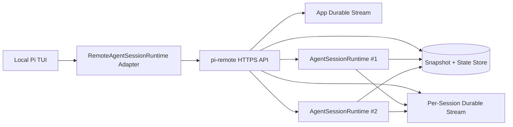

# Remote Headless Pi Product Spec

## Goal

Build a server-driven Pi architecture where the full agent runtime lives on a remote machine and the local app only owns TUI rendering and local device integrations.

The product must support:

- multiple concurrent Pi sessions on one server
- seamless reconnect and cross-device handoff
- durable replayable event delivery
- server-owned prompts, auth, config, skills, sessions, storage, files, and tool execution
- maximal reuse of the current Pi TUI by swapping the local runtime/session layer for a remote-backed adapter

This is not a terminal remoting product. It is a Pi session remoting product.

## Product Summary

We are building a daemon, `pi-remote`, that runs on a Linux or macOS host and owns multiple in-memory Pi `AgentSessionRuntime` / `AgentSession` instances. Local clients attach over HTTP(S), fetch snapshots, send commands over stateless HTTP, and receive replayable live updates through Durable Streams-compatible HTTP streams using SSE or long-poll.

The current TUI stays local and should remain visually and behaviorally familiar. The TUI must stop spawning a local runtime and instead bind to a `RemoteAgentSessionRuntime` / `RemoteAgentSession` adapter that mirrors the current in-process contract closely enough to preserve existing UI code paths.

## Locked-In Decisions

### Architecture

- The session authority moves to the remote server.
- The server owns the full agent runtime, not just tool execution.
- The local client owns only rendering, local notifications, and local device UX.
- We are not using SSH as the product transport.
- We are not using `tmux` as the product architecture.
- We are not exposing stdin/stdout Pi RPC as the public product protocol.
- We will reuse Pi RPC concepts and event semantics where useful, but not its transport framing.
- We will reuse as much of the current TUI as possible.

### Runtime Model

- `pi-remote` will manage multiple in-memory Pi agent runtimes concurrently.
- Sessions will be server-owned and identified by durable `sessionId` values.
- Multiple authenticated clients may attach to and actively mutate the same session concurrently.
- The server is the sole authority for session state, draft state, and command ordering.
- A session has one shared authoritative draft that is synchronized across attached clients.
- Server-owned mutable state includes at least draft text, draft attachments, active session selection, client presence, and the ordered session command queue.

### Transport

- Commands and mutations use stateless HTTPS endpoints.
- Event delivery uses Durable Streams-style HTTP streams with catch-up and live tailing.
- SSE is the preferred live transport for JSON event feeds.
- Long-poll remains a first-class fallback.
- WebSocket is explicitly deferred. It may be added later as a façade if needed.

### Server Framework And API Tooling

- `pi-remote` will be implemented with Hono on Node.js.
- The client/server command and snapshot API will use Hono RPC so both sides share a typesafe route contract.
- Request and response validation will use TypeBox schemas via `@hono/typebox-validator`.
- OpenAPI documentation will be generated from the Hono route layer using `hono-openapi`.
- Durable stream endpoints remain HTTP stream endpoints, but they should still live in the same Hono application.
- Hono RPC is the primary typed integration path for command and snapshot routes, not a replacement for SSE or long-poll stream delivery.

### State Synchronization

- Reconnect and handoff are implemented with `snapshot + lastSeenOffset + replay from offset`.
- We will not rebuild full client state by replaying the full history from zero on every attach.
- Durable streams are used for event history and replay, not as the sole authority for mutable session state.

### Authentication

- Authentication uses public-key challenge/response.
- The server maintains an allowlist of public keys.
- Clients request a challenge, sign it with a private key, and exchange it for a session token or secure cookie.
- There are no accounts, no OAuth flows, and no public-key recovery complexity in v1.

### Compatibility Scope

- Backward compatibility is not a design goal for the new protocol.
- We will preserve Pi event semantics and TUI reuse where it simplifies implementation.
- Bun is an acceptable runtime/deployment target for the daemon, but Bun-specific source code was not part of this research and should not drive the protocol design.

## Non-Goals

- Terminal byte-stream remoting
- CRDT-style collaborative editing beyond server-authoritative ordered updates in v1
- Public multi-tenant SaaS auth model
- WebSocket-first transport
- Productizing SSH or `tmux` as the main UX
- Reusing raw Pi RPC as the public external API without an orchestration layer

## Why This Direction

Pi already exposes the core runtime state and event seams we need:

- `AgentState` already models transcript, active tools, streaming state, pending tool calls, and errors in `/Users/shady/.cache/checkouts/github.com/badlogic/pi-mono/packages/agent/src/types.ts:253-277`.
- `AgentEvent` already models lifecycle, message, and tool execution streams in `/Users/shady/.cache/checkouts/github.com/badlogic/pi-mono/packages/agent/src/types.ts:322-341`.
- `AgentSessionEvent` adds queue, compaction, and retry events that the current TUI expects in `/Users/shady/.cache/checkouts/github.com/badlogic/pi-mono/packages/coding-agent/src/core/agent-session.ts:112-129`.
- The current interactive mode is tightly coupled to `AgentSessionRuntime` / `AgentSession`, not to a remote protocol, in `/Users/shady/.cache/checkouts/github.com/badlogic/pi-mono/packages/coding-agent/src/modes/interactive/interactive-mode.ts:165-175`, `/Users/shady/.cache/checkouts/github.com/badlogic/pi-mono/packages/coding-agent/src/modes/interactive/interactive-mode.ts:267-285`, and `/Users/shady/.cache/checkouts/github.com/badlogic/pi-mono/packages/coding-agent/src/modes/interactive/interactive-mode.ts:2325-2338`.

That means the right reuse strategy is to preserve the TUI and replace the runtime binding under it.

Durable Streams is a strong fit for the event transport problem because it is explicitly designed for durable, replayable, ordered client-facing HTTP streams with resume, SSE, long-poll, offset-based replay, and explicit closure semantics in `/Users/shady/.cache/checkouts/github.com/durable-streams/durable-streams/README.md:24-47`, `/Users/shady/.cache/checkouts/github.com/durable-streams/durable-streams/README.md:57-74`, `/Users/shady/.cache/checkouts/github.com/durable-streams/durable-streams/PROTOCOL.md:86-103`, and `/Users/shady/.cache/checkouts/github.com/durable-streams/durable-streams/PROTOCOL.md:523-599`.

Sandbox Agent validates the broader product shape above the raw agent runtime: server-owned sessions, HTTP command handling, durable event replay, snapshots, and broadcasted session updates in `/Users/shady/.cache/checkouts/github.com/rivet-dev/sandbox-agent/README.md:29-47`, `/Users/shady/.cache/checkouts/github.com/rivet-dev/sandbox-agent/README.md:102-118`, and `/Users/shady/.cache/checkouts/github.com/rivet-dev/sandbox-agent/foundry/packages/backend/src/actors/task/workspace.ts:1184-1212`.

## High-Level Architecture



## Core Components

### 1. `pi-remote`

Responsibilities:

- own process lifetime and orchestration
- hold session registry
- create, attach, detach, close, and archive sessions
- host in-memory `AgentSessionRuntime` / `AgentSession` instances
- materialize session snapshots
- append normalized events to durable streams
- track attached client presence
- order accepted commands per session
- authenticate clients
- expose command endpoints and stream endpoints

### 2. In-Memory Pi Session Workers

Responsibilities:

- execute Pi agent logic directly in-process
- emit `AgentSessionEvent`-compatible events
- load prompts, auth, config, skills, extensions, session storage, and workspace state from the server host
- execute all tools and workspace operations on the server host

The server owns the full session state, not just tool routing.

### 3. Snapshot + State Store

Responsibilities:

- fast attach bootstrap
- persisted session metadata
- draft state
- draft revision and last updater metadata
- attached client presence summaries
- selected model and tool configuration
- durable mapping of session stream names to latest offsets
- last known summaries for session lists and app views

### 4. Durable Event Streams

Responsibilities:

- append-only replayable event delivery
- cross-device catch-up and live tailing
- explicit offset resume
- live SSE and long-poll access

Durable streams are used for event history, not as the authority for mutable session fields.

### 5. Local Remote Runtime Adapter

Responsibilities:

- emulate enough of `AgentSessionRuntime` / `AgentSession` for the TUI to keep working
- fetch snapshots on attach
- subscribe to app and session streams
- translate server envelopes back into local `AgentSessionEvent` callbacks
- map TUI actions to HTTP commands
- surface server-driven UI requests back into the current TUI mechanisms

## Server-Owned State Model

Each session must own at least the following authoritative state:

- `sessionId`
- lifecycle status: `starting | idle | running | compacting | retrying | error | closed`
- server-side `AgentState` equivalent
- active model
- thinking level
- active tools / tool configuration
- transcript
- streaming assistant state
- pending tool calls
- pending steering queue
- pending follow-up queue
- compaction state
- retry state
- draft text
- draft attachments
- draft revision
- draft updated-at timestamp
- draft updated-by client id
- session name
- attached client presence
- ordered pending command queue
- created and updated timestamps
- stream identifiers and latest committed offsets

The state choices are grounded by Pi `AgentState`, Pi `AgentSessionEvent`, and Sandbox Agent’s server-owned draft/transcript/session detail design in:

- `/Users/shady/.cache/checkouts/github.com/badlogic/pi-mono/packages/agent/src/types.ts:253-277`
- `/Users/shady/.cache/checkouts/github.com/badlogic/pi-mono/packages/agent/src/types.ts:322-341`
- `/Users/shady/.cache/checkouts/github.com/badlogic/pi-mono/packages/coding-agent/src/core/agent-session.ts:112-129`
- `/Users/shady/.cache/checkouts/github.com/rivet-dev/sandbox-agent/foundry/packages/backend/src/actors/task/workspace.ts:1037-1053`

## Multi-Active Client Data Model

The server is authoritative. Clients are thin replicas plus input surfaces.

### Session

Authoritative server object.

- `sessionId`
- `status`
- `agentState`
- `draft`
- `activeRun`
- `pendingCommands`
- `transcript`
- `model`
- `thinkingLevel`
- `activeTools`
- `createdAt`
- `updatedAt`
- `lastEventOffset`

### Draft

One shared draft exists per session.

- `text`
- `attachments`
- `revision`
- `updatedAt`
- `updatedByClientId`

Every accepted draft update increments `revision`. All clients render the latest server-published draft.

### Client Presence

Per attached client.

- `clientId`
- `deviceId` optional
- `connectionId`
- `connectedAt`
- `lastSeenAt`
- `clientCapabilities`
- `lastSeenSessionOffset`
- `lastSeenAppOffset`

Presence is informational only. It does not gate mutation rights.

### Command

Authoritative mutation accepted by the server.

- `commandId`
- `sessionId`
- `clientId`
- `requestId`
- `kind`
- `payload`
- `acceptedAt`
- `sequence`

`sequence` is the authoritative ordering primitive for one session.

### Run

Represents the current agent execution state.

- `runId`
- `status`
- `triggeringCommandId`
- `startedAt`
- `updatedAt`
- `pendingUiRequestId` optional
- `queueDepth`

## Multi-Active Client Semantics

- Any authenticated attached client may issue session commands.
- The server defines the total order of accepted commands for one session.
- All accepted commands and resulting state transitions are emitted to all attached clients in that server order.
- Prompt, interrupt, steer, and follow-up are ordinary ordered session commands.
- The session runtime may start, queue, or reinterpret accepted commands based on current run state, but the server order remains authoritative.
- There is no controller, writer lock, watcher mode, or exclusive owner role.

## Shared Draft Synchronization

- A session has one shared authoritative draft.
- Clients send debounced `POST /v1/sessions/:sessionId/draft` updates.
- The server accepts draft updates in arrival order and publishes the resulting authoritative draft state.
- All clients replace their local draft with the latest authoritative server draft when they receive the update.
- Prompt submission should carry explicit text and attachments in the request body rather than implicitly consuming whatever draft happens to be current at that instant.

## Protocol Design

### Design Principles

- HTTP-native
- stateless commands
- durable replayable events
- offsets are opaque
- snapshot-first attach
- preserve Pi semantics where it reduces adaptation cost
- separate command API from event delivery
- typesafe client/server route contracts for non-stream endpoints
- server-ordered multi-client mutations

### Surface Split

#### A. Command API

Normal HTTPS endpoints. These are mutations and queries, not streams.

Implementation notes:

- These routes should be declared in Hono and exported as a shared app or route tree for Hono RPC client generation.
- Route inputs and outputs should be defined with TypeBox-backed validators so runtime validation and static typing stay aligned.
- These routes should be the primary source for generated OpenAPI docs.

Examples:

- `POST /v1/auth/challenge`
- `POST /v1/auth/verify`
- `GET /v1/app/snapshot`
- `GET /v1/sessions`
- `POST /v1/sessions`
- `GET /v1/sessions/:sessionId/snapshot`
- `POST /v1/sessions/:sessionId/prompt`
- `POST /v1/sessions/:sessionId/steer`
- `POST /v1/sessions/:sessionId/follow-up`
- `POST /v1/sessions/:sessionId/interrupt`
- `POST /v1/sessions/:sessionId/draft`
- `POST /v1/sessions/:sessionId/ui-response`
- `POST /v1/sessions/:sessionId/model`
- `POST /v1/sessions/:sessionId/session-name`
- `DELETE /v1/sessions/:sessionId`

#### B. Durable Event Streams

These are replayable event feeds backed by Durable Streams semantics.

Examples:

- `GET /v1/streams/app-events?offset=<opaque>&live=sse`
- `GET /v1/streams/sessions/:sessionId/events?offset=<opaque>&live=sse`

Long-poll must remain supported for fallback and non-SSE clients.

#### C. Snapshot API

These return materialized state for fast attach and recovery.

Implementation notes:

- Snapshot endpoints should be part of the same Hono RPC surface as command routes.
- Snapshot response bodies should use explicit TypeBox schemas and participate in generated OpenAPI docs.

Examples:

- `GET /v1/app/snapshot`
- `GET /v1/sessions/:sessionId/snapshot`

## Event Envelope

The server event envelope should be stable and explicit.

Example:

```json
{
  "eventId": "evt_123",
  "sessionId": "sess_123",
  "streamOffset": "opaque-offset",
  "ts": 1760000000000,
  "kind": "agent_session_event",
  "payload": {
    "type": "tool_execution_start",
    "toolCallId": "tool_1",
    "toolName": "bash",
    "args": {
      "command": "ls"
    }
  }
}
```

Envelope fields:

- `eventId`: server-unique event id
- `streamOffset`: durable-stream offset returned by the stream backend
- `sessionId`: nullable for app-level events, required for session events
- `ts`: monotonic server event timestamp
- `kind`: namespaced event class
- `payload`: actual semantic event body

### Event Kinds

App-level:

- `session_created`
- `session_closed`
- `session_summary_updated`
- `client_presence_updated`
- `auth_notice`
- `server_notice`

Session-level:

- `agent_session_event`
- `command_accepted`
- `draft_updated`
- `session_state_patch`
- `extension_ui_request`
- `extension_error`

### Payload Shape

For `agent_session_event`, preserve Pi `AgentSessionEvent` shape as much as possible. This reduces the amount of TUI adaptation required because the current interactive mode already consumes that shape.

Pi RPC already exposes useful UI request concepts that should be reused semantically in the new protocol:

- `select`
- `confirm`
- `input`
- `editor`
- `notify`
- `setStatus`
- `setWidget`
- `setTitle`
- `set_editor_text`

Grounding: `/Users/shady/.cache/checkouts/github.com/badlogic/pi-mono/packages/coding-agent/src/modes/rpc/rpc-types.ts:206-256`

## Snapshot Shape

The session snapshot should include:

- `sessionId`
- `sessionName`
- `status`
- `model`
- `thinkingLevel`
- `activeTools`
- `draft`
- `draftRevision`
- `transcript`
- `queue`
- `retry`
- `compaction`
- `presence`
- `activeRun`
- `lastSessionStreamOffset`
- `lastAppStreamOffsetSeenByServer`
- `streamingState`
- `pendingToolCalls`
- `errorMessage`
- `createdAt`
- `updatedAt`

The app snapshot should include:

- `serverInfo`
- `currentClientAuthInfo`
- `sessionSummaries`
- `recentNotices`
- `defaultAttachSessionId` if any

Snapshot design is informed by Sandbox Agent’s use of server-owned detail views, session summaries, draft state, and transcript materialization in `/Users/shady/.cache/checkouts/github.com/rivet-dev/sandbox-agent/foundry/packages/backend/src/actors/task/workspace.ts:1037-1053`, `/Users/shady/.cache/checkouts/github.com/rivet-dev/sandbox-agent/foundry/packages/backend/src/actors/task/workspace.ts:1184-1212`, and `/Users/shady/.cache/checkouts/github.com/rivet-dev/sandbox-agent/foundry/packages/frontend/src/components/mock-layout.tsx:352-361`.

## Attach / Resume Flow

### New Attach

1. Client authenticates.
2. Client fetches app snapshot.
3. Client chooses a session.
4. Client fetches session snapshot.
5. Client opens app stream from latest known app offset.
6. Client opens session stream from latest known session offset.
7. Client begins rendering and applying incremental updates.

### Resume After Disconnect

1. Client loads last stored offsets.
2. Client fetches fresh snapshot.
3. Client reopens streams from last stored offsets.
4. Client applies replayed events.
5. Client resumes live tailing once stream reports up-to-date.

### Cross-Device Handoff

1. Device A and device B authenticate independently.
2. Device B fetches snapshot and resumes from offsets.
3. Both devices may remain attached and active at the same time.
4. Commands from both devices are accepted and ordered by the server.

Durable Streams semantics directly support this with opaque offsets, `HEAD`, catch-up reads, up-to-date detection, and live tailing in `/Users/shady/.cache/checkouts/github.com/durable-streams/durable-streams/PROTOCOL.md:523-599` and `/Users/shady/.cache/checkouts/github.com/durable-streams/durable-streams/PROTOCOL.md:605-620`.

## Durable Streams Usage Plan

### Use Durable Streams For

- app event feed
- per-session event feed
- replay and resume
- reconnect after mobile suspension
- durable ordering
- explicit stream closure when a session is fully archived or finalized

### Do Not Use Durable Streams As

- the authority for current mutable draft state
- the only representation of current session summary data

### Stream Topology

V1:

- one app stream
- one stream per session

Deferred:

- aggregated multiplexed all-sessions stream

### Why Not One Giant Multiplexed Stream In V1

- unnecessary coupling between unrelated sessions
- harder client filtering
- larger attach payloads
- worse backpressure behavior
- more complex summary synchronization

### Durable Streams Features We Intend To Exploit

- offset-based resume
- SSE live tailing
- long-poll fallback
- `HEAD` for metadata and closure checks
- `Stream-Up-To-Date` to transition from catch-up to live
- `Stream-Closed` to detect terminal EOF
- stream forking as a future model for session branching

Forking is especially interesting for future Pi branch support because Durable Streams already defines `Stream-Forked-From` and `Stream-Fork-Offset` in `/Users/shady/.cache/checkouts/github.com/durable-streams/durable-streams/PROTOCOL.md:141-181`.

## Authentication Design

### Model

- server has an allowlist of public keys
- client requests a challenge
- server returns `challengeId`, nonce, server origin, and expiry
- client signs canonical challenge payload with its private key
- client submits signature and key identity
- server verifies signature against the allowlist
- server returns a secure cookie or bearer token

### Requirements

- challenge TTL must be short
- challenges are one-time use
- all production transport is HTTPS only
- auth is server-local and accountless

### Explicitly Rejected

- OAuth
- account system
- public-key recovery as a protocol feature
- WebSocket-specific auth semantics in v1

## Concurrent Command Model

### V1 Policy

- any attached authenticated client may send commands
- the server orders accepted commands per session
- all clients receive the same resulting event stream

### Command Ordering

- every accepted mutation receives a server `sequence`
- clients must treat server order as authoritative
- session execution may queue later commands behind a running turn, but acceptance order remains explicit and visible

### Shared Draft Behavior

- draft updates are ordinary session mutations
- a draft update replaces the authoritative session draft with a new revision
- all clients converge by applying the latest server-published draft update

### UI Request Behavior

- any attached client may answer a pending UI request
- the first valid response accepted by the server wins
- later responses for the same request are ignored or rejected
- all clients receive the resulting resolution event

## Client Adapter Design

The local client must preserve the current TUI as much as possible.

### New Local Types

- `RemoteAgentSessionRuntime`
- `RemoteAgentSession`
- `RemoteSessionManager`
- `RemoteSettingsManager` if required by current TUI reads

### Adapter Responsibilities

- present a runtime/session API that looks close enough to the current in-process objects
- subscribe to server events and re-emit local `AgentSessionEvent`
- translate TUI actions into HTTP commands
- handle stream attach/resume
- handle offset persistence per stream

### Implementation Rule

The adapter should preserve the existing TUI contracts wherever possible instead of rewriting the TUI to become protocol-native.

## Server-Driven UI Interactions

The server may need user feedback for extension UI flows. We will preserve the Pi RPC interaction vocabulary semantically:

- `select`
- `confirm`
- `input`
- `editor`
- `notify`
- `setStatus`
- `setWidget`
- `setTitle`
- `set_editor_text`

Flow:

1. server appends `extension_ui_request` event to the session stream
2. any attached client may render and answer the request locally
3. client sends `POST /v1/sessions/:sessionId/ui-response`
4. server resumes the waiting operation

This is derived from Pi RPC behavior in `/Users/shady/.cache/checkouts/github.com/badlogic/pi-mono/packages/coding-agent/src/modes/rpc/rpc-types.ts:206-256` and `/Users/shady/.cache/checkouts/github.com/badlogic/pi-mono/packages/coding-agent/src/modes/rpc/rpc-mode.ts:43-54`.

## Workspace and Tool Execution

Because the server owns the full runtime, all tool execution and file operations execute on the server host.

This avoids the earlier split-brain remote workspace model where the UI, prompts, and config were local but workspace tools were remote. The new architecture moves everything except UI rendering and local device UX to the server.

Earlier tool-pluggability research still matters internally because Pi’s built-in workspace tools are already modeled through pluggable operations:

- `read`: `/Users/shady/.cache/checkouts/github.com/badlogic/pi-mono/packages/coding-agent/src/core/tools/read.ts:29-53`
- `write`: `/Users/shady/.cache/checkouts/github.com/badlogic/pi-mono/packages/coding-agent/src/core/tools/write.ts:21-37`
- `edit`: `/Users/shady/.cache/checkouts/github.com/badlogic/pi-mono/packages/coding-agent/src/core/tools/edit.ts:66-87`
- `bash`: `/Users/shady/.cache/checkouts/github.com/badlogic/pi-mono/packages/coding-agent/src/core/tools/bash.ts:45-67`
- `grep`: `/Users/shady/.cache/checkouts/github.com/badlogic/pi-mono/packages/coding-agent/src/core/tools/grep.ts:46-57`
- `find`: `/Users/shady/.cache/checkouts/github.com/badlogic/pi-mono/packages/coding-agent/src/core/tools/find.ts:38-51`
- `ls`: `/Users/shady/.cache/checkouts/github.com/badlogic/pi-mono/packages/coding-agent/src/core/tools/ls.ts:27-42`

This is useful for internal portability and future topology changes, but it is no longer the top-level product architecture.

## Local Current-Repo Implications

The current repo already contains local assumptions that would have made a client-owned remote-workspace model incomplete. These become server-local concerns in the new architecture, which simplifies the client:

- project info uses local git commands in `/Users/shady/github/shekohex/dotai/agent/src/extensions/coreui/project-info.ts:18-75`
- file browser logic assumes local project paths in `/Users/shady/github/shekohex/dotai/agent/src/extensions/files.ts:1029-1108`
- `apply_patch` currently edits local files directly in `/Users/shady/github/shekohex/dotai/agent/src/extensions/patch.ts:197-310`
- `AGENTS.md` discovery is local-filesystem-based in `/Users/shady/github/shekohex/dotai/agent/src/extensions/agents-md.ts:140-245`
- project context file loading is cwd-local in `/Users/shady/github/shekohex/dotai/agent/src/extensions/context.ts:509-525`

Because the full runtime moves server-side, these do not need to be remote-protocolized for the client. They need to run correctly on the server host.

## Milestones

### Milestone 0: Product Scaffold

#### Goal

Lock the protocol shape, state model, and adaptation strategy before implementation.

#### Deliverables

- this product spec
- server API draft
- snapshot schema draft
- event envelope draft
- adapter contract draft

#### Exit Criteria

- all locked decisions are documented
- all rejected alternatives are documented
- server/client boundaries are stable enough to code against

### Milestone 1: `pi-remote` Foundation

#### Goal

Create a daemon that can authenticate clients, manage a session registry, and host one in-memory Pi session.

#### Scope

- Hono Node.js server skeleton
- HTTP server skeleton
- public-key challenge auth
- session registry
- one in-memory `AgentSessionRuntime`
- snapshot storage
- app stream and one session stream plumbing
- shared draft state with revisions
- multi-client presence tracking
- your work should be living inside `../src/remote` (~/github/shekohex/dotai/agent/src/remote) directory.

#### Deliverables

- base Hono app structure with shared route registration
- Hono RPC-compatible command and snapshot route tree
- TypeBox validation for request and response schemas
- OpenAPI doc endpoint generation
- `POST /v1/auth/challenge`
- `POST /v1/auth/verify`
- `GET /v1/app/snapshot`
- `POST /v1/sessions`
- `GET /v1/sessions/:sessionId/snapshot`
- durable stream append path for app/session events

#### Verification

- create a session
- fetch its snapshot
- attach to its empty stream
- disconnect and reconnect from the last offset

### Milestone 2: Session Command Surface

#### Goal

Make a single remote Pi session fully operable over HTTP while all execution stays server-side.

#### Scope

- prompt
- steer
- follow-up
- interrupt
- session naming
- model changes
- draft updates
- concurrent multi-client command ordering

#### Deliverables

- `POST /v1/sessions/:sessionId/prompt`
- `POST /v1/sessions/:sessionId/steer`
- `POST /v1/sessions/:sessionId/follow-up`
- `POST /v1/sessions/:sessionId/interrupt`
- `POST /v1/sessions/:sessionId/draft`
- `POST /v1/sessions/:sessionId/model`
- `POST /v1/sessions/:sessionId/session-name`
- server-issued command sequencing for concurrent clients
- authoritative draft revision updates broadcast to all clients

#### Verification

- send prompt
- observe streamed agent events
- disconnect mid-run and reconnect from offset
- resume on another device without losing state

### Milestone 3: Remote Runtime Adapter For Current TUI

#### Goal

Run the existing local TUI against the remote daemon with minimal UI changes.

#### Scope

- implement `RemoteAgentSessionRuntime`
- implement `RemoteAgentSession`
- adapt event subscription and command methods
- bind app/session snapshots into local TUI startup
- map server UI requests back into local TUI dialogs/widgets

#### Deliverables

- local client can attach to remote daemon
- current TUI renders remote transcript and tool activity
- prompts from the local TUI drive the remote runtime

#### Verification

- local TUI experience stays recognizable
- no local agent runtime is spawned
- session updates are driven entirely from the server

### Milestone 4: Multi-Session Orchestration

#### Goal

Support multiple concurrent sessions with fast switching and background activity.

#### Scope

- multiple in-memory sessions
- app-level session summaries
- session switching in the local UI
- unread/session activity tracking
- session close and archive flow

#### Deliverables

- `GET /v1/sessions`
- session summary updates on app stream
- background sessions continue while not focused

#### Verification

- create 3 to 4 sessions on one server
- switch among them locally
- verify background sessions continue generating events

### Milestone 5: Cross-Device Handoff

#### Goal

Make device switching first-class and reliable.

#### Scope

- stable offset persistence per device
- simultaneous multi-device attachment
- shared draft synchronization across devices
- reconnect after disconnect or mobile suspension
- conflict handling through server command ordering

#### Deliverables

- deterministic attach/resume flow
- shared draft propagation across devices
- presence updates for attached clients
- deterministic ordered command handling across devices

#### Verification

- start on laptop
- continue on phone
- return to laptop and resume from latest offset and snapshot without divergence

### Milestone 6: Session Branching And Historical Forks

#### Goal

Design and implement a future-proof branch model for Pi sessions.

#### Scope

- map Pi branch semantics onto durable stream forks or host-managed branch snapshots
- enable replay from a branch root
- preserve history without copying full transcripts unnecessarily

#### Deliverables

- branch creation API
- branch snapshot strategy
- branch event stream strategy

#### Verification

- create branch at historical point
- continue independently
- attach to both branches from different clients

## Rejected Alternatives

### Raw SSH / `tmux`

Rejected as the product architecture because it solves terminal attachment, not durable Pi session orchestration.

### Public API = Pi RPC Over StdIO Wrapped In HTTP

Rejected because Pi RPC is worker-local. It lacks orchestration, durable session registry, snapshot discipline, multi-client command ordering, and app-level multiplexing.

Grounding for Pi RPC’s existing capabilities and limits:

- `/Users/shady/.cache/checkouts/github.com/badlogic/pi-mono/packages/coding-agent/src/modes/rpc/rpc-types.ts:19-68`
- `/Users/shady/.cache/checkouts/github.com/badlogic/pi-mono/packages/coding-agent/src/modes/rpc/rpc-mode.ts:43-54`
- `/Users/shady/.cache/checkouts/github.com/badlogic/pi-mono/packages/coding-agent/src/modes/rpc/rpc-client.ts:54-100`

### WebSocket-First Transport

Deferred because the primary hard problem is replayable durable event delivery and attach/resume, which Durable Streams addresses directly over HTTP.

### Replay-Only Without Snapshots

Rejected because replaying from zero on every attach is wasteful and fragile. We are explicitly choosing `snapshot + offset resume`.

## Risks And Mitigations

### Risk: TUI Coupling Is Deeper Than Expected

Mitigation:

- preserve `AgentSessionEvent` semantics closely
- add facades instead of rewrites
- implement adapter incrementally against the current TUI code paths

### Risk: Durable Streams Integration Complexity

Mitigation:

- keep command API separate from streams
- use only app and per-session streams in v1
- avoid premature multiplexed super-streams

### Risk: Concurrent Command Ambiguity Across Devices

Mitigation:

- server-issued command sequencing per session
- explicit draft revision updates
- first-valid-response-wins semantics for UI requests

### Risk: Server Crash Loses In-Memory Sessions

Mitigation:

- persist snapshots frequently enough for fast recovery
- persist event streams continuously
- restore session metadata and rehydrate sessions on daemon restart in later milestones

## Execution Order

1. Build the daemon, auth, snapshots, and durable event plumbing.
2. Make one in-memory Pi session remotely operable.
3. Build the local remote-runtime adapter.
4. Attach the existing TUI to the adapter.
5. Add multi-session orchestration and multi-client semantics.
6. Add cross-device handoff polish.
7. Add branch/fork support later.

## References

### Current Repo

- `/Users/shady/github/shekohex/dotai/agent/src/extensions/coreui/project-info.ts:18-75`
- `/Users/shady/github/shekohex/dotai/agent/src/extensions/files.ts:1029-1108`
- `/Users/shady/github/shekohex/dotai/agent/src/extensions/patch.ts:197-310`
- `/Users/shady/github/shekohex/dotai/agent/src/extensions/agents-md.ts:140-245`
- `/Users/shady/github/shekohex/dotai/agent/src/extensions/context.ts:509-525`
- `/Users/shady/github/shekohex/dotai/agent/src/extensions/executor/docker/README.md:5-15`
- `/Users/shady/github/shekohex/dotai/agent/src/extensions/executor/docker/README.md:31-35`
- `/Users/shady/github/shekohex/dotai/agent/src/extensions/executor/connection.ts:44-58`
- `/Users/shady/github/shekohex/dotai/agent/src/extensions/executor/mcp-client.ts:111-169`

### Pi Monorepo

- `/Users/shady/.cache/checkouts/github.com/badlogic/pi-mono/README.md:20-34`
- `/Users/shady/.cache/checkouts/github.com/badlogic/pi-mono/packages/agent/src/types.ts:253-277`
- `/Users/shady/.cache/checkouts/github.com/badlogic/pi-mono/packages/agent/src/types.ts:322-341`
- `/Users/shady/.cache/checkouts/github.com/badlogic/pi-mono/packages/coding-agent/src/core/agent-session.ts:112-129`
- `/Users/shady/.cache/checkouts/github.com/badlogic/pi-mono/packages/coding-agent/src/core/agent-session.ts:620-675`
- `/Users/shady/.cache/checkouts/github.com/badlogic/pi-mono/packages/coding-agent/src/core/agent-session.ts:2248-2286`
- `/Users/shady/.cache/checkouts/github.com/badlogic/pi-mono/packages/coding-agent/src/core/agent-session.ts:2315-2328`
- `/Users/shady/.cache/checkouts/github.com/badlogic/pi-mono/packages/coding-agent/src/modes/interactive/interactive-mode.ts:1-4`
- `/Users/shady/.cache/checkouts/github.com/badlogic/pi-mono/packages/coding-agent/src/modes/interactive/interactive-mode.ts:165-175`
- `/Users/shady/.cache/checkouts/github.com/badlogic/pi-mono/packages/coding-agent/src/modes/interactive/interactive-mode.ts:267-285`
- `/Users/shady/.cache/checkouts/github.com/badlogic/pi-mono/packages/coding-agent/src/modes/interactive/interactive-mode.ts:2325-2338`
- `/Users/shady/.cache/checkouts/github.com/badlogic/pi-mono/packages/coding-agent/src/modes/rpc/rpc-types.ts:1-6`
- `/Users/shady/.cache/checkouts/github.com/badlogic/pi-mono/packages/coding-agent/src/modes/rpc/rpc-types.ts:19-68`
- `/Users/shady/.cache/checkouts/github.com/badlogic/pi-mono/packages/coding-agent/src/modes/rpc/rpc-types.ts:90-103`
- `/Users/shady/.cache/checkouts/github.com/badlogic/pi-mono/packages/coding-agent/src/modes/rpc/rpc-types.ts:206-256`
- `/Users/shady/.cache/checkouts/github.com/badlogic/pi-mono/packages/coding-agent/src/modes/rpc/rpc-mode.ts:1-12`
- `/Users/shady/.cache/checkouts/github.com/badlogic/pi-mono/packages/coding-agent/src/modes/rpc/rpc-mode.ts:43-54`
- `/Users/shady/.cache/checkouts/github.com/badlogic/pi-mono/packages/coding-agent/src/modes/rpc/rpc-mode.ts:336-339`
- `/Users/shady/.cache/checkouts/github.com/badlogic/pi-mono/packages/coding-agent/src/modes/rpc/rpc-mode.ts:422-438`
- `/Users/shady/.cache/checkouts/github.com/badlogic/pi-mono/packages/coding-agent/src/modes/rpc/rpc-mode.ts:719-729`
- `/Users/shady/.cache/checkouts/github.com/badlogic/pi-mono/packages/coding-agent/src/modes/rpc/rpc-client.ts:54-100`
- `/Users/shady/.cache/checkouts/github.com/badlogic/pi-mono/packages/coding-agent/src/modes/rpc/rpc-client.ts:141-180`
- `/Users/shady/.cache/checkouts/github.com/badlogic/pi-mono/packages/coding-agent/src/core/tools/read.ts:29-53`
- `/Users/shady/.cache/checkouts/github.com/badlogic/pi-mono/packages/coding-agent/src/core/tools/write.ts:21-37`
- `/Users/shady/.cache/checkouts/github.com/badlogic/pi-mono/packages/coding-agent/src/core/tools/edit.ts:66-87`
- `/Users/shady/.cache/checkouts/github.com/badlogic/pi-mono/packages/coding-agent/src/core/tools/bash.ts:45-67`
- `/Users/shady/.cache/checkouts/github.com/badlogic/pi-mono/packages/coding-agent/src/core/tools/grep.ts:46-57`
- `/Users/shady/.cache/checkouts/github.com/badlogic/pi-mono/packages/coding-agent/src/core/tools/find.ts:38-51`
- `/Users/shady/.cache/checkouts/github.com/badlogic/pi-mono/packages/coding-agent/src/core/tools/ls.ts:27-42`
- `/Users/shady/.cache/checkouts/github.com/badlogic/pi-mono/packages/coding-agent/src/core/tools/index.ts:135-167`

### Sandbox Agent

- `/Users/shady/.cache/checkouts/github.com/rivet-dev/sandbox-agent/README.md:7-9`
- `/Users/shady/.cache/checkouts/github.com/rivet-dev/sandbox-agent/README.md:29-47`
- `/Users/shady/.cache/checkouts/github.com/rivet-dev/sandbox-agent/README.md:102-118`
- `/Users/shady/.cache/checkouts/github.com/rivet-dev/sandbox-agent/foundry/packages/backend/src/actors/task/workspace.ts:1037-1053`
- `/Users/shady/.cache/checkouts/github.com/rivet-dev/sandbox-agent/foundry/packages/backend/src/actors/task/workspace.ts:1184-1212`
- `/Users/shady/.cache/checkouts/github.com/rivet-dev/sandbox-agent/foundry/packages/backend/src/actors/task/workspace.ts:1265-1282`
- `/Users/shady/.cache/checkouts/github.com/rivet-dev/sandbox-agent/foundry/packages/backend/src/actors/task/workspace.ts:1385-1505`
- `/Users/shady/.cache/checkouts/github.com/rivet-dev/sandbox-agent/foundry/packages/frontend/src/features/sessions/model.ts:1-40`
- `/Users/shady/.cache/checkouts/github.com/rivet-dev/sandbox-agent/foundry/packages/frontend/src/features/sessions/model.ts:94-105`
- `/Users/shady/.cache/checkouts/github.com/rivet-dev/sandbox-agent/foundry/packages/frontend/src/components/mock-layout.tsx:352-361`
- `/Users/shady/.cache/checkouts/github.com/rivet-dev/sandbox-agent/foundry/packages/frontend/src/components/mock-layout.tsx:480-560`

### Durable Streams

- `/Users/shady/.cache/checkouts/github.com/durable-streams/durable-streams/README.md:24-47`
- `/Users/shady/.cache/checkouts/github.com/durable-streams/durable-streams/README.md:57-74`
- `/Users/shady/.cache/checkouts/github.com/durable-streams/durable-streams/PROTOCOL.md:86-103`
- `/Users/shady/.cache/checkouts/github.com/durable-streams/durable-streams/PROTOCOL.md:105-139`
- `/Users/shady/.cache/checkouts/github.com/durable-streams/durable-streams/PROTOCOL.md:141-181`
- `/Users/shady/.cache/checkouts/github.com/durable-streams/durable-streams/PROTOCOL.md:523-599`
- `/Users/shady/.cache/checkouts/github.com/durable-streams/durable-streams/PROTOCOL.md:605-620`
- `/Users/shady/.cache/checkouts/github.com/durable-streams/durable-streams/packages/server/src/types.ts:10-15`
- `/Users/shady/.cache/checkouts/github.com/durable-streams/durable-streams/packages/server/src/store.ts:1073-1129`
- `/Users/shady/.cache/checkouts/github.com/durable-streams/durable-streams/packages/server/src/store.ts:1199-1214`
- `/Users/shady/.cache/checkouts/github.com/durable-streams/durable-streams/packages/server/src/server.ts:812-826`
- `/Users/shady/.cache/checkouts/github.com/durable-streams/durable-streams/packages/server/src/server.ts:930-943`
- `/Users/shady/.cache/checkouts/github.com/durable-streams/durable-streams/packages/server/src/server.ts:1109-1223`

### Hono And Related Tooling

- `https://hono.dev/docs/getting-started/nodejs`
- `https://hono.dev/docs/guides/rpc`
- `https://hono.dev/docs/middleware/third-party`
- `https://github.com/honojs/middleware/tree/main/packages/typebox-validator`
- `https://github.com/rhinobase/hono-openapi`
- `https://hono.dev/docs/guides/testing` for testing.
