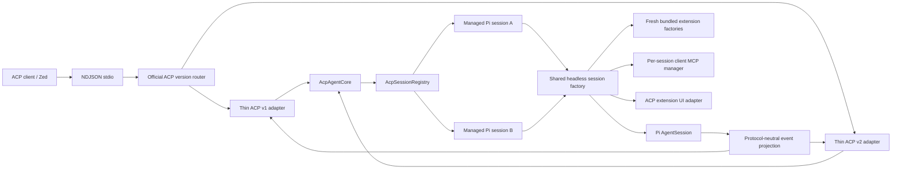

# Plan 002: Add built-in ACP v1 and feature-gated ACP v2 agent mode

> **Executor instructions**: Follow this plan in order. Each numbered slice must leave a runnable, testable vertical outcome. Do not skip session-isolation work: ACP keeps multiple live Pi sessions in one process, while several bundled extensions currently hold mutable module-global state. Use the official `@agentclientprotocol/sdk`; do not copy Oh My Pi's private ACP protocol implementation.
>
> **Drift check (run first)**: `git diff --stat 9e86aa92..HEAD -- package.json package-lock.json src/cli.ts src/remote src/extensions test openwiki README.md`
>
> **Naming assumption**: speech-to-text references to “by-acb”, “ACB”, and “OhMyBI” mean `pi acp`, Agent Client Protocol (ACP), and Oh My Pi (OMP).

## Status

- **Priority**: P1
- **Effort**: XL
- **Risk**: HIGH
- **Depends on**: none
- **Category**: feature
- **Planned at**: commit `9e86aa92`, 2026-08-07
- **Status**: TODO

## Goal

Ship a built-in stdio ACP agent mode that exposes this repository's real Pi agent, bundled extensions, tools, skills, prompt templates, slash commands, subagents, files, images, models, modes, thinking levels, and persisted sessions to ACP clients such as Zed.

Success is measurable:

- `pi acp` starts a protocol-only stdio process using official ACP SDK v1.
- `pi --mode acp` remains an alias for clients already configured around mode flags.
- `pi acp --experimental-acp-v2` enables ACP v2 negotiation while retaining v1 downgrade support.
- Without the experimental flag, a version-2 client negotiates down to stable v1.
- Every advertised v1 or v2 capability is implemented and covered by conformance tests.
- Unsupported optional capabilities are omitted rather than stubbed or falsely advertised.
- Two simultaneous sessions can use different modes, review state, context-pruning state, MCP servers, prompts, and subagents without cross-session leakage.
- Zed can initialize, create a session, send a prompt, observe text and tool calls, cancel, resume, and run a bundled slash command.

“100% compliant” in this plan means full compliance for every capability and protocol version the agent advertises. ACP optional capabilities that Pi cannot implement correctly are intentionally absent until implementation and tests exist.

## Non-goals

- Replacing Pi's TUI, JSON, print, or RPC modes.
- Reimplementing the ACP wire protocol, JSON-RPC router, framing, or version negotiation.
- Copying OMP's private ACP SDK or its protocol deviations.
- Advertising audio input before Pi/provider support and end-to-end tests exist.
- Making arbitrary TUI widgets render inside ACP clients. ACP-safe elicitation replaces interactive prompts; purely visual widgets become no-ops.
- Sandboxing arbitrary shell commands to ACP workspace roots. Path-oriented tools enforce roots; shell access remains an explicit powerful capability.
- Preserving compatibility for an unreleased local ACP API. This is a new surface.

## Decisions fixed by this plan

| Decision                | Chosen behavior                                                                                                                                                                      |
| ----------------------- | ------------------------------------------------------------------------------------------------------------------------------------------------------------------------------------ |
| Canonical command       | `pi acp`; retain `pi --mode acp` as alias.                                                                                                                                           |
| SDK                     | Pin exact `@agentclientprotocol/sdk` version `1.3.0`. Stable imports come from package root; v2 imports come from `@agentclientprotocol/sdk/experimental/v2`.                        |
| Transport               | ACP NDJSON over stdin/stdout. Stdout contains protocol frames only; logs and diagnostics use stderr.                                                                                 |
| Version routing         | Use official `v2.agentProtocolRouter().withV1(...).withV2(...)`. Never parse initialization manually.                                                                                |
| Stable default          | Register only v1 unless `--experimental-acp-v2` is present. This allows official router downgrade from requested v2 to v1.                                                           |
| Internal extension mode | Bind extensions with Pi's existing `rpc` extension mode. ACP is an external adapter, not a new upstream `ExtensionMode`.                                                             |
| Session ownership       | One process-level `AcpSessionRegistry`; one isolated managed Pi session record per ACP session ID.                                                                                   |
| Session concurrency     | Different sessions may run concurrently. Each session serializes lifecycle mutations and foreground prompt ownership.                                                                |
| v1 overlapping prompt   | Cancel active turn, wait for bounded cleanup, then run queued prompt. This matches OMP's practical policy and avoids two open foreground requests mutating one Pi session.           |
| v2 overlapping prompt   | Acknowledge immediately. Default to Pi `followUp`; namespaced `_meta["shekohex.dev/delivery"]` may request `steer` or `followUp`.                                                    |
| Local credentials       | Advertise no ACP auth methods initially. Pi continues using locally configured provider credentials. Do not claim login/logout support.                                              |
| Commands                | Central ACP command catalog combines every built-in slash command, extension command, prompt template, and skill command. TUI-only built-ins receive explicit headless adapters.     |
| Client MCP              | Per-session manager. Support stdio before advertising MCP; advertise HTTP only after its fixture test passes. Do not advertise deprecated SSE.                                       |
| Files                   | v1 uses client filesystem operations when advertised, otherwise local operations. v2 uses agent-local tools plus client-provided MCP because v2 removed client filesystem APIs.      |
| Terminals               | v1 may execute through client terminals when advertised, otherwise local shell. v2 executes locally and reports agent-owned display terminal updates.                                |
| Workspace roots         | Normalize cwd plus additional directories into a session root policy. Advertise additional directories only after every path-oriented ACP tool wrapper enforces that policy.         |
| Images                  | Accept prompt image blocks and embedded image resources; preserve tool-result images. Omit audio capability.                                                                         |
| Extension UI            | Map select, confirm, input, and editor to ACP elicitation where supported. Status, widgets, notifications, theme access, and custom TUI rendering must not block or write to stdout. |
| Optional ACP extensions | All custom protocol methods and metadata use a reverse-domain `_` namespace such as `_shekohex.dev/...` and are capability-advertised.                                               |

## Architecture

ACP must be a deep module. Transport/version adapters translate wire types only. Session construction, lifecycle, commands, MCP, permissions, content conversion, and Pi event normalization live behind one protocol-neutral core.



### Module seams

Target file names may shift to match implementation, but preserve these responsibilities:

| Module                        | Responsibility                                                                                                  |
| ----------------------------- | --------------------------------------------------------------------------------------------------------------- |
| `src/acp/command.ts`          | Parse `acp`, alias, and experimental flag before upstream CLI handling.                                         |
| `src/acp/server.ts`           | Own stdio, stderr logging, official router setup, connection disposal, and process exit.                        |
| `src/acp/core.ts`             | Protocol-neutral ACP use cases and capability-independent session operations.                                   |
| `src/acp/session-registry.ts` | Map ACP session IDs to isolated managed session records; serialize mutations and cleanup.                       |
| `src/headless/session.ts`     | Shared construction seam for remote and ACP Pi sessions with fresh extension instances.                         |
| `src/acp/session-store.ts`    | Resolve, list, create, load/resume, fork, close, delete, and replay persisted Pi sessions.                      |
| `src/acp/events.ts`           | Convert `AgentSessionEvent` into stable internal text, thought, tool, plan, usage, config, and terminal events. |
| `src/acp/content.ts`          | Convert ACP prompt blocks/resources/images to Pi content and Pi result content back to ACP-neutral content.     |
| `src/acp/commands.ts`         | Build command catalog and dispatch headless built-ins, extensions, templates, and skills.                       |
| `src/acp/config.ts`           | Mode, model, and thinking configuration; emit updates after changes.                                            |
| `src/acp/ui.ts`               | ACP elicitation and permission bridge for extension contexts.                                                   |
| `src/acp/client-bridge.ts`    | v1 client filesystem and terminal adapters with local fallback.                                                 |
| `src/acp/mcp.ts`              | Per-session client MCP lifecycle and tool registration.                                                         |
| `src/acp/roots.ts`            | Normalize and enforce cwd/additional-directory policy for path-oriented operations.                             |
| `src/acp/v1/agent.ts`         | Official v1 request/notification handlers and v1 event mapping.                                                 |
| `src/acp/v2/agent.ts`         | Official experimental v2 handlers, lifecycle state machine, and v2 event mapping.                               |

Do not let v1 and v2 own separate Pi sessions or duplicate business rules. Both adapters call the same `AcpAgentCore` and observe the same normalized event stream.

## Current state and reusable seams

### CLI and session construction

`src/cli.ts:1-49` already intercepts wrapper-owned commands before calling upstream `main()`. Add ACP interception beside remote and conductor interception, before upstream parsing can reject `acp`.

`src/remote/session.ts:1-108` already constructs an in-process `AgentSession` with `SettingsManager`, `DefaultResourceLoader`, `SessionManager`, bundled extension factories, and an RPC-mode extension context. Extract a shared headless session factory rather than building a second subtly different stack. Preserve remote behavior and tests.

`src/extensions/index.ts:1-61` is the authoritative bundled-extension catalog. Every ACP session must receive a fresh invocation of every bundled factory. Do not maintain a second ACP extension list.

### Pi APIs to use

Installed Pi `AgentSession` already exposes:

- `subscribe`, `prompt`, `steer`, `followUp`, `abort`, `waitForIdle`, and `dispose`.
- active model and thinking-level getters/setters.
- active/all tools and extension runner access.
- prompt templates, messages, session name, compaction, reload, fork, tree, and session navigation.
- events including text/thought deltas, tool execution, queue changes, `agent_end`, `agent_settled`, entry append, session info, model/thinking changes, compaction, retry, and bash execution.

`AgentSession.prompt()` already resolves extension commands, file prompt templates, and `/skill:<name>` commands. ACP dispatch should reuse this path instead of duplicating command execution.

`ExtensionRunner` exposes registered commands, registered tools, flags, and binding hooks. Use it for discovery and updates after reload.

`ResourceLoader` exposes bundled/user extensions, skills, prompt templates, AGENTS files, and reload.

`SessionManager` exposes create/open/continue/fork/list/list-all/context-building operations. Keep Pi's session files as source of truth.

Pi's built-in tools expose pluggable operations:

- `ReadOperations` provides `readFile`, `access`, and optional image MIME detection.
- `WriteOperations` provides `writeFile` and `mkdir`.
- `EditOperations` provides `readFile`, `writeFile`, and `access`.
- `BashOperations` provides streaming `exec` with abort and timeout.
- Find, grep, and list expose equivalent operation seams.

Use these upstream operation interfaces for ACP client-backed tools. Do not fork entire tool implementations.

### Extension isolation blockers

ACP exposes bugs hidden by one-session-per-process TUI usage. Audit every module-level mutable value under `src/extensions/**` and classify it as immutable constant, intentional process service, or session-local state.

Known blockers at planning baseline:

| Extension                                    | Current risk                                                                                                                           | Required change                                                                                                                                                    |
| -------------------------------------------- | -------------------------------------------------------------------------------------------------------------------------------------- | ------------------------------------------------------------------------------------------------------------------------------------------------------------------ |
| `src/extensions/modes/index.ts`              | Module-global `runtime` and `failoverRuntime` let one session's mode replace another's.                                                | Move mutable runtime into each factory invocation or a session-owned runtime object. Preserve exported immutable mode definitions and event names.                 |
| `src/extensions/review/index.ts`             | Module-global options, Pi handle, SDK, event disposer, and runtime are overwritten by later sessions.                                  | Introduce one `ReviewExtensionRuntime` per factory invocation; lifecycle cleanup belongs to that instance.                                                         |
| `src/extensions/context-prune/public-api.ts` | One module-global runtime/footer/last result creates “last session wins” behavior for compaction, goals, modes, subagents, and CoreUI. | Replace singleton with explicit session-context lookup or a `WeakMap` registry keyed by session/extension context. Register and unregister with session lifecycle. |
| `src/extensions/fff/index.ts`                | Mutable state is already factory-local.                                                                                                | Add regression coverage; no redesign unless audit finds escaping references.                                                                                       |

Intentional process-wide services must be named and documented as such, with state keyed by session ID or normalized cwd where sharing is required. Do not silently retain a mutable singleton because TUI historically had one session.

## OMP reference policy

Use OMP as behavioral and architectural prior art, not as wire implementation.

Cached checkout: `/home/coder/.cache/checkouts/github.com/can1357/oh-my-pi`

| OMP reference                                                                    | Reuse concept                                                       | Do not copy                                          |
| -------------------------------------------------------------------------------- | ------------------------------------------------------------------- | ---------------------------------------------------- |
| `packages/coding-agent/src/commands/acp.ts:1-37`                                 | Thin CLI mode entry.                                                | OMP command parser details.                          |
| `packages/coding-agent/src/modes/acp/acp-mode.ts:26-51`                          | Protocol-only stdout and disposal on disconnect.                    | OMP transport implementation.                        |
| `packages/coding-agent/src/modes/acp/acp-agent.ts:155-181,473-535`               | Managed record per session and truthful capability declaration.     | Private protocol classes/types.                      |
| `packages/coding-agent/src/modes/acp/acp-agent.ts:682-766,897-946`               | Same-session prompt serialization and bounded cancellation cleanup. | Exact queue code.                                    |
| `packages/coding-agent/src/modes/acp/acp-agent.ts:1035-1490`                     | Session create/load/resume/fork flow and replay ordering.           | OMP session internals.                               |
| `packages/coding-agent/src/modes/acp/acp-agent.ts:1493-1665`                     | Prompt content and model/mode/thinking option mapping.              | OMP-specific model registry.                         |
| `packages/coding-agent/src/modes/acp/acp-agent.ts:1860-1930`                     | Command bootstrap and session info updates.                         | OMP command names not present here.                  |
| `packages/coding-agent/src/modes/acp/acp-agent.ts:2320-2517`                     | Headless extension UI and per-session MCP lifecycle.                | Nonstandard custom methods or unnamespaced metadata. |
| `packages/coding-agent/src/modes/acp/acp-client-bridge.ts:1-145`                 | v1 client filesystem/terminal/permission bridge.                    | OMP bridge interfaces.                               |
| `packages/coding-agent/src/modes/acp/acp-event-mapper.ts:450-760`                | Tool kind/location/diff/terminal mapping policy.                    | OMP wire events.                                     |
| `packages/coding-agent/src/modes/acp/slash-commands/acp-builtins.ts:1-75`        | Separate headless command policy from TUI dispatch.                 | OMP's reduced built-in set; this plan adapts all.    |
| `packages/coding-agent/src/modes/acp/slash-commands/available-commands.ts:1-100` | One command catalog merging multiple command sources.               | OMP source-specific command loaders.                 |

OMP currently targets ACP v1 and uses a behavior-compatible private SDK. This implementation must instead use the official SDK and must not copy OMP's unnamespaced `speech.models.list` custom method.

## Official protocol references

### TypeScript SDK

Cached checkout: `/home/coder/.cache/checkouts/github.com/agentclientprotocol/typescript-sdk`

- `package.json:1-60` exports stable v1 from root and experimental v2 from `experimental/v2`.
- `README.md:17-28` marks v2 as an unstable draft requiring explicit import.
- `src/examples/agent.ts:268-307` shows official v1 handlers and NDJSON connection.
- `src/examples/dual-version-agent.ts:1-147` shows separate v1/v2 adapters behind one official router.
- `src/protocol-router.ts:51-309` owns initialization, highest-compatible-version selection, downgrade behavior, and batch framing.

Pin exact SDK version because experimental v2 may break between SDK releases. An SDK upgrade must rerun both conformance suites and Zed smoke tests.

### ACP specification

Cached checkout: `/home/coder/.cache/checkouts/github.com/zed-industries/agent-client-protocol`

Read the stable protocol pages and these v2 documents before implementation:

- `docs/protocol/v2/migration.mdx`
- `docs/protocol/v2/draft/prompt-lifecycle.mdx`
- `docs/protocol/v2/draft/transports.mdx`

Important v2 constraints:

- Prompt responds with `{}` immediately; completion arrives through `session/state_update` transitions.
- Lifecycle is `running`, optional `requires_action`, then `idle` with a stop reason.
- Message IDs are mandatory. Messages use whole-message upserts plus chunks.
- Tool creation and progress both use `tool_call_update`; first update creates the call.
- Diffs are structured add/delete/modify/move/copy changes and may include binary file metadata.
- Display terminals are agent-owned and stream base64 bytes through terminal updates.
- Permission requests require title, description, and subject.
- Client filesystem and client terminal execution APIs were removed.
- Modes were removed; config options are the only mode/model/thinking surface.
- Required session baseline is new/list/resume/close/prompt/cancel/update.
- `load` was removed; resume uses replay semantics including `replayFrom: "start"`.
- JSON-RPC request/notification batches are valid and must be handled by official routing.

## Capability matrix

| Surface                        | ACP v1                                                                   | ACP v2                                                                                      |
| ------------------------------ | ------------------------------------------------------------------------ | ------------------------------------------------------------------------------------------- |
| Initialize/version negotiation | Stable SDK adapter                                                       | Experimental SDK adapter behind flag                                                        |
| Session new/list/resume/close  | Yes                                                                      | Yes                                                                                         |
| Session load                   | Yes, with replay before response                                         | Not advertised; use resume replay                                                           |
| Session fork                   | Yes when official capability exists                                      | Advertise only if current v2 draft supports it                                              |
| Session delete                 | Optional; implement and advertise                                        | Optional; implement and advertise                                                           |
| Prompt lifecycle               | Request remains open through settled state                               | Immediate ack plus state updates                                                            |
| Cancel                         | Abort, drain, final cancelled stop                                       | Abort, drain, final idle/cancelled                                                          |
| Text/thought streaming         | Content chunks                                                           | Message upserts/chunks with stable IDs                                                      |
| Tool calls                     | Start/update/end with kind and location                                  | `tool_call_update`, content chunks, stable IDs                                              |
| Diffs                          | Text old/new or official v1 diff shape                                   | Structured changes, including binary metadata                                               |
| Client filesystem              | Use when client advertises                                               | Removed; local tools/MCP only                                                               |
| Client terminal execution      | Use when client advertises                                               | Removed; agent-owned display terminals                                                      |
| Elicitation/permissions        | Use only when client advertises                                          | Use v2 request shape and `requires_action`                                                  |
| Modes                          | Config options preferred; legacy mode only if required for compatibility | Config options only                                                                         |
| Models/thinking                | Config options and updates                                               | Config options and updates                                                                  |
| MCP                            | Per-session stdio; HTTP only after tests                                 | Per-session under v2 session capabilities                                                   |
| Additional directories         | Advertise after root enforcement                                         | Same                                                                                        |
| Images                         | Prompt and result image content                                          | Prompt and result image content                                                             |
| Audio                          | Omitted                                                                  | Omitted                                                                                     |
| Commands                       | Available-command updates plus dispatch                                  | Current v2 command surface if defined; otherwise namespaced extension advertised in `_meta` |

## Command compatibility policy

Command discovery uses one catalog with deterministic precedence matching Pi's extension runner. It must update after session creation and reload.

| Command source                  | Discovery                                                     | Invocation                                                                        |
| ------------------------------- | ------------------------------------------------------------- | --------------------------------------------------------------------------------- |
| Bundled/user extension commands | `session.extensionRunner.getRegisteredCommands()`             | `session.prompt()` so existing handlers and argument parsing remain authoritative |
| Skills                          | `resourceLoader.getSkills()` and current skill-command naming | `/skill:<name>` through `session.prompt()`                                        |
| Prompt templates                | `session.promptTemplates`                                     | Existing prompt-template expansion through `session.prompt()`                     |
| Built-in slash commands         | Explicit headless adapter table                               | Direct `AgentSession`/`SessionManager` APIs, config, auth, resources, or text     |

Audit and adapt the complete upstream built-in set: `settings`, `model`, `scoped-models`, `export`, `import`, `share`, `copy`, `name`, `session`, `changelog`, `hotkeys`, `fork`, `clone`, `tree`, `trust`, `login`, `logout`, `new`, `compact`, `resume`, `reload`, and `quit`.

Each built-in needs deterministic ACP semantics before release. Use standard session, config, auth, resource, and elicitation APIs where available. Where ACP lacks original terminal affordance, preserve command intent through text, resources, arguments, elicitation, or equivalent session operation. Examples: render hotkeys, changelog, and settings as text; return copyable content instead of mutating client clipboard; require explicit paths for import/export; map trust/login choices through elicitation; map quit to orderly session/connection closure. Do not silently drop a built-in or forward a TUI picker that can hang.

All extension commands remain discoverable, with ACP UI elicitation replacing supported interactive prompts. Commands using custom TUI surfaces need headless presentation adapters that preserve operation result even when visual chrome cannot be reproduced.

If an extension command depends on unavailable local infrastructure such as Herdr, tmux, a browser, or credentials, return an explicit command error. Never wait forever for a TUI interaction.

## Content and event policy

### Prompt input

| ACP input               | Pi input                                                                                              |
| ----------------------- | ----------------------------------------------------------------------------------------------------- |
| Text block              | Prompt text, preserving order                                                                         |
| Image block             | Pi `ImageContent` with media type and decoded data                                                    |
| Embedded text resource  | Delimited source text with URI/name metadata                                                          |
| Embedded image resource | Pi `ImageContent`, retaining source URI in adjacent text metadata when needed                         |
| Resource link           | Stable textual source reference; fetch only through an explicitly supported client/resource operation |
| Audio                   | Reject as unsupported because capability is omitted                                                   |

Validate all boundary payloads with TypeBox schemas where SDK types do not already establish runtime validity. Reject malformed base64, unsupported media types, and oversized blocks with protocol errors, not process crashes.

### Pi output

Normalize Pi events once, then map per protocol version:

- Assistant text and thought deltas.
- Tool call start, arguments, progress, result, error, kind, title, and locations.
- Tool result text, image content, diffs, and terminal output.
- Plan updates where Pi extensions emit a plan-shaped event.
- Session metadata, model, mode, thinking, and config changes.
- Usage/cost information only where ACP has a compatible field; otherwise use a namespaced advertised extension or omit.
- Compaction/retry notices only when representable without inventing standard events.

v2 message and tool IDs must be stable across live delivery and replay. Prefer persisted Pi entry IDs. For events without persisted IDs, derive deterministic IDs from session ID plus entry/tool identity and store the mapping in the managed session record until persisted identity exists.

## Session and lifecycle invariants

- Pi session ID is ACP session ID.
- Registry lookup is exact; never pick a session by filename prefix or “most recent” when an ID was supplied.
- Each managed record owns `AgentSession`, `SessionManager`, `ResourceLoader`, extension UI binding, MCP clients, event subscription, prompt queue, lifecycle state, outbound write chain, and cleanup controller.
- Session new creates a persisted Pi session unless ACP explicitly requests ephemeral behavior supported by the protocol.
- v1 load replays persisted history before its response completes.
- v1 resume attaches without replay unless the stable spec requires requested replay.
- v2 resume with replay from start sends the full ordered replay before resume completion.
- Close aborts active work, drains outbound events, unsubscribes, disposes extensions/MCP/session, and removes registry entry without deleting persisted history.
- Delete performs close first when active, resolves the exact session file, deletes idempotently, and never removes a different session.
- Connection disconnect closes all managed records with bounded cleanup.
- No v1 event may be sent after the corresponding prompt response has been written.
- Every v2 accepted prompt reaches a final `idle` state exactly once, including errors and cancellation.
- Permission requests transition v2 into `requires_action`, then back to `running` or `idle` after the answer.

## Implementation slices

### Slice 1: Boot official v1 and dual-version router shell

**Outcome**: Zed or an SDK test client can start `pi acp`, initialize v1, and create a protocol connection without stdout corruption. Experimental flag negotiates v2 but does not yet advertise session features.

Implementation:

- Add exact dependency `@agentclientprotocol/sdk: 1.3.0` to `package.json` and `package-lock.json`.
- Add CLI interception for canonical `acp`, alias `--mode acp`, and `--experimental-acp-v2`.
- Reject conflicting interactive/output modes with a clear stderr error and nonzero exit.
- Create stdio server using official NDJSON transport.
- Build separate official v1 and v2 agent adapters behind official protocol router.
- Without flag, register v1 only. With flag, register v1 and v2.
- Route every human-readable log to stderr. Guard against extension/bootstrap code writing to stdout before connection starts.
- Dispose connection and process resources when stdin closes or protocol connection ends.
- Advertise only initialization metadata actually implemented in this slice.

Tests:

- Subprocess test sends v1 initialize and verifies negotiated version `1`.
- Subprocess test requests v2 without feature flag and verifies official downgrade to `1`.
- Subprocess test requests v2 with feature flag and verifies negotiated version `2`.
- Test every stdout line parses as ACP JSON-RPC; startup diagnostics appear only on stderr.
- Test malformed startup flags exit before writing protocol frames.

Visible verification:

```bash
node dist/cli.js acp
node dist/cli.js acp --experimental-acp-v2
```

Both processes wait on stdin without banners on stdout.

### Slice 2: Make extensions session-safe and extract shared headless construction

**Outcome**: Two in-process headless Pi sessions can run simultaneously with the complete bundled extension catalog and independent mutable state. Existing remote sessions behave unchanged.

Implementation:

- Audit all `src/extensions/**` module-level mutable bindings and record classification in the implementation PR description or commit body.
- Refactor modes runtime into session-owned state.
- Refactor review runtime into session-owned state with instance cleanup.
- Replace context-prune singleton with explicit session-context registry and lifecycle unregister.
- Verify all callbacks from compaction, goals, modes, subagent bootstrap, and CoreUI resolve the correct context-prune runtime.
- Extract `src/headless/session.ts` from reusable parts of `src/remote/session.ts`.
- Parameterize session manager selection, extension UI binding, client-backed tool overrides, and extra per-session extension factories without branching remote behavior.
- Ensure every session creates fresh bundled extension factory instances from the authoritative catalog.
- Keep immutable definition catalogs process-wide; make intentional shared services explicit and keyed.

Tests:

- Start two sessions in one process, activate different modes, and assert both retain their mode and model policy.
- Start review workflows in two sessions and assert events/runtime handles do not cross.
- Trigger context pruning in one session and assert footer/last-result queries in the other remain unchanged.
- Invoke subagent/bootstrap paths in both sessions and assert each sees its own context-prune runtime.
- Dispose one session and prove the other remains functional.
- Run existing modes, review, context-prune, subagent, remote, harness, and tool-preview tests.

Visible verification:

- One test intentionally reproduces the pre-fix “last session wins” behavior and passes only after isolation.
- Existing remote mode creates and prompts a session through the extracted factory.

STOP condition: if another module-global mutable extension state cannot be safely assigned a session identity, stop and redesign the extension boundary before adding ACP concurrency.

### Slice 3: Deliver complete ACP v1 session lifecycle and one real prompt

**Outcome**: v1 client can create/list/load/resume/fork/close/delete a Pi session and complete one real streamed prompt through the bundled agent.

Implementation:

- Add protocol-neutral `AcpAgentCore`, session registry, managed record, and persisted session resolver.
- Implement v1 initialize capabilities truthfully.
- Implement session new, list, load, resume, fork, close, and delete when present in stable SDK.
- Bind full bundled extensions in RPC mode with a minimal nonblocking ACP UI adapter.
- Subscribe before prompting so no first-token or first-tool event is lost.
- Normalize text/thought events and map to v1 session updates.
- Keep v1 prompt request open through `agent_settled`, outbound update drain, and final stop reason.
- Implement active-turn cancellation with bounded wait and idempotent cleanup.
- On overlapping same-session prompt, cancel active turn, await cleanup, then run queued prompt.
- Allow different sessions to prompt concurrently.
- Use deterministic fake model/provider fixtures; do not require network credentials.

Tests:

- Lifecycle test covers new → prompt → close → list → resume → prompt → delete.
- Load test verifies ordered replay finishes before load response.
- Fork test verifies context is inherited but future entries diverge.
- Delete test proves exact-ID resolution and idempotency.
- Cancellation test verifies abort and no updates after v1 prompt response.
- Overlap test verifies first prompt cancels before second starts.
- Concurrency test verifies two sessions stream independently.
- Disconnect test verifies subscriptions, MCP placeholders, sessions, and queues dispose.

Visible verification:

- SDK client receives assistant text from a fake-model prompt and can resume same persisted session after closing it.

### Slice 4: Expose extensions, slash commands, templates, skills, and subagents

**Outcome**: ACP command discovery reflects the live Pi session, and representative bundled command, prompt template, skill, mode command, and subagent execution work end to end.

Implementation:

- Build centralized command catalog from every built-in, extension command, prompt template, and skill.
- Preserve ExtensionRunner collision/precedence behavior; add deterministic labels/descriptions.
- Publish available-command update at session bootstrap and after reload/resource changes.
- Dispatch extension commands, templates, and skill commands through `session.prompt()`.
- Implement and test a headless adapter for every built-in command listed in command compatibility policy.
- Add ACP extension UI mapping for select, confirm, input, and editor using client elicitation when advertised.
- Return explicit unsupported-interaction errors when command needs elicitation but client lacks it.
- Make status, widget, notification, theme, and custom-render operations no-op or textual without blocking.
- Verify full bundled extension factories load, including dynamic workflows, goals, GSD, image generation, executor integrations, and subagent.
- Do not invoke external services in catalog tests; use representative local commands and mocks.

Tests:

- Snapshot/catalog test compares ACP-discoverable extension commands with `ExtensionRunner` registered commands.
- Skill test invokes a bundled `/skill:<name>` command.
- Prompt-template test expands a file template.
- Mode command test changes only target session.
- Elicitation test covers select, confirm, input, editor, cancel, and unsupported client.
- Subagent test invokes actual registered `subagent` tool through ACP and observes nested output/result.
- Reload test changes available resources and emits refreshed command catalog.
- Built-in matrix test invokes every built-in adapter without opening a TUI or hanging on unavailable interaction.

Visible verification:

- Zed command palette/session command list includes live extension commands and a bundled skill.
- Invoking representative command returns output without opening a TUI.

### Slice 5: Add rich tool events, file collaboration, terminals, permissions, and images for v1

**Outcome**: v1 client sees complete tool lifecycle and can collaborate through advertised filesystem/terminal/permission capabilities; image prompts and image results survive round-trip.

Implementation:

- Normalize tool start/update/result/error events with stable tool IDs, titles, kinds, and file locations.
- Map Pi edit details to official v1 diff shape without losing old/new content.
- Convert text and image tool-result blocks to ACP content.
- Convert prompt text, image, embedded text resources, embedded image resources, and resource links according to content policy.
- Build per-session file service selecting v1 client filesystem operations when advertised and local operations otherwise.
- Override upstream read/write/edit tools through official Pi operation interfaces; preserve existing schemas and rendering-independent behavior.
- Route list/find/grep through compatible operation seams where client API can support them; otherwise retain local implementations and document that unsaved buffers only affect direct file operations.
- Route custom mutators such as patch/FFF through the same root/file abstraction where technically possible. If a mutator cannot honor client-backed content, disclose that limitation in capability docs and do not claim complete editor-buffer synchronization for it.
- Build bash operations using v1 client terminal execution when advertised, with streaming output, exit status, timeout, and cancellation. Fall back to Pi local bash operations otherwise.
- Map extension and tool permission requests to ACP only when client advertises permission support. Define deterministic fallback from repository policy: deny when explicit approval is required and no client request channel exists.
- Ensure no tool renderer or extension UI writes ANSI/TUI output to stdout.

Tests:

- Fake v1 client serves unsaved file text; read and edit operate on client version and write back.
- Local fallback test works with no client filesystem capability.
- Terminal fixture streams stdout/stderr, returns exit code, handles timeout, and cancels.
- Tool mapper tests read, write, edit, delete-like patch, bash, search, generic extension tool, error, image result, and multi-location result.
- Permission fixture tests allow, deny, cancel, and unavailable capability.
- Prompt content tests text/image/resource ordering, invalid base64, unsupported media, and size limit.
- Image generation extension fixture emits image content without binary corruption.

Visible verification:

- Editing an unsaved Zed buffer through read/edit uses client-visible content when Zed advertises v1 filesystem support.
- Tool cards show running/completed/error states and file locations.

### Slice 6: Add workspace roots and per-session client MCP

**Outcome**: ACP sessions honor cwd/additional directories for path tools and can use isolated client-supplied MCP tools without leaking processes or names across sessions.

Implementation:

- Add `WorkspaceRoots` value object that resolves absolute cwd and additional directories, rejects relative/duplicate/invalid entries, and performs symlink-aware containment checks for existing paths.
- Apply root checks to every ACP-wrapped path read/write/edit/list/find/grep/patch/FFF operation.
- Validate parent directories before creating new files so `..` and symlink escapes fail.
- Document shell as unsandboxed; do not represent root policy as a shell sandbox.
- Advertise additional-directory capability only after enforcement tests cover every registered path-oriented ACP wrapper.
- Create one client MCP manager per managed session using existing `@modelcontextprotocol/sdk`.
- Support stdio server descriptors first; add HTTP only if official ACP descriptor, MCP SDK transport, cleanup, and fixture tests all pass.
- Omit deprecated SSE.
- Register MCP tools into target session with TypeBox schemas and abort propagation.
- Preserve tool names when unique. On collision, prefix with sanitized server name and expose final mapping in session metadata/logs.
- Existing bundled tools win collisions; never replace them silently.
- Disconnect MCP clients on reconfiguration, session close/delete, protocol disconnect, and failed initialization.

Tests:

- Root tests cover cwd, additional directory, sibling prefix, `..`, symlink escape, create-parent escape, and duplicate normalization.
- Capability test proves additional directories remain omitted if any enforcement adapter is disabled.
- Two-session MCP test loads different same-named tools and proves isolation.
- Stdio MCP fixture covers initialize, list tools, invoke, cancellation, process exit, and cleanup.
- HTTP MCP fixture is mandatory before HTTP is advertised.
- Collision test proves bundled tool remains intact and client tool receives deterministic prefixed name.
- Failed MCP startup returns session-scoped error without killing server or other sessions.

Visible verification:

- ACP client supplies a fixture MCP server and model invokes its tool in one session only.
- Path tool outside configured roots fails with explicit boundary error.

STOP condition: if every path-oriented tool cannot share or enforce the root policy, do not advertise additional directories. Keep cwd-only behavior truthful and record blocker.

### Slice 7: Add model, mode, thinking, metadata, usage, and plan updates

**Outcome**: client can inspect and change supported session configuration, and receives live updates when commands/extensions change it.

Implementation:

- Build config options from live model registry, local mode definitions, and `AgentSession` thinking levels.
- Apply mode through existing mode extension event/API, not by duplicating mode internals.
- Apply model and thinking through `AgentSession` setters and upstream validation.
- Publish config updates after direct ACP changes and after slash commands/extensions change mode/model/thinking.
- Prefer v1 config options. Expose legacy v1 modes only if required by stable-client compatibility and keep values synchronized.
- v2 uses config options only.
- Publish session title/name, cwd, active model, mode, thinking, and available commands through standard session info fields where available.
- Map usage/cost and plan updates only to compatible standard fields. Any custom metadata must be namespaced and advertised.
- Do not leak provider secrets, auth tokens, environment values, or full settings objects.

Tests:

- Option list reflects available models/modes/thinking levels from fixture session.
- Setting each option changes only target session and emits one update.
- Slash-command-driven mode/model change emits equivalent config update.
- Invalid/stale option returns protocol error without changing state.
- Session metadata redaction test detects secret-like fixture values.
- Usage/plan mapper tests cover present and absent protocol fields.

Visible verification:

- Zed session configuration can change model, mode, and thinking level and subsequent prompt uses selected values.

### Slice 8: Harden and prove stable ACP v1 compliance

**Outcome**: stable v1 is production-ready before v2 work expands. Capability matrix, lifecycle ordering, and failure cleanup are proven through official SDK fixtures and subprocess tests.

Implementation:

- Build conformance harness with official SDK client over in-memory duplex and real subprocess stdio.
- Verify every initialized capability has positive and negative-path coverage.
- Add bounded outbound write queue and make response ordering explicit.
- Ensure JSON-RPC errors preserve request IDs and never become stdout logs.
- Handle client disconnect, malformed requests, unsupported methods, prompt exceptions, extension exceptions, model errors, MCP failures, and cancellation races without orphaning state.
- Add payload limits for image/resource blocks and replay volume consistent with protocol/server constraints.
- Add stderr structured diagnostics including connection/session IDs but no prompt contents or secrets by default.
- Document stable ACP setup and capability matrix in `openwiki` and user-facing README only after behavior passes.

Tests:

- Assert no session update is written after v1 prompt response.
- Race cancel against settle, tool completion, permission answer, client disconnect, and second prompt.
- Replay long session with tool/image entries and preserve order.
- Exercise all advertised filesystem, terminal, elicitation, permission, MCP, command, config, and session capabilities.
- Run stdout-hygiene test with all bundled extensions enabled.
- Run resource leak test over repeated new/prompt/close cycles and assert no lingering child process, subscription, or timer owned by ACP.

Visible verification:

- Stable `pi acp` passes full v1 suite without experimental flag.
- Capability snapshot is reviewed against official stable schema and matches tests one-for-one.

STOP condition: do not enable v2 in documentation or Zed configuration until stable v1 suite is green.

### Slice 9: Implement feature-gated ACP v2 lifecycle on shared core

**Outcome**: experimental v2 client can negotiate v2, create/list/resume/close/delete sessions, prompt with immediate ack, observe lifecycle state, and cancel.

Implementation:

- Implement v2 adapter using official experimental SDK types only.
- Reuse existing `AcpAgentCore`, registry, session store, content conversion, command/config services, MCP manager, and normalized events.
- Implement required v2 session baseline: new, list, resume, close, prompt, cancel, and update.
- Implement optional delete and advertise only after tests.
- Do not implement or advertise v1-only load or modes.
- Prompt handler validates/enqueues work and returns `{}` immediately.
- Emit `running` before turn output, `requires_action` during permissions/elicitation, and one final `idle` with correct stop reason.
- Default prompt arriving while running to Pi `followUp`.
- Add namespaced `_meta["shekohex.dev/delivery"]` for explicit `steer`/`followUp`, with corresponding namespaced capability metadata.
- Implement v2 resume replay from start with stable message/tool IDs and ordered completion before response semantics required by current draft.
- Let official router handle batches and mixed request/notification framing.

Tests:

- Negotiation remains v1 without flag and v2 with flag.
- Prompt response arrives before first asynchronous content update.
- Lifecycle ordering is running → optional requires_action → running → idle.
- Error and cancellation each reach idle exactly once with correct stop reason.
- Second prompt defaults to follow-up; namespaced steer is immediate and isolated to same session.
- Resume replay uses stable IDs equal to prior live delivery IDs.
- Official batch fixture sends batched requests and notifications through router.
- v1 suite remains unchanged and green with v2 code present.

Visible verification:

- Experimental SDK client completes a prompt and observes asynchronous idle completion while same binary still serves v1 clients.

### Slice 10: Complete ACP v2 messages, tools, diffs, terminals, permissions, MCP, and commands

**Outcome**: v2 offers parity with every compatible v1 feature using v2-native semantics, not v1 emulation.

Implementation:

- Map assistant/user messages to whole-message upserts plus chunks with mandatory IDs.
- Map first tool event to `tool_call_update` creation and later events to updates/content chunks.
- Convert edit/patch results into structured add/delete/modify/move/copy changes with file type and optional git patch.
- Represent binary/image mutations without invented textual diffs.
- Create agent-owned display terminals for local bash calls; stream base64 bytes and final exit status.
- Implement v2 permission shape with title, description, and subject; connect state transitions to `requires_action`.
- Use local file operations in v2; do not call removed client filesystem APIs.
- Use local bash/display terminals in v2; do not call removed client terminal-execution APIs.
- Expose client MCP under v2 session capabilities and preserve per-session lifecycle.
- Expose mode/model/thinking through config options only.
- If current v2 draft lacks standard command discovery, expose commands through a namespaced method/capability only after validating extension naming rules. Do not reuse an unnamespaced v1 method.
- Audit current SDK/spec at implementation time because v2 is unstable; update this adapter only, keeping core stable.

Tests:

- Message tests cover whole upsert, incremental chunks, replay, and stable IDs.
- Tool tests cover create/update/content/error/cancel and no duplicate creation.
- Diff tests cover add, delete, modify, move, copy, binary, and git patch fields.
- Terminal test verifies exact byte round-trip, non-UTF8 bytes, exit code, cancellation, and terminal close.
- Permission test verifies shape and lifecycle state.
- Assert no v2 request uses removed client fs, terminal execution, load, or modes APIs.
- MCP and command tests run through v2 session capability negotiation.
- All v1 tests run in same CI job to detect shared-core regressions.

Visible verification:

- Experimental client renders text, tool cards, structured file changes, and live terminal output from one prompt.

### Slice 11: Zed smoke, documentation, release gates, and maintenance notes

**Outcome**: documented Zed configuration works against built artifact; repository quality gates pass; future maintainers know v1/v2 boundaries and upgrade procedure.

Implementation:

- Add concise README/OpenWiki instructions for Zed custom agent command `pi` with args `["acp"]`.
- Document optional experimental args `["acp", "--experimental-acp-v2"]` only if target Zed build supports v2 negotiation.
- Document local credential expectation, cwd behavior, additional directories, client MCP, supported commands/content, and omitted audio.
- Add architecture note explaining official router, shared core, per-session isolation, and v2 feature gate.
- Add protocol capability matrix generated or checked from tests to reduce documentation drift.
- Add maintenance note: exact SDK pin, deliberate upgrade procedure, v2 spec reread, dual conformance suite, and Zed smoke requirement.
- Add troubleshooting for stdout contamination, missing local credentials, MCP startup, unsupported elicitation, and root rejection.
- Do not include machine-specific absolute checkout paths in user docs; those references remain implementation-plan evidence only.

Automated verification:

```bash
npm run typecheck
npm test
npm run lint
npm run format:check
npm run test:subagent
npm run test:harness
npm run test:tool-preview
npm run build
```

Manual Zed smoke:

1. Build/install current repository's `pi` binary.
2. Configure Zed custom ACP agent with command `pi` and args `acp`.
3. Open repository and create new agent session.
4. Confirm initialize and session creation produce no protocol parsing errors.
5. Send prompt that reads a file, edits it, and runs a short shell command.
6. Confirm text, tool cards, file locations/diff, and terminal output render.
7. Invoke one bundled extension command and one `/skill:<name>` command.
8. Invoke subagent tool through a deterministic prompt and confirm result returns.
9. Send image prompt and confirm model receives image when selected provider supports vision.
10. Cancel a long-running prompt and confirm session remains usable.
11. Close and resume session; confirm persisted history/replay behavior.
12. Open second concurrent session with different mode/model and prove first session remains unchanged.
13. Repeat with experimental v2 flag only on Zed build that negotiates ACP v2.

Record Zed version, negotiated protocol version, model/provider, and smoke result in PR validation notes. Do not claim v2 Zed support if available Zed release negotiates only v1.

## Test organization

Prefer focused files under existing test conventions. Suggested grouping:

| Test area                       | Suggested file                                                      |
| ------------------------------- | ------------------------------------------------------------------- |
| CLI/stdio/version routing       | `test/acp/stdio.test.ts`                                            |
| Session lifecycle and replay    | `test/acp/sessions.test.ts`                                         |
| Prompt/cancel/concurrency       | `test/acp/prompts.test.ts`                                          |
| Extension isolation             | `test/acp/extension-isolation.test.ts` plus focused extension tests |
| Commands/skills/templates       | `test/acp/commands.test.ts`                                         |
| Content/images                  | `test/acp/content.test.ts`                                          |
| Tools/diffs/terminals           | `test/acp/tools.test.ts`                                            |
| Client filesystem/permission UI | `test/acp/client-bridge.test.ts`                                    |
| MCP/root policy                 | `test/acp/mcp.test.ts`, `test/acp/roots.test.ts`                    |
| Config/session metadata         | `test/acp/config.test.ts`                                           |
| v2 lifecycle and messages       | `test/acp/v2.test.ts`                                               |
| Official capability conformance | `test/acp/conformance.test.ts`                                      |

Use in-memory duplex streams for precise ordering assertions and subprocess tests for stdout/stderr/process lifecycle. Use fake models, fake ACP clients, temporary session directories, and fixture MCP servers. No network or real provider credentials in automated tests.

## Security and reliability checklist

- Protocol stdout never contains logs, banners, ANSI, tool output, extension output, or stack traces.
- All external structured data crossing ACP/MCP boundaries is runtime-validated with SDK schemas or TypeBox.
- Image/resource sizes and base64 decoding are bounded.
- Session IDs resolve exactly and cannot select arbitrary files.
- Path-oriented tools normalize and enforce configured roots before operation.
- Symlink and create-parent escapes are tested.
- Shell capability is documented as unsandboxed.
- MCP child processes and transports terminate on every cleanup path.
- Permission denial and unavailable-client behavior are deterministic.
- Secrets never appear in metadata, errors, logs, replay, or capability payloads.
- Every async listener/subscription has one owner and one disposal path.
- Cancellation is idempotent and bounded.
- v2 lifecycle reaches final idle once.
- All custom protocol methods/metadata are reverse-domain namespaced and advertised.

## Definition of done

- All eleven vertical slices pass their stated tests and visible verification.
- Stable v1 works without any experimental flag.
- Experimental v2 cannot activate accidentally and always retains v1 downgrade.
- Capability snapshots match implementations and tests exactly.
- Full bundled extension catalog loads in every ACP session.
- Every built-in slash command plus representative custom command, skill, prompt template, subagent, file, image, MCP, mode, model, thinking, permission, and terminal paths pass end to end.
- Extension-isolation regression tests prove no cross-session mutable-state leakage.
- Existing TUI, remote, conductor, extension, subagent, harness, and tool-preview behavior remains green.
- Zed v1 smoke passes against built artifact.
- Zed v2 smoke is recorded only if available client supports v2.
- README/OpenWiki describe real behavior and limitations.
- `plans/README.md` marks Plan 002 `DONE` only after all automated gates and required v1 Zed smoke pass.

## STOP conditions

- Official SDK installed version no longer exports stable v1 root plus `experimental/v2`: stop and re-plan imports/router against current SDK.
- Current ACP v2 draft materially differs from references above: update v2 slices before coding adapter behavior.
- Session isolation cannot be established for a bundled extension: stop before enabling concurrent ACP sessions.
- A capability cannot be implemented without lying about semantics: omit it and update matrix; do not stub it.
- Additional-directory enforcement cannot cover all path-oriented ACP wrappers: do not advertise capability.
- HTTP MCP fixture does not pass: advertise stdio MCP only.
- Zed-specific behavior conflicts with official ACP: preserve protocol compliance and document/client-report Zed issue rather than adding an unnamespaced deviation.

## Git workflow

Keep slices independently reviewable where practical. Suggested commit sequence:

1. `feat(acp): add official sdk server entrypoint`
2. `fix(extensions): isolate headless session state`
3. `feat(acp): add v1 session lifecycle`
4. `feat(acp): expose commands skills and subagents`
5. `feat(acp): bridge v1 tools files and images`
6. `feat(acp): add roots and client mcp`
7. `feat(acp): add session configuration updates`
8. `test(acp): prove stable v1 conformance`
9. `feat(acp): add feature-gated v2 lifecycle`
10. `feat(acp): complete v2 rich updates`
11. `docs(acp): add zed setup and maintenance guide`

Before each commit, run focused tests for that slice. Before final commit/PR, run every repository gate listed in Slice 11. Read git-committing and creating-pull-requests skills if commit or PR creation is requested.

## Rejected alternatives

- **Copy OMP's ACP implementation**: rejected because OMP uses its own behavior-compatible SDK, targets v1, and includes at least one unnamespaced custom method.
- **Implement custom JSON-RPC/version router**: rejected because official SDK already handles initialization, downgrade, and v2 batches.
- **Create separate v1 and v2 agent cores**: rejected because lifecycle, sessions, extensions, MCP, content, and permissions would drift.
- **Add `acp` to upstream Pi `ExtensionMode`**: rejected because bundled extensions already have a headless `rpc` behavior and ACP belongs at transport boundary.
- **Load a reduced extension set**: rejected because user explicitly requires all local agent functionality and session isolation can be fixed without disabling intended features.
- **Run one process per ACP session**: rejected because ACP connection owns multiple sessions and clients expect list/resume/concurrency within one agent connection.
- **Forward every upstream slash command unchanged**: rejected because many built-ins are TUI-only. Every command instead receives a tested headless adapter preserving its intent.
- **Advertise optional capabilities with “unsupported” responses**: rejected as noncompliant capability negotiation.
- **Make v2 default immediately**: rejected because v2 is explicitly experimental and its SDK API may break between releases.
- **Use v1 client filesystem/terminal calls in v2**: rejected because v2 removed those APIs.
