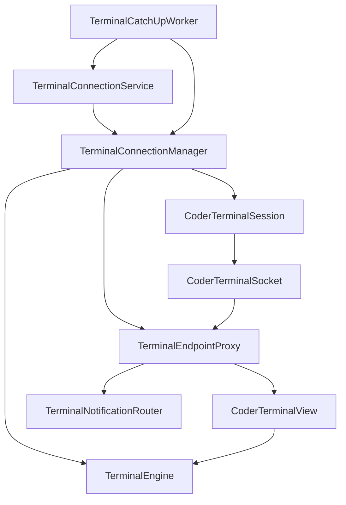

# Android Background Terminal Refactor

## Goal

Make terminal sessions survive UI lifecycle changes, support background operation, route notifications/replies by terminal id, and reduce native/view coupling.

## High-Level Result

Terminal runtime ownership moved out of `CoderTerminalView` into a manager/service architecture.

Visible UI now attaches to an existing terminal engine instead of owning terminal state directly.

Headless/background mode uses same terminal engine model, so output can continue without a renderer.

Native terminal state and native renderer handles are split.

## Main Architecture



## Key Files

- `TerminalEngine.kt`: owns native terminal state handle.
- `CoderTerminalView.kt`: owns renderer handle and UI gestures/rendering.
- `TerminalConnectionManager.kt`: owns runtime sessions by `terminalId`.
- `TerminalEndpointProxy.kt`: hot-swaps visible/headless endpoints without reconnecting socket.
- `CoderHeadlessTerminalEndpoint.kt`: consumes terminal output without UI and routes OSC notifications.
- `TerminalConnectionService.kt`: foreground service for background terminals.
- `TerminalCatchUpWorker.kt`: WorkManager recovery/catch-up path.
- `TerminalNotificationRouter.kt`: background notification posting.
- `TerminalNotificationFormat.kt`: shared notification formatting/channel/id logic.
- `coder_jni.cpp`: split JNI terminal/renderer handles.
- `coder_renderer.cpp`: GL resource cleanup.

## Refactor Steps

### 1. Extracted Terminal Endpoint Interface

Added `CoderTerminalEndpoint` so `CoderTerminalSession` talks to an abstract endpoint instead of `CoderTerminalView` directly.

This enabled both visible and headless endpoints.

### 2. Added Headless Terminal Engine

Added `TerminalEngine` to own native terminal state independent of any `GLSurfaceView`.

It handles:

- remote output feed
- title/pwd/bell state
- OSC event consumption
- terminal disposal

### 3. Added Headless Endpoint

Added `CoderHeadlessTerminalEndpoint` for background sessions.

It feeds output into `TerminalEngine` and routes OSC notification/progress events through `TerminalNotificationRouter`.

### 4. Added Terminal Connection Manager

Added `TerminalConnectionManager` as central owner for runtime sessions.

It provides:

- `startHeadless`
- `startVisible`
- `detachRenderer`
- `stop`
- `stopAll`
- `sendInput`
- `engineFor`

Visible session construction moved behind manager APIs.

### 5. Added Endpoint Proxy

Added `TerminalEndpointProxy` so existing socket/session can keep running while UI endpoint changes.

This fixed the earlier reconnect-on-attach problem.

Important behavior:

- remote socket stays bound to proxy
- proxy forwards output to current endpoint
- visible endpoint can swap to headless endpoint on detach
- visible endpoint can reattach without reconnecting

### 6. Separated Detach From Close

`detachRenderer()` no longer stops session.

`stop()` is now explicit terminal close.

This matters because UI lifecycle detach should not kill socket/engine.

### 7. Added Background Service And Catch-Up Worker

Added `TerminalConnectionService` foreground service to keep manager-owned sessions alive when background terminals are enabled.

Added `TerminalCatchUpWorker` for periodic recovery. It attempts foreground service start, with fallback to direct headless reconnect if service start is denied.

### 8. Added Background Terminals Setting

Added user setting backed by `background_terminals` preference.

When enabled:

- app schedules catch-up worker
- app starts foreground service on background transition when terminals exist

### 9. Routed Notifications And Inline Replies By Terminal Id

Notifications now include `terminalId`.

`TerminalNotificationReplyReceiver` routes replies through `TerminalConnectionManager.sendInput(terminalId, text)`.

Old view-global fallback reply routing was removed.

### 10. Fixed Native Ownership

Split native state into separate handles:

- terminal handle via `nativeInitTerminal` / `nativeDisposeTerminal`
- renderer handle via `nativeInitRenderer` / `nativeDisposeRenderer`

`TerminalEngine` owns terminal handle.

`CoderTerminalView` owns renderer handle.

Rendering bridges both handles via:

- `nativeRendererSurfaceChanged(terminalHandle, rendererHandle, ...)`
- `nativeRendererDrawFrame(terminalHandle, rendererHandle)`

### 11. Fixed GL Resource Cleanup

Added `CoderRenderer::releaseGlResources()`.

Renderer now deletes:

- VBOs
- VAOs
- GL programs

`init()` releases existing GL resources before reinitializing.

### 12. Fixed Kotlin Lifecycle Leaks

`CoderTerminalSession.stop()` now cancels IO/main coroutine scopes after closing socket and publishing final disconnected state.

Session state used across callbacks is `@Volatile`.

Network loss now clears socket and detaches remote input so reconnect can happen on network return.

### 13. Fixed Detached Renderer Ownership

When visible UI detaches, manager swaps endpoint to `CoderHeadlessTerminalEndpoint` using same `TerminalEngine`.

This prevents output from being delivered to disposed UI.

Engine ownership is explicit through `ownsEngine` to avoid double-free or leaked terminal handles.

### 14. Fixed Retry Lifecycle

Retry now stops old runtime, detaches/disposes old view, creates a fresh `CoderTerminalView`, and starts visible session through manager.

This avoids reusing a view whose native engine was already disposed.

## Tests Added

### Unit Tests

`TerminalEndpointProxyTest` covers:

- remote input moves to new endpoint
- latest remote input callback is used after reconnect
- output targets current endpoint only
- detach affects only active endpoint

### Instrumentation Tests

`DebugWorkflowInstrumentedTest` covers:

- debug render deep link shows OSC debug surface
- debug render posts OSC notification while backgrounded
- debug render posts OSC progress notification while backgrounded

Uses UIAutomator because notification shade and Compose/debug UI are system-level workflows.

## Verification Run

Final gate passed:

```bash
./gradlew :app:testDebugUnitTest :app:connectedDebugAndroidTest :app:lintDebug :app:assembleRelease
```

Manual emulator checks performed:

- installed debug app
- launched `MainActivity`
- opened `pi://debug/render`
- verified GL renderer initialized
- rotated emulator
- backgrounded/foregrounded app
- checked logcat for app/native crashes

## Known Limitations

No authenticated Coder backend/session was available in emulator.

So these paths were not fully end-to-end verified against real backend:

- actual workspace terminal WebSocket
- real background terminal persistence through Coder reconnect token
- inline reply into real remote shell

The architecture supports these paths, and debug/local notification/runtime paths were tested, but real backend validation still needs credentials/workspace.

## Confidence

Code-level loopholes found during audit were fixed.

Current confidence is high for architecture and emulator-tested flows.

Absolute 100% confidence is not honest without real backend/device matrix testing.
