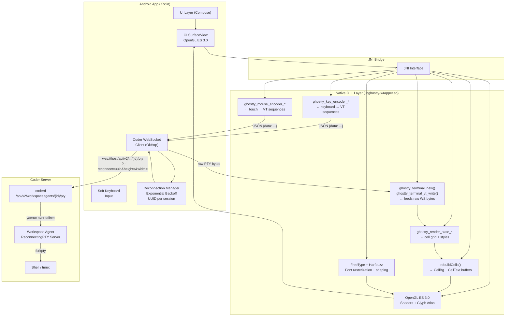
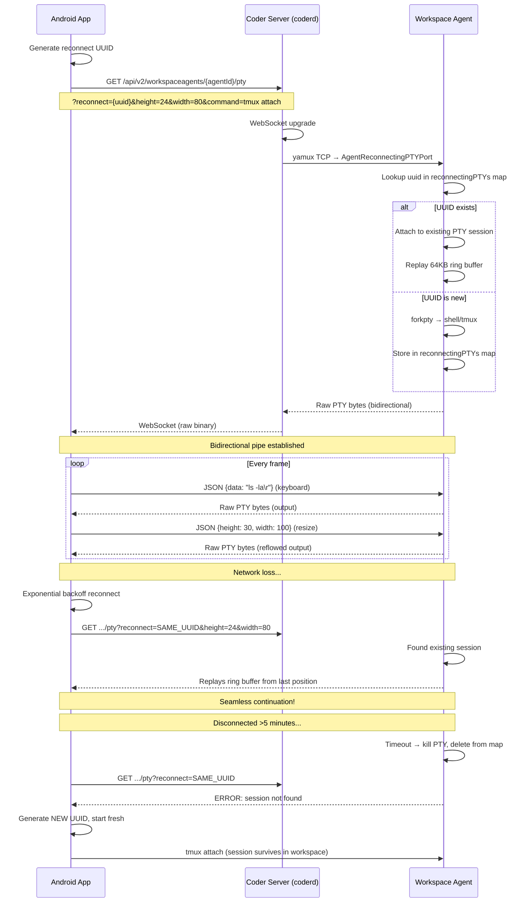

# Coder Terminal — Android App Plan

> A terminal emulator for Android using libghostty-vt and the Coder WebSocket API,
> with GPU-accelerated rendering via OpenGL ES 3.x.

---

## Table of Contents

1. [Repositories Explored](#1-repositories-explored)
2. [Key File Paths & Discoveries](#2-key-file-paths--discoveries)
3. [Architecture Diagram](#3-architecture-diagram)
4. [Decisions (Locked)](#4-decisions-locked)
5. [The Rendering Pipeline](#5-the-rendering-pipeline)
6. [Coder WebSocket Protocol](#6-coder-websocket-protocol)
7. [Implementation Phases](#7-implementation-phases)
8. [Cross-Compilation Strategy](#8-cross-compilation-strategy)
9. [Appendix: Key References](#9-appendix-key-references)

---

## 1. Repositories Explored

### 1.1 `coder/coder`

| Aspect | Detail |
|--------|--------|
| **URL** | `https://github.com/coder/coder.git` |
| **Clone** | `git clone --depth 1 --single-branch https://github.com/coder/coder.git` |
| **Language** | Go (backend), TypeScript/React (frontend) |
| **Purpose** | Coder workspace manager — provides the WebSocket PTY endpoint |

### 1.2 `ghostty-org/ghostty`

| Aspect | Detail |
|--------|--------|
| **URL** | `https://github.com/ghostty-org/ghostty.git` |
| **Clone** | `git clone --depth 1 --single-branch https://github.com/ghostty-org/ghostty.git` |
| **Language** | Zig (core), C (public API header), Swift (macOS GUI) |
| **Purpose** | Terminal emulator with an embeddable C library (`libghostty-vt`) |

### 1.3 `ghostty-org/ghostling`

| Aspect | Detail |
|--------|--------|
| **URL** | `https://github.com/ghostty-org/ghostling.git` |
| **Clone** | `git clone --depth 1 --single-branch https://github.com/ghostty-org/ghostling.git` |
| **Language** | C (single-file), CMake build |
| **Purpose** | **Minimal C example** using `libghostty-vt` + Raylib for rendering. Directly analogous to what we're building for Android. |

---

## 2. Key File Paths & Discoveries

### 2.1 From `coder/coder/`

```
coder/
├── agent/reconnectingpty/
│   ├── server.go              ← TCP server that accepts PTY connections
│   ├── reconnectingpty.go     ← ReconnectingPTY interface + New() factory
│   ├── buffered.go            ← Default backend: 64KB ring buffer + multiplex
│   └── screen.go              ← Linux-only screen(1) backend
├── codersdk/workspacesdk/
│   ├── agentconn.go           ← AgentConn interface + ReconnectingPTY init
│   │   Lines 199-214: AgentReconnectingPTYInit struct
│   │   Lines 240-252: ReconnectingPTY() implementation
│   └── workspacesdk.go        ← Workspace agent WebSocket dialer
│       Lines 340-420: AgentReconnectingPTY() HTTP → WebSocket upgrade
├── coderd/workspaceapps/
│   └── proxy.go               ← HTTP handler for /api/v2/workspaceagents/{id}/pty
│       Lines 704-800: workspaceAgentPTY() — WebSocket accept + Bicopy
├── site/src/modules/terminal/
│   ├── WorkspaceTerminal.tsx   ← Frontend xterm.js component
│   ├── terminalConfig.ts
│   └── types.ts
├── site/src/utils/
│   ├── terminal.ts             ← terminalWebsocketUrl() builder
│   ├── reconnectingWebSocket.ts ← Exponential backoff WebSocket
│   └── connection.ts           ← Connection type helpers
└── site/package.json           ← "@xterm/xterm": "5.5.0" (NOT libghostty)
```

**Key Protocol Details:**

```go
// AgentReconnectingPTYInit — sent once to start/reconnect a session
// File: agentconn.go:199-214
type AgentReconnectingPTYInit struct {
    ID           uuid.UUID   // reconnection key
    Height       uint16
    Width        uint16
    Command      string      // "" → default shell
    Container    string      // Docker container support
    ContainerUser string
    BackendType  string      // "buffered" | "screen"
}

// ReconnectingPTYRequest — sent from client → server over WebSocket
// File: agentconn.go:117-120
type ReconnectingPTYRequest struct {
    Data   string `json:"data,omitempty"`    // keyboard input
    Height uint16 `json:"height,omitempty"`  // resize
    Width  uint16 `json:"width,omitempty"`   // resize
}

// Server→Client: raw PTY bytes (NOT JSON!)
```

| Parameter | Value |
|-----------|-------|
| WebSocket URL | `wss://{host}/api/v2/workspaceagents/{agentId}/pty` |
| Query params | `reconnect={uuid}&height={}&width={}&command={}&backend_type=` |
| Auth | `Cookie: coder_session_token=...` or signed token query param |
| Reconnect timeout | **5 minutes** (hardcoded, not configurable via env) |
| Backend auto-detect | Linux with `screen` installed → `"screen"`, else `"buffered"` |
| Buffer | 64KB circular buffer (`github.com/armon/circbuf`) |
| Multiple connections | Supported — all get output simultaneously |

### 2.2 From `ghostty-org/ghostty/`

```
ghostty/
├── include/
│   └── ghostty.h                   ← Main C API header (1207 lines)
│   └── ghostty/
│       └── vt/
│           ├── terminal.h          ← GhosttyTerminal, vt_write, effects
│           ├── screen.h            ← GhosttyCell, GhosttyRow, queries
│           ├── style.h             ← GhosttyStyle (bold, italic, colors)
│           ├── color.h             ← Color types
│           ├── key.h               ← Keyboard input types
│           ├── key/
│           │   └── encoder.h       ← GhosttyKeyEncoder
│           ├── mouse/
│           │   └── encoder.h       ← GhosttyMouseEncoder
│           ├── point.h             ← Coordinate/selection types
│           ├── modes.h             ← Terminal modes
│           ├── selection.h         ← Text selection
│           ├── wasm.h              ← WASM alloc helpers
│           ├── allocator.h         ← Custom allocator
│           └── build_info.h        ← Build info queries
├── src/
│   ├── renderer/
│   │   ├── generic.zig            ← GenericRenderer — the shared GPU pipeline
│   │   ├── Metal.zig              ← Metal backend (macOS/iOS)
│   │   ├── OpenGL.zig             ← OpenGL backend (Linux/GTK)
│   │   ├── WebGL.zig              ← WebGL backend (browser)
│   │   ├── cell.zig               ← Cell GPU buffer structure
│   │   ├── cursor.zig
│   │   ├── message.zig
│   │   ├── size.zig
│   │   ├── image.zig
│   │   ├── link.zig
│   │   └── metal/                 ← Metal-specific: Target, Frame, Pipeline, shaders
│   ├── font/
│   │   ├── main.zig               ← Font system
│   │   ├── face/
│   │   │   ├── freetype.zig       ← FreeType font loading
│   │   │   └── coretext.zig       ← CoreText font loading (macOS)
│   │   ├── shaper/                ← Text shaping (Harfbuzz/CoreText)
│   │   └── SharedGrid.zig         ← GPU texture atlas
│   ├── terminal/
│   │   └── main.zig               ← Core terminal state machine
│   ├── apprt/
│   │   ├── embedded.zig           ← Embedded runtime (the one we care about)
│   │   └── surface.zig            ← Surface abstraction
│   └── lib_vt.zig                 ← Library entry point
├── example/
│   ├── c-vt-cmake-cross/          ← CMake cross-compilation example
│   │   ├── CMakeLists.txt         ← How to cross-compile with zig cc
│   │   └── src/main.c
│   ├── c-vt-grid-traverse/        ← Grid traversal example
│   ├── c-vt-paste/                ← Paste handling
│   ├── wasm-vt/                   ← WASM browser terminal example
│   ├── wasm-key-encode/           ← WASM key encoding
│   └── wasm-sgr/                  ← WASM SGR parser
└── dist/cmake/
    └── GhosttyZigCompiler.cmake   ← CMake helper for zig cc cross-compilation
```

### 2.3 From `ghostty-org/ghostling/`

```
ghostling/
├── main.c                         ← Single-file C terminal (1605 lines)
├── CMakeLists.txt                 ← CMake build: raylib + libghostty-vt
├── bin2header.cmake               ← Embed TTF font as C header
├── fonts/
│   └── JetBrainsMono-Regular.ttf  ← Bundled monospace font
├── AGENTS.md
└── README.md
```

**Ghostling's architecture maps directly to our Android app:**

```
main.c structure:
├── PTY helpers (forkpty, pty_read, pty_write)
├── Input handling (keyboard → GhosttyKeyEncoder, mouse → GhosttyMouseEncoder)
├── Scrollbar handling (drag-to-scroll)
├── Kitty graphics protocol support (image rendering)
├── Rendering (render_terminal via RenderState + row/cell iterators)
├── Effects callbacks (write_pty, size, device_attributes, title_changed)
└── Main loop (poll pty → ghostty_terminal_vt_write → render → check input)
```

The key difference: Ghostling uses **CPU-based Raylib 2D rendering** (`DrawTextEx` per cell). We will replace that with **GPU-based OpenGL ES 3.x** — the same approach Ghostty itself uses for Metal/OpenGL.

---

## 3. Architecture Diagram



---

## 4. Decisions (Locked)

| # | Decision | Rationale | Source |
|---|----------|-----------|--------|
| 1 | **Use libghostty-vt C API** (not WASM/WebView) for VT processing | Full native integration, zero WebView overhead, direct JNI access | `ghostty/include/ghostty.h`, `ghostling/main.c` |
| 2 | **OpenGL ES 3.x + GLSurfaceView** for rendering | Mirrors Ghostty's own GPU pipeline (Metal on macOS, OpenGL on Linux). GPU-accelerated text via glyph atlas + shaders. Available on virtually all Android devices since ~2013. | `ghostty/src/renderer/generic.zig`, `ghostty/src/renderer/OpenGL.zig` |
| 3 | **FreeType + Harfbuzz** for font rasterization/shaper | Ghostty's own font pipeline on Linux. Gives us full control over glyph atlas, subpixel positioning, ligature support. | `ghostty/src/font/face/freetype.zig` |
| 4 | **WebSocket in Kotlin** (OkHttp), not C++ | Simpler, no need for a C++ HTTP/WS stack. OkHttp has built-in WebSocket with ping/pong, connection pooling, TLS. | Feedback item #5 |
| 5 | **Reconnection via UUID + exponential backoff** | Coder's native reconnection protocol. UUID identifies the PTY session on the agent. Within 5 min, full buffer replay on reconnect. | `coder/agent/reconnectingpty/server.go` |
| 6 | **Run tmux on the remote workspace** for session persistence | tmux survives independently of the Coder PTY. If PTY dies (5 min timeout), start a new PTY and `tmux attach`. | Feedback item #3, #8 |
| 7 | **No WebView / xterm.js approach** | Native rendering is the whole point. GPU path gives better performance, lower latency, more control. | Feedback item #6 |

---

## 5. The Rendering Pipeline

### 5.1 Ghostty's Own Render Pipeline (What We Replicate)

Ghostty's `GenericRenderer` (from `ghostty/src/renderer/generic.zig`) defines the canonical GPU pipeline. On Android we replicate this using OpenGL ES 3.x.

```
  FRAME LOOP (native display refresh rate)
  ───────────────────────────────────────────────────────

  [Terminal State]          [CPU Side]
       │
       ▼
  rebuildCells()
  ┌─────────────────────────────────────────────┐
  │ Iterates each dirty row in RenderState      │
  │ For each cell:                              │
  │   • Read grapheme codepoints                │
  │   • Resolve fg/bg colors (palette/RGB)      │
  │   • Read style flags (bold, italic, etc.)   │
  │   • Build CellBg[] flat array               │
  │   • Build CellText[] row-wise buffers       │
  │   • Compute cursor position + style         │
  └─────────────────────────────────────────────┘
       │
       ▼
  [CellBg[] + CellText[]]   [Upload to GPU]
       │
       ▼
  DRAW PASSES                [GPU Side - OpenGL ES 3.0]
  ┌─────────────────────────────────────────────┐
  │ Pass 1: Background                          │
  │   Full-screen triangle with per-cell bg     │
  │   colors from CellBg[] buffer               │
  │                                             │
  │ Pass 2: Glyphs                              │
  │   For each CellText (glyph quad):           │
  │   • Index into font atlas texture           │
  │   • Draw textured quad with fg color        │
  │   • Bold → draw again +1px offset          │
  │   • Italic → shear transform               │
  │                                             │
  │ Pass 3: Decorations                         │
  │   • Underlines, strikethroughs, overline    │
  │   • Rendered as solid filled rects          │
  │                                             │
  │ Pass 4: Cursor                              │
  │   • Block/underline/bar cursor shape        │
  │   • Blink via uniform timer                 │
  │                                             │
  │ Pass 5: Selection + Search Highlights       │
  │   • Semi-transparent overlay rectangles     │
  └─────────────────────────────────────────────┘
       │
       ▼
  [Swap Buffers] → [Display]
```

### 5.2 Cell Buffer Structure (Matches `ghostty/src/renderer/cell.zig`)

```cpp
// C++ translation of Ghostty's cell buffer
struct CellBg {
    float r, g, b, a;  // background color
};

struct CellText {
    float pos_x, pos_y;         // screen position (in cells)
    float tex_u, tex_v;         // UV into font atlas
    float tex_w, tex_h;         // glyph size in atlas
    float fg_r, fg_g, fg_b;    // foreground color
    float bg_r, bg_g, bg_b;    // background color
    uint32_t style_flags;       // bold, italic, underline, inverse, etc.
};

struct CellBuffer {
    CellBg* bg_cells;          // flat: [row * cols + col]
    std::vector<CellText> fg_rows[];  // per-row, variable length
    uint16_t cols, rows;
};
```

### 5.3 Comparison: Ghostling (CPU) vs Our Approach (GPU)

| Aspect | Ghostling (Raylib 2D) | Coder (OpenGL ES 3.x) |
|--------|-----------------------|----------------------|
| Per-glyph rendering | `DrawTextEx()` per cell → thousands of draw calls | Batched vertex buffer → 1 draw call per pass |
| Font rendering | Raylib internal font atlas | Custom glyph atlas via FreeType |
| 24-bit color | Yes (DrawRectangle per cell) | Yes (vertex color attributes) |
| Bold | Fake bold (draw twice +1px) | Shader or multi-draw |
| Italic | Shear via offset | Shader matrix transform |
| Ligatures | No (Raylib limitation) | Yes (Harfbuzz shaping) |
| Performance | Drops frames at scale | Tracks native display refresh rate |
| Battery | Higher (CPU every cell) | Lower (GPU accelerated) |

---

## 6. Coder WebSocket Protocol

### 6.1 Connection Flow



### 6.2 Wire Format

```
CONNECTION:
  URL:    wss://{host}/api/v2/workspaceagents/{agent_id}/pty
          ?reconnect={uuid}
          &height=24
          &width=80
          &command=tmux+attach
          &backend_type=buffered
  METHOD: GET (WebSocket upgrade)
  AUTH:   Cookie: coder_session_token=<token>

CLIENT → SERVER (JSON):
  {"data":"ls -la\r"}              # keyboard input
  {"height":30,"width":100}        # resize terminal

SERVER → CLIENT (Binary):
  <raw PTY bytes>                  # terminal output, NOT JSON
  <raw PTY bytes>                  # buffer replay on reconnect
```

---

## 7. Implementation Phases

### Phase 1: Foundation (Kotlin)
```
Estimated: 1-2 weeks

├── Coder REST API Client
│   ├── Auth: session token
│   ├── GET /api/v2/workspaces — list user's workspaces
│   ├── GET /api/v2/users/me/workspace/{id} — workspace details
│   └── GET /api/v2/workspaceagents/{id} — agent connection info
├── WebSocket Client (OkHttp)
│   ├── Connect to wss://host/api/v2/workspaceagents/{id}/pty
│   ├── Send JSON {data} and {height,width} messages
│   ├── Receive raw byte stream
│   └── Forward bytes to JNI
└── Reconnection Manager
    ├── Exponential backoff (1s base, 10s max, 2x factor)
    ├── UUID session tracking
    ├── Network change detection (ConnectivityManager)
    └── Lifecycle-aware (handle app background/foreground)
```

### Phase 2: Terminal Engine (C++/JNI)
```
Estimated: 3-4 weeks

├── Build libghostty-vt for Android
│   ├── zig build -Demit-lib-vt -Dtarget=aarch64-linux-android -Doptimize=ReleaseFast
│   ├── zig build -Demit-lib-vt -Dtarget=x86_64-linux-android -Doptimize=ReleaseFast
│   └── Bundle libghostty-vt.a into Android NDK build
├── JNI Wrapper
│   ├── nativeInit() → ghostty_terminal_new()
│   ├── nativeWrite(bytes) → ghostty_terminal_vt_write()
│   ├── nativeResize(cols, rows) → ghostty_terminal_set_size()
│   ├── nativeGetScreen() → read RenderState → return cell grid to Kotlin
│   ├── nativeKeyEvent() → ghostty_key_encoder_encode()
│   └── nativeDispose() → ghostty_terminal_free()
├── FreeType + Harfbuzz integration
│   ├── Initialize font face from bundled TTF (JetBrains Mono)
│   ├── Build glyph atlas texture
│   ├── Shape text per cell (Harfbuzz for ligatures)
│   └── Cache glyph metrics
└── Cell Buffer Builder
    ├── Read GhosttyRenderState row iterator
    ├── For each cell: extract codepoint, style, colors
    ├── Build CellBg[] + CellText[] GPU buffers
    └── Track dirty rows for partial updates
```

### Phase 3: GPU Rendering (C++/OpenGL ES 3.x)
```
Estimated: 3-4 weeks

├── GLSurfaceView setup
│   ├── EGL context with OpenGL ES 3.0
│   ├── onSurfaceCreated() → compile shaders, init buffers
│   ├── onSurfaceChanged() → update projection matrix
│   └── onDrawFrame() → render loop
├── Shaders
│   ├── bg.vert/frag — per-cell background colors
│   ├── glyph.vert/frag — textured quad from font atlas
│   ├── decoration.vert/frag — underlines, strikethroughs
│   └── cursor.vert/frag — cursor rendering
├── Glyph Atlas
│   ├── Rasterize glyphs via FreeType at requested size
│   ├── Pack into GPU texture (shelf or skyline algorithm)
│   ├── Update atlas when new glyphs appear
│   └── Bind as GL_TEXTURE_2D array texture
├── Render Loop
│   ├── lock draw mutex
│   ├── rebuildCells() → CPU side
│   ├── Upload CellBg[] to GL buffer
│   ├── Upload CellText[] to GL buffer
│   ├── Render passes (bg → glyphs → decorations → cursor)
│   └── swap buffers
└── Performance
    ├── Dirty row tracking — only rebuild what changed
    ├── Frame timing — target device display refresh rate
    └── Triple buffering for smooth rendering
```

### Phase 4: Input & Interaction (Kotlin + JNI)
```
Estimated: 1-2 weeks

├── Keyboard Input
│   ├── Connect soft keyboard (WindowInsetsCompat)
│   ├── Key down/up events → ghostty_key_encoder_encode()
│   ├── Modifier tracking (Shift, Ctrl, Alt)
│   ├── IME composition (preedit text overlay)
│   └── Special keys: arrows, function keys, esc, tab
├── Touch/Mouse Input
│   ├── Tap → cursor position
│   ├── Long press → selection mode
│   ├── Drag → text selection
│   ├── Two-finger scroll → viewport scrolling
│   ├── Pinch → font size adjustment
│   └── ghostty_mouse_encoder_encode() for app tracking
├── Clipboard
│   ├── Copy selection → system clipboard
│   ├── Paste from clipboard → WebSocket JSON {data}
│   └── OSC 52 clipboard support
├── Resize Handling
│   ├── Detect viewport size changes
│   ├── Send JSON {height, width} via WebSocket
│   └── ghostty_terminal_set_size() + text reflow
└── Terminal Features
    ├── URL detection + tap to open
    ├── Font size adjustment
    └── Color scheme (light/dark)
```

### Phase 5: Multi-Tab & Polish (Kotlin)
```
Estimated: 2-3 weeks

├── Tab Manager
│   ├── Each tab = GhosttyTerminal* + WebSocket + RCM state
│   ├── Tab switching preserves full state
│   └── Close tab → cleanup JNI + WebSocket
├── Workspace List
│   ├── Fetch from Coder API
│   ├── Show workspace name, status, agent info
│   ├── Tap → connect to agent → open terminal
│   └── Swipe to delete/disconnect
├── Background Lifecycle
│   ├── Service for WebSocket when app is backgrounded
│   ├── Reconnect on foreground
│   └── Notification for disconnected sessions
├── Settings
│   ├── Coder instance URL + token
│   ├── Default font size
│   ├── Color theme
│   └── Backend type (buffered/screen)
└── Error Handling
    ├── Workspace unreachable
    ├── Session timeout (>5 min)
    ├── Auth token expired
    └── Network lost
```

---

## 8. Cross-Compilation Strategy

### 8.1 Building libghostty-vt for Android

Direct Zig build (from `ghostty/`):
```bash
# ARM64 (physical devices)
zig build -Demit-lib-vt \
  -Dtarget=aarch64-linux-android \
  -Doptimize=ReleaseFast

# x86_64 (emulator)
zig build -Demit-lib-vt \
  -Dtarget=x86_64-linux-android \
  -Doptimize=ReleaseFast
```

Output:
```
zig-out/
├── lib/
│   ├── libghostty-vt.a              ← static library
│   └── libghostty-vt.so             ← shared library (if -Demit-shared)
└── include/
    └── ghostty/
        └── vt.h                     ← generated umbrella header
```

### 8.2 Android NDK Integration

```
app/
├── src/main/
│   └── cpp/
│       ├── CMakeLists.txt           ← Android NDK CMake
│       ├── coder_jni.cpp            ← JNI wrapper
│       ├── coder_terminal.cpp       ← Terminal engine
│       ├── coder_renderer.cpp       ← OpenGL ES renderer
│       └── coder_font.cpp           ← FreeType font atlas
├── libs/
│   ├── arm64-v8a/
│   │   └── libghostty-vt.a         ← prebuilt
│   └── x86_64/
│       └── libghostty-vt.a         ← prebuilt
```

NDK `CMakeLists.txt`:
```cmake
cmake_minimum_required(VERSION 3.19)
project(coder-terminal LANGUAGES C CXX)

# libghostty-vt static library
add_library(ghostty-vt STATIC IMPORTED)
set_target_properties(ghostty-vt PROPERTIES
    IMPORTED_LOCATION
    ${CMAKE_SOURCE_DIR}/../libs/${ANDROID_ABI}/libghostty-vt.a
)

# FreeType + Harfbuzz (via vcpkg or built from source)
find_package(freetype REQUIRED)
find_package(HarfBuzz REQUIRED)

# Our native library
add_library(coder-terminal SHARED
    coder_jni.cpp
    coder_terminal.cpp
    coder_renderer.cpp
    coder_font.cpp
)
target_include_directories(coder-terminal PRIVATE
    ${CMAKE_SOURCE_DIR}/../libs/include
)
target_link_libraries(coder-terminal
    ghostty-vt
    freetype
    harfbuzz
    EGL
    GLESv3
    android
    log
)
```

### 8.3 Using Ghostty's CMake Integration

Ghostty provides `dist/cmake/GhosttyZigCompiler.cmake` which wraps `zig cc` as the C/C++ compiler for cross-compilation. The `example/c-vt-cmake-cross/` demonstrates the full pattern:

```cmake
include(path/to/GhosttyZigCompiler.cmake)
ghostty_zig_compiler(ZIG_TARGET aarch64-linux-android)
project(coder-terminal LANGUAGES C CXX)

FetchContent_Declare(ghostty
    GIT_REPOSITORY https://github.com/ghostty-org/ghostty.git
    GIT_TAG main
)
FetchContent_MakeAvailable(ghostty)

ghostty_vt_add_target(NAME android-arm64 ZIG_TARGET aarch64-linux-android)
target_link_libraries(coder-terminal PRIVATE ghostty-vt-static-android-arm64)
```

---

## 9. Appendix: Key References

### 9.1 Coder PTY Code (for protocol understanding)

| File | Line(s) | What It Shows |
|------|---------|--------------|
| `coder/agent/reconnectingpty/server.go` | 1-240 | TCP server, init message, session lookup, Attach() call |
| `coder/agent/reconnectingpty/reconnectingpty.go` | 1-180 | ReconnectingPTY interface, state machine, New() factory, readConnLoop() |
| `coder/agent/reconnectingpty/buffered.go` | 1-280 | 64KB ring buffer, multiplex to connections, lifecycle, reconnection replay |
| `coder/codersdk/workspacesdk/agentconn.go` | 199-252 | AgentReconnectingPTYInit struct, ReconnectingPTY() TCP dial |
| `coder/codersdk/workspacesdk/workspacesdk.go` | 340-420 | AgentReconnectingPTY() HTTP→WebSocket upgrade |
| `coder/coderd/workspaceapps/proxy.go` | 704-830 | WebSocket accept, tailnet dial, Bicopy pipe |

### 9.2 Ghostty C API (for terminal emulation)

| Header | Key Functions |
|--------|--------------|
| `ghostty/include/ghostty.h` | `ghostty_init()`, `ghostty_app_new()`, `ghostty_surface_new()`, all input/output callbacks |
| `ghostty/include/ghostty/vt/terminal.h` | `ghostty_terminal_new()`, `ghostty_terminal_vt_write()`, `ghostty_terminal_set_size()`, effects callbacks |
| `ghostty/include/ghostty/vt/screen.h` | `GhosttyCell`, `GhosttyRow`, cell content/styling queries |
| `ghostty/include/ghostty/vt/style.h` | `GhosttyStyle` — bold, italic, underline, inverse, colors |
| `ghostty/include/ghostty/vt/color.h` | `GhosttyColorRgb`, palette types |
| `ghostty/include/ghostty/vt/key/encoder.h` | `ghostty_key_encoder_encode()` — keyboard → VT sequences |
| `ghostty/include/ghostty/vt/mouse/encoder.h` | `ghostty_mouse_encoder_encode()` — mouse → VT sequences |
| `ghostty/include/ghostty/vt/wasm.h` | WASM alloc helpers (only for `__wasm__` target) |

### 9.3 Ghostling (Reference Implementation)

| File | Line(s) | What It Shows |
|------|---------|--------------|
| `ghostling/main.c` | 1-1605 | Complete working example: forkpty, VT processing, input, rendering, effects |
| `ghostling/main.c` | `pty_spawn()` | How to create a PTY and spawn a shell |
| `ghostling/main.c` | `render_terminal()` | How to iterate ghostty's RenderState and render cells |
| `ghostling/main.c` | `handle_input()` | How to encode keyboard input via ghostty_key_encoder |
| `ghostling/main.c` | `handle_mouse()` | How to encode mouse/touch events |
| `ghostling/main.c` | `effect_*()` | How to register terminal effects (write_pty, size, title, etc.) |
| `ghostling/CMakeLists.txt` | 1-55 | How to build with libghostty-vt + CMake |

### 9.4 Ghostty GPU Pipeline (What We Port to OpenGL ES)

| File | What It Shows |
|------|--------------|
| `ghostty/src/renderer/generic.zig` | Full GPU renderer: `drawFrame()`, `rebuildCells()`, render passes |
| `ghostty/src/renderer/cell.zig` | Cell buffer data structures (`CellBg`, `CellText`, `Contents`) |
| `ghostty/src/renderer/Metal.zig` | Metal implementation — triple buffering, IOSurface textures |
| `ghostty/src/renderer/OpenGL.zig` | OpenGL implementation — pipeline, frame, render pass |
| `ghostty/src/renderer/metal/shaders.zig` | Metal shader source |
| `ghostty/src/renderer/opengl/shaders.zig` | OpenGL GLSL shader source |
| `ghostty/src/font/SharedGrid.zig` | GPU glyph atlas texture management |
