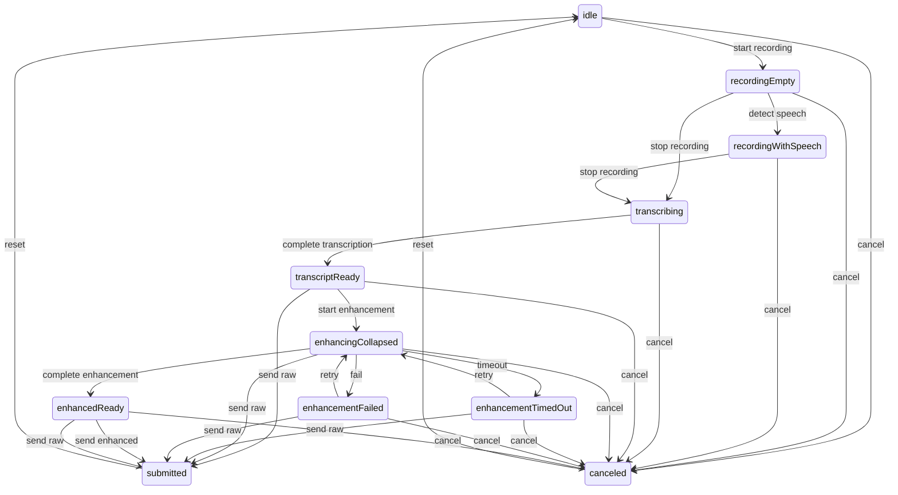

# Android Speech-To-Text Checklist

## Feature Summary

Goal: replace the current chat-mode dictation stub with production speech-to-text that records microphone audio, runs local on-device transcription with LiteRT Parakeet when supported, previews transcript in chat UI, optionally enhances text with terminal context, and submits through existing chat draft behavior.

Primary product flow:

- User opens Chat Mode from terminal accessory toolbar.
- User taps microphone in `ChatInputBar`.
- App requests `RECORD_AUDIO` if needed, then starts visible foreground mic capture.
- Dictation UI shows waveform, speech state, transcript preview, and cancel/accept controls.
- Audio is transcribed locally with LiteRT Parakeet. Audio never leaves device.
- Final transcript appears in chat draft bubble.
- Optional enhancement injects transcript plus bounded terminal context into prompt.
- Accepted text enters existing `chatDraft`; existing Auto Send controls Enter.

Primary Android paths:

- `app/src/main/java/com/coder/pi/CoderSheetComponents.kt` owns `ChatInputBar`, mic action, `DictationStubBar`, and chat action rail.
- `app/src/main/java/com/coder/pi/CoderApp.kt` owns `TerminalAccessory`, `chatDraft`, chat attachments, settings screens, and submit behavior.
- `app/src/main/java/com/coder/pi/CoderTerminalView.kt` exposes `snapshotText()` and terminal send helpers.
- `app/src/main/res/raw` should hold default speech enhancement prompt.
- `app/build.gradle.kts` owns LiteRT and possible tokenizer/preprocessor dependencies.

Reference paths:

- `~/.cache/checkouts/github.com/google-ai-edge/litert-samples/compiled_model_api/speech_recognition/README.md`
- `~/.cache/checkouts/github.com/google-ai-edge/litert-samples/compiled_model_api/speech_recognition/AndroidApp/app/src/main/java/com/google/ai/edge/examples/asr/MicrophoneAudioSource.kt`
- `~/.cache/checkouts/github.com/google-ai-edge/litert-samples/compiled_model_api/speech_recognition/AndroidApp/app/src/main/java/com/google/ai/edge/examples/asr/LiteRtRunner.kt`
- `~/.cache/checkouts/github.com/google-ai-edge/litert-samples/compiled_model_api/speech_recognition/AndroidApp/app/src/main/java/com/google/ai/edge/examples/asr/TdtDecoder.kt`
- `~/.cache/checkouts/huggingface.co/litert-community/parakeet-tdt-0.6b-v3`
- `/Users/shady/github/Beingpax/VoiceInk/VoiceInk/Recorder.swift`
- `/Users/shady/github/Beingpax/VoiceInk/VoiceInk/Transcription/Engine/VoiceInkEngine.swift`
- `/Users/shady/github/Beingpax/VoiceInk/VoiceInk/Transcription/Engine/TranscriptionPipeline.swift`
- `/Users/shady/github/Beingpax/VoiceInk/VoiceInk/Transcription/FluidAudio/FluidAudioTranscriptionService.swift`
- `/Users/shady/github/Beingpax/VoiceInk/VoiceInk/Views/Recorder/AudioVisualizerView.swift`
- `/Users/shady/github/Beingpax/VoiceInk/VoiceInk/Services/AIEnhancement/AIEnhancementService.swift`
- `/Users/shady/github/Beingpax/VoiceInk/VoiceInk/Models/PromptTemplates.swift`
- `android-cli` skill for searching online android docs or running things.

## Feasibility Snapshot

- Google LiteRT ASR sample explicitly lists Parakeet TDT with CPU/GPU and Pixel 10 TPU/NPU support.
- LiteRT sample architecture already contains Android mic capture, log-mel processing, LiteRT runner, TDT decoder, tokenizer, and overlap merge building blocks.
- Parakeet LiteRT model files are large: int8 is about `614 MB`; Google Tensor G5 f32 is about `1.3 GB`; generic f32 is about `2.4 GB`.
- Parakeet is not true streaming in the sample; mic transcription uses 5-second chunks with 4-second overlap to show text early.
- NNAPI is deprecated in Android 15; use LiteRT/CompiledModel path rather than new NNAPI integration.
- Production model delivery should be download/cache/delete, not APK-bundled.

## Current Risk Snapshot

- Model size may be too large for many users unless storage controls and clear download UI exist.
- First text latency may be materially higher than native keyboard dictation because Parakeet uses chunked windows, not true streaming.
- TPU/NPU support appears target-specific; CPU/GPU fallback must be measured on real devices.
- Audio capture can be silenced by Android input-sharing rules when another app has priority.
- Enhancement sends transcript and terminal context upstream, so prompt rendering, settings copy, and redaction need strong bounds.
- Terminal context must not include secrets, raw tool output, clipboard contents, or hidden scrollback beyond visible text.

## VoiceInk UI/UX Pattern Inventory

These patterns should shape Android UX before model internals are built:

- `MiniRecorderView.swift` has a compact control bar that expands from about `184` to `300` width when live transcript is present, using `easeInOut(0.3)` and rounded corners that change between compact and expanded states.
- `NotchRecorderView.swift` models display state separately from recording state: `collapsed`, `active`, and `liveText`. Android should do the same so visual transitions are deterministic and testable.
- VoiceInk recording UI keeps controls visible while transcript panel appears beneath a divider. Android should keep mic/stop/cancel affordances visible while the transcript bubble grows.
- `RecorderStatusDisplay` swaps between static bars, active waveform, `Transcribing` progress dots, and `Enhancing` progress dots with short opacity transitions.
- `AudioVisualizerView.swift` uses 15 rounded bars, smoothed meter input, min/max heights, sinusoidal motion, and center weighting. Android should use the same feel, adapted to Compose.
- `LiveTranscriptView` is read-only, auto-scrolls to bottom, and masks top edge with a fade. Android transcript preview should be read-only while recording/transcribing.
- `EnhancementPromptPopover` exposes enhancement toggle and prompt selection near recorder controls. Android can map this to Speech settings and a compact prompt chip, not necessarily a popover.
- VoiceInk starts compact, expands only when useful text/state exists, and collapses after processing. Android should collapse final dictation into a compact chip before inserting or sending.

## UX-First Strategy

Build backward from the user journey before model integration. First deliver a debug-only deep link screen that simulates speech states without microphone/model dependencies. Use Android CLI and UI Automator to validate transitions visually and behaviorally. Only after UX is stable should audio capture, LiteRT Parakeet, and enhancement internals replace fake providers.

Debug route target: `pi://debug/speech` in debug builds only. The screen should host a terminal-themed chat input and deterministic controls to simulate permission, recording, partial transcript, final transcript, enhancement running, enhancement timeout, enhancement failure, retry, ready, submit, and auto-send.

## ASTT-1: Define Dictation UX State Machine

Status: review

Research:

- VoiceInk separates visual display state from recording pipeline state.
- Android current `DictationStubBar` has only one fake `Dictating...` state.
- User requires read-only live transcript while transcribing, chip collapse during enhancement, timeout, failure fallback, retry, send-as-is, enhanced result, and optional auto-send.
- Implemented pure Kotlin contract in `app/src/main/java/com/coder/pi/SpeechDictationState.kt`; tests in `app/src/test/java/com/coder/pi/SpeechDictationStateTest.kt` cover contracts, happy path, timeout/failure retry, capabilities, invalid transitions, and deterministic fixtures.

Plan:

- Define state model and UX contract before writing model code.
- Document exact transitions, allowed actions, button labels, disabled controls, and timeout behavior.
- Add fixture strings for simulated partial/final/enhanced transcript.

Checklist:

- [x] Define display states: `idle`, `recordingEmpty`, `recordingWithSpeech`, `transcribing`, `transcriptReady`, `enhancingCollapsed`, `enhancementTimedOut`, `enhancementFailed`, `enhancedReady`, `submitted`, `canceled`.
- [x] Define pipeline states separately: permission, capture, VAD, STT, enhancement, send.
- [x] Specify which states allow editing, cancel, retry, send raw, send enhanced, and auto-send.
- [x] Specify transition durations and collapse/expand behavior.
- [x] Add accessibility labels and test IDs for every visible state.

State diagram:

UX contract:

- Editing allowed only in `idle`, `transcriptReady`, `enhancementTimedOut`, `enhancementFailed`, and `enhancedReady`.
- Cancel allowed from active recording, transcription, transcript-ready, enhancement, timeout, failure, and enhanced-ready states.
- Retry allowed only from `enhancementTimedOut` and `enhancementFailed`.
- Raw send allowed from `transcriptReady`, `enhancingCollapsed`, `enhancementTimedOut`, `enhancementFailed`, and `enhancedReady`.
- Enhanced send allowed only from `enhancedReady`.
- Auto-send eligible only from `transcriptReady` and `enhancedReady`; existing Auto Send controls Enter in later integration tickets.
- Compact/collapsed display used by `idle`, `recordingEmpty`, `enhancingCollapsed`, `submitted`, and `canceled`; transcript-bearing states render expanded.
- Transition durations are bounded to `180ms`, `220ms`, or `300ms`.

User story:

As a chat user, I want voice input to feel predictable and reversible: I can see recording, understand when text is still being generated, retry enhancement if it fails, and decide what gets sent.

Implementation guide:

- Model this as pure Kotlin data first.
- Do not touch LiteRT or mic capture in this ticket.
- Include a Mermaid state diagram in this checklist after implementation.

Acceptance criteria:

- Unit tests cover every state transition and invalid transition.
- Checklist includes final state diagram and UX contract.

Validation:

- `./gradlew testDebugUnitTest --tests '*Speech*' --no-daemon` passed on local JVM, `BUILD SUCCESSFUL in 11s`.

Review:

- Subagent review pending: `subagent` tool is unavailable in current toolset.
- Self-review residual risk: reviewer gate from goal cannot be satisfied until tool is available.

Commit:

- Implementation: `03c7379` (`feat(android): define speech dictation state machine`).

## ASTT-2: Build Debug Speech UX Deep Link

Status: review

Research:

- Current app already supports `pi://debug/render` through `MainActivity.handleDeepLink` and debug-only destination switching.
- Android docs confirm deep links can be tested with `adb shell am start -W -a android.intent.action.VIEW -d <URI> <PACKAGE>`.
- Android CLI docs search returned `Create Deep Links` and related app-link testing docs for manual `am start` validation.
- Existing debug render path uses `debugPlaygroundRevision`; speech now mirrors it with `debugSpeechRevision` and `AppDestination.DEBUG_SPEECH`.

Plan:

- Add debug-only `pi://debug/speech` destination.
- Render a deterministic speech playground using the same Composables planned for production chat input.
- Add simulation controls so UI Automator can drive all states without mic permission or model assets.

Checklist:

- [x] Add debug deep link path `speech` beside existing `render` path.
- [x] Add `AppDestination.DEBUG_SPEECH` or equivalent debug destination.
- [x] Render terminal-themed chat composer with mic button.
- [x] Add debug simulation rail hidden from production builds.
- [x] Add buttons or test-only controls: start recording, add partial text, finalize transcript, start enhancement, timeout, fail, retry, complete enhancement, submit.
- [x] Ensure screen is reachable with Android CLI/ADB.

User story:

As a developer, I want a deterministic debug screen for the speech UX so I can validate transitions without needing a model download, network, or real microphone input.

Implementation guide:

- Keep all debug controls gated to debuggable builds.
- Reuse production Composables for the dictation surface.
- Do not include real transcript content in logs.

Acceptance criteria:

- `pi://debug/speech` opens the speech playground on debug builds.
- The playground can simulate every UX state.
- Production launcher/settings are unchanged.

Validation:

- `./gradlew compileDebugKotlin --no-daemon` passed, `BUILD SUCCESSFUL in 15s`.
- `android docs search "Android app links deep link adb am start"` returned Android deep-link docs.
- `android emulator list` shows `owlchat` available.
- `adb devices` showed no connected/running devices, so `adb shell am start -W -a android.intent.action.VIEW -d 'pi://debug/speech' com.coder.pi` and `android layout --device <id> --pretty` are blocked until a device/emulator is running.

Review:

- Subagent review pending: `subagent` tool is unavailable in current toolset.
- Self-review residual risk: device reachability is compile-verified but not UI-verified because no Android device is connected.

Commit:

- Implementation: `7c0c48c` (`feat(android): add debug speech playground`).

## ASTT-3: Implement Dictation Compose Surface With Fake Provider

Status: review

Research:

- VoiceInk uses compact-to-expanded animation, read-only live transcript, waveform, progress dots, and collapse after active transcription.
- Android chat composer already has rounded dock, action rail, text field, attachments, haptics, and send behavior.
- `DictationInputSurface` now replaces `DictationStubBar` in `ChatInputBar` and is reused by the debug speech playground for non-idle simulated states.
- Production mic remains fake-provider only: no audio capture, LiteRT, model download, or network behavior added.

Plan:

- Replace `DictationStubBar` with a real state-driven `DictationInputSurface` powered by fake provider in debug path.
- Keep the production mic action wired to the same surface but backed by fake/no-op until audio ticket lands.

Checklist:

- [x] Add Compose waveform with 15 animated rounded bars and smoothed meter input.
- [x] Add read-only live transcript bubble with auto-scroll/fade behavior.
- [x] Add compact chip state for enhancement running.
- [x] Add timeout and failure states with retry and send-as-is actions.
- [x] Add enhanced-ready state showing enhanced text and submit affordance.
- [x] Disable editing while recording/transcribing/enhancing.
- [x] Collapse final accepted speech into `chatDraft`.

User story:

As a user, I want voice input to visually communicate what is happening without letting me accidentally edit unstable transcript text.

Implementation guide:

- Match current Android visual language, not macOS notch visuals literally.
- Use VoiceInk behavior as interaction reference.
- Keep Composable stateless where practical; state owner supplies callbacks.

Acceptance criteria:

- All states render from fake provider.
- No model/audio code is required to test UI.
- Text editing is disabled in transient transcript states.

Validation:

- `./gradlew testDebugUnitTest --tests '*Speech*' --no-daemon` passed, `BUILD SUCCESSFUL in 11s`.
- `./gradlew compileDebugKotlin --no-daemon` passed, `BUILD SUCCESSFUL in 15s`.
- Debug screenshots blocked because `adb devices` shows no connected/running devices.

Review:

- Subagent review pending: `subagent` tool is unavailable in current toolset.
- Self-review residual risk: Compose rendering is compile-verified but not screenshot-verified because no Android device is connected.

Commit:

- Implementation: `185d5eb` (`feat(android): add fake dictation compose surface`).

## ASTT-4: Add UI Automator Speech UX Journey

Status: review

Research:

- Android UI Automator docs recommend modern Kotlin DSL with `uiAutomator`, `onElement`, `watchFor(PermissionDialog)`, `waitForStable`, and screenshots.
- Existing tests use `androidx.test.uiautomator.UiDevice`, `By`, and `Until`; `libs.androidx.uiautomator` is already present in `app/build.gradle.kts`.
- Added `app/src/androidTest/java/com/coder/pi/SpeechDebugWorkflowInstrumentedTest.kt` to launch `pi://debug/speech`, drive fake state controls, assert visible state labels/transcripts, enable `chat_auto_send`, submit enhanced text, and capture screenshots under app external files.

Plan:

- Add instrumented UI journey that opens `pi://debug/speech`, clicks mic, simulates transitions, and asserts visible UI states.
- Capture screenshots/artifacts for key transitions.

Checklist:

- [x] Add UI Automator dependency if missing.
- [x] Add `SpeechDebugWorkflowInstrumentedTest`.
- [x] Launch debug deep link with `Intent.ACTION_VIEW`.
- [x] Click mic and assert recording waveform.
- [x] Simulate partial transcript and assert read-only bubble.
- [x] Simulate final transcript and enhancement collapsed chip.
- [x] Simulate enhancement failure and assert retry/send-as-is.
- [x] Simulate enhancement success and assert enhanced text can submit.
- [x] Add auto-send-on-enhanced test path if setting enabled.

User story:

As a maintainer, I want real device/emulator automation proving the speech UX transitions work before backend integration changes timing and complexity.

Implementation guide:

- Prefer content descriptions/test tags that are stable and user-meaningful.
- Use screenshots for review evidence.
- Avoid flaky timing by driving fake states with explicit debug buttons.

Acceptance criteria:

- UI Automator test passes on emulator or real device.
- Failure screenshots make state regressions easy to diagnose.

Validation:

- `./gradlew connectedDebugAndroidTest -Pandroid.testInstrumentationRunnerArguments.class=com.coder.pi.SpeechDebugWorkflowInstrumentedTest --no-daemon`
- `android screen capture --device <id> -o <file>` when manual proof is needed.
- `./gradlew compileDebugAndroidTestKotlin --no-daemon` passed, `BUILD SUCCESSFUL in 8s`.
- Connected execution blocked: `adb devices` shows no connected/running devices.
- Screenshot proof blocked until connected execution can run.

Review:

- Subagent review pending: `subagent` tool is unavailable in current toolset.
- Self-review residual risk: test compiles but has not run on device/emulator in this session.

Commit:

- Implementation: `86e74ba` (`test(android): add debug speech ui journey`).

## ASTT-5: Define Speech Architecture And Settings

Status: review

Research:

- `SpeechSettingsScreen` currently says speech provider integration is not enabled.
- Chat Mode settings already have `Enable Chat Mode` and `Auto Send` toggles.
- Added `SpeechSettingsStore` with SharedPreferences-backed local LiteRT Parakeet, enhancement, visible-context, VAD sensitivity, and prompt override settings.
- Added bundled raw prompt at `app/src/main/res/raw/speech_enhancement_prompt.txt` with `<TRANSCRIPT>` and `<CONTEXT>` placeholders.
- Updated `SpeechSettingsScreen` with local transcription, model cache placeholder controls, enhancement toggle, visible-context copy, VAD sensitivity, and editable prompt override dialog.

Plan:

- Add settings for model download/cache, enhancement prompt, context inclusion, and VAD sensitivity after UX contract is stable.
- Keep speech settings local-only for transcription and explicit about upstream enhancement only.

Checklist:

- [x] Add local STT settings scoped to LiteRT Parakeet.
- [x] Add model cache status, download, and delete controls.
- [x] Add enhancement toggle and editable prompt override.
- [x] Add context inclusion toggle with visible-terminal-only copy.
- [x] Add VAD sensitivity setting with sane default.
- [x] Add default prompt under `app/src/main/res/raw`.

User story:

As a user, I want speech settings that explain local transcription and optional enhancement clearly, so I know what stays on device and what may be sent to my AI provider.

Implementation guide:

- Prefer existing SharedPreferences style unless current app has a stronger settings abstraction.
- Do not add any non-LiteRT transcription provider.

Acceptance criteria:

- Prompt loads from raw resource when no override exists.
- Tests cover prompt default, prompt override, and settings defaults.

Validation:

- `./gradlew testDebugUnitTest --no-daemon`
- `./gradlew compileDebugKotlin --no-daemon`
- `./gradlew testDebugUnitTest --tests '*Speech*' --no-daemon` passed, `BUILD SUCCESSFUL in 9s`.
- `./gradlew compileDebugKotlin --no-daemon` passed, `BUILD SUCCESSFUL in 5s`.

Review:

- Subagent review pending: `subagent` tool is unavailable in current toolset.
- Self-review residual risk: model download/delete controls are UI placeholders until model cache implementation ticket.

Commit:

- Implementation: `485bbd1` (`feat(android): add speech settings defaults`).

## ASTT-6: Implement Audio Capture, Metering, And VAD

Status: review

Research:

- Google sample `MicrophoneAudioSource.kt` uses `AudioRecord`, `VOICE_RECOGNITION`, mono PCM16, min buffer size, and RMS silence threshold.
- Android docs warn capture can be silenced when another app has priority.
- VoiceInk recorder uses smoothed audio meter values to drive UI.
- Android CLI docs search found Android `Sharing audio input` guidance for capture silencing priority behavior.
- Added `RECORD_AUDIO` manifest permission.
- Added `SpeechAudioCapture` using `AudioRecord`, `MediaRecorder.AudioSource.VOICE_RECOGNITION`, mono PCM16, `AudioRecord.getMinBufferSize`, normalized float frames, API 29 recording callback silenced detection, explicit stop/cleanup, max duration, and failure states.
- Added pure `SpeechVadSegmenter` with smoothed meter, speech start frames, trailing silence finalization, max duration finalization, and reset.

Plan:

- Add Android audio capture component independent from UI.
- Emit PCM frames, smoothed meter values, and speech/silence state.
- Add VAD/pre-roll/trailing silence for finalization while preserving Parakeet chunk needs.

Checklist:

- [x] Request and validate `RECORD_AUDIO` before capture.
- [x] Use `AudioRecord` with `MediaRecorder.AudioSource.VOICE_RECOGNITION`.
- [x] Capture mono PCM16 and convert to normalized float frames.
- [x] Use device buffer guidance and `AudioRecord.getMinBufferSize`.
- [x] Register recording callback where available to detect silenced capture/device changes.
- [x] Emit smoothed meter values for waveform UI.
- [x] Implement pre-roll and trailing-silence finalization.
- [x] Enforce max recording duration and cleanup on disposal.

User story:

As a chat user, I want microphone capture to start quickly, show that it hears me, stop when I stop, and never keep recording after I cancel or leave the terminal.

Implementation guide:

- Keep audio component lifecycle explicit.
- Never retain raw audio beyond active transcription buffers unless a test fixture requires it.
- Make permission denial recoverable.
- Treat capture-silenced as user-visible failure, not blank transcript.

Acceptance criteria:

- Manual smoke can start, stop, cancel, rotate, and close terminal without leaked recorder.
- Unit tests cover VAD segmentation using fixture PCM.
- Meter values update during recording and reset after stop.

Validation:

- `./gradlew testDebugUnitTest --no-daemon`
- Device mic smoke.
- `./gradlew testDebugUnitTest --tests '*Speech*' --no-daemon` passed, `BUILD SUCCESSFUL in 17s`.
- Device mic smoke blocked: `adb devices` shows no connected/running devices.

Review:

- Subagent review pending: `subagent` tool is unavailable in current toolset.
- Self-review residual risk: audio capture compiles and VAD is unit-tested, but real microphone lifecycle is not device-smoked.

Commit:

- Implementation: `6477cfb` (`feat(android): add speech audio capture`).

## ASTT-7: Implement Local LiteRT Parakeet Transcriber

Status: building

Research:

- Google sample uses `LiteRtRunner`, `TdtDecoder`, log-mel processing, tokenizer, and overlap merge.
- Parakeet mic path uses 5-second windows with 4-second overlap.
- Model files are too large for APK bundling.
- `gradle/libs.versions.toml` has no LiteRT dependency yet, so runtime inference is not wired in this slice.
- Hugging Face LFS pointer for `parakeet_tdt_0.6b_v3_5s_i8.tflite` gives `sha256:f25e5972fe72048f67272e26d4badfe19d876e0fa19027cb2c6c0e0fc4da692b` and size `614437424`.
- Added `SpeechTranscriber`, `ParakeetModelCache`, int8 model metadata, verified download/delete path, runtime-unavailable LiteRT placeholder, and overlap transcript merge.

Plan:

- Define a `SpeechTranscriber` interface and implement a LiteRT Parakeet provider.
- Reuse Google sample ideas but adapt style and lifecycle to this app.
- Support downloadable model cache with integrity and delete controls.

Checklist:

- [x] Add `SpeechTranscriber` interface for local provider.
- [x] Add model artifact metadata and storage path.
- [x] Download model with integrity verification.
- [ ] Load LiteRT `CompiledModel` and pick accelerator safely.
- [ ] Implement log-mel preprocessing compatible with model metadata.
- [ ] Implement tokenizer and TDT decode.
- [x] Implement overlap transcript merge.
- [ ] Keep warm model when safe; release on low memory or disposal.

User story:

As a user with a capable Android device, I want high-quality speech-to-text to run locally so my audio stays private and dictation works without network.

Implementation guide:

- Do not block UI during model load.
- Expose model load progress and failures.
- Prefer int8 model for initial broad support.
- Record timings without transcript content.

Acceptance criteria:

- Fixture audio transcribes locally with expected tolerance.
- Model cache survives app restart.
- Deleting model forces re-download before next local transcription.

Validation:

- `./gradlew testDebugUnitTest --no-daemon`
- `./gradlew assembleDebug --no-daemon`
- Device fixture smoke.
- `./gradlew testDebugUnitTest --tests '*Speech*' --no-daemon` passed, `BUILD SUCCESSFUL in 10s`.
- `./gradlew assembleDebug --no-daemon` passed, `BUILD SUCCESSFUL in 10s`.
- Device fixture smoke blocked: no connected/running device.

Review:

- Not ready for subagent review yet: LiteRT runtime, log-mel, tokenizer/TDT decode, warm model lifecycle, and fixture transcription remain incomplete.
- Self-review residual risk: current `LiteRtParakeetTranscriber` returns `RuntimeUnavailable` when model exists; this avoids false support claims.

Commit:

- TBD.

## ASTT-8: Add Enhancement Prompt And Terminal Context

Status: not-started

Research:

- VoiceInk enhancement injects `<TRANSCRIPT>` and context sections.
- Android terminal exposes visible text through `snapshotText()`.
- Existing app already has Gemini/OpenAI-compatible provider concepts for AI features.

Plan:

- Add prompt renderer that combines transcript and bounded visible terminal context.
- Add enhancement client using existing AI provider settings where possible.
- Keep enhancement optional and fail open to raw transcript.

Checklist:

- [ ] Inject final transcript into `<TRANSCRIPT>`.
- [ ] Inject bounded visible terminal text into `<CONTEXT>`.
- [ ] Trim blanks and limit lines/chars.
- [ ] Redact obvious tokens, bearer strings, and secret query params.
- [ ] Include latest safe agent text only if available without tool/prompt leakage.
- [ ] Add OpenAI-compatible and Gemini enhancement path.
- [ ] Add timeout, cancellation, one transient retry, raw transcript fallback.

User story:

As a terminal agent user, I want dictated text corrected using what I can see in terminal, so the final message fixes speech errors and matches current task context.

Implementation guide:

- Do not include hidden scrollback by default.
- Do not include clipboard.
- Store no prompt/request bodies in logs.
- Output only enhanced text.

Acceptance criteria:

- Tests prove prompt injection, bounds, redaction, provider request shape, cancellation, and failure fallback.
- Enhancement failure leaves raw transcript usable.

Validation:

- `./gradlew testDebugUnitTest --no-daemon`
- Provider mock tests.

Review:

- TBD.

Commit:

- TBD.

## ASTT-9: Integrate Terminal Send Behavior

Status: not-started

Research:

- Existing chat submit sends `terminalView.sendText(it)` and then Enter when `chatAutoSendEnabled()` is true.

Plan:

- Route accepted speech through existing `chatDraft` and submit path.
- Preserve multiline formatting and attachments.

Checklist:

- [ ] Insert accepted transcript into `chatDraft`.
- [ ] Respect existing Auto Send setting.
- [ ] Preserve multiline/list formatting.
- [ ] Restore keyboard/focus after dictation closes.
- [ ] Ensure cancel does not alter draft unless user accepted text.

User story:

As a terminal user, I want speech text to behave exactly like typed chat text so I can review before sending or auto-send when configured.

Implementation guide:

- Do not bypass existing chat submit code.
- Do not send partial transcript to terminal.

Acceptance criteria:

- Manual smoke verifies paste-only and paste+Enter modes.
- Draft survives rotate while dictation result is ready.

Validation:

- Focused unit/manual tests.

Review:

- TBD.

Commit:

- TBD.

## ASTT-10: Final Privacy, Reliability, And Release Audit

Status: not-started

Research:

- Speech feature touches microphone, large model downloads, AI provider requests, and terminal text context.

Plan:

- Audit all logs, metrics, docs, settings copy, and lifecycle edges.
- Record final validation evidence.

Checklist:

- [ ] Audit logs for audio/transcript/context/prompt leaks.
- [ ] Add sanitized metrics only: model load ms, chunk ms, VAD segment count, enhancement ms, failure kind.
- [ ] Test permission denied, capture silenced, network failure, model missing, low memory, rotation, terminal close.
- [ ] Document local-only transcription and optional upstream enhancement.
- [ ] Fill every ticket review/commit/validation section.

User story:

As a privacy-conscious user, I want confidence that local transcription keeps audio on device and optional enhancement has clear, bounded context sharing.

Implementation guide:

- Treat privacy docs as release blocker.
- Do not mark done with unreviewed debug logging.

Acceptance criteria:

- All tickets done with review and commit sections filled.
- No known high-risk privacy or lifecycle gaps remain.
- Final validation passes.

Validation:

- `./gradlew testDebugUnitTest --no-daemon`
- `./gradlew assembleDebug --no-daemon`
- Device mic smoke.

Review:

- TBD.

Commit:

- TBD.
