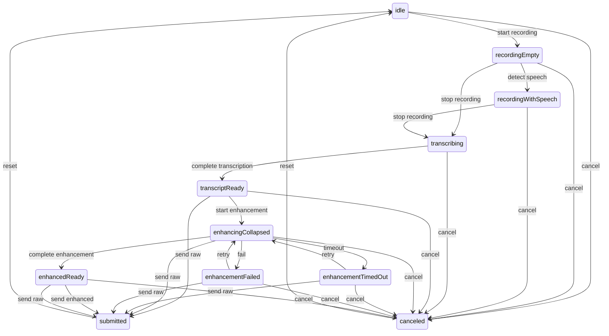

# Android Speech-To-Text Checklist

## Feature Summary

Goal: replace the current chat-mode dictation stub with production speech-to-text that records microphone audio, runs local on-device transcription with LiteRT Parakeet when supported, previews transcript in chat UI, optionally enhances text with terminal context, and submits through existing chat draft behavior.

Primary product flow:

- User opens Chat Mode from terminal accessory toolbar.
- User taps microphone in `ChatInputBar`.
- App requests `RECORD_AUDIO` if needed, then starts visible foreground mic capture.
- Dictation UI shows waveform, speech state, transcript preview, and cancel/accept controls.
- Audio is transcribed locally with LiteRT Parakeet. Audio never leaves device.
- Final transcript appears in chat draft bubble.
- Optional enhancement injects transcript plus bounded terminal context into prompt.
- Accepted text enters existing `chatDraft`; existing Auto Send controls Enter.

Primary Android paths:

- `app/src/main/java/com/coder/pi/CoderSheetComponents.kt` owns `ChatInputBar`, mic action, `DictationStubBar`, and chat action rail.
- `app/src/main/java/com/coder/pi/CoderApp.kt` owns `TerminalAccessory`, `chatDraft`, chat attachments, settings screens, and submit behavior.
- `app/src/main/java/com/coder/pi/CoderTerminalView.kt` exposes `snapshotText()` and terminal send helpers.
- `app/src/main/res/raw` should hold default speech enhancement prompt.
- `app/build.gradle.kts` owns LiteRT and possible tokenizer/preprocessor dependencies.

Reference paths:

- `~/.cache/checkouts/github.com/google-ai-edge/litert-samples/compiled_model_api/speech_recognition/README.md`
- `~/.cache/checkouts/github.com/google-ai-edge/litert-samples/compiled_model_api/speech_recognition/AndroidApp/app/src/main/java/com/google/ai/edge/examples/asr/MicrophoneAudioSource.kt`
- `~/.cache/checkouts/github.com/google-ai-edge/litert-samples/compiled_model_api/speech_recognition/AndroidApp/app/src/main/java/com/google/ai/edge/examples/asr/LiteRtRunner.kt`
- `~/.cache/checkouts/github.com/google-ai-edge/litert-samples/compiled_model_api/speech_recognition/AndroidApp/app/src/main/java/com/google/ai/edge/examples/asr/TdtDecoder.kt`
- `~/.cache/checkouts/huggingface.co/litert-community/parakeet-tdt-0.6b-v3`
- `/Users/shady/github/Beingpax/VoiceInk/VoiceInk/Recorder.swift`
- `/Users/shady/github/Beingpax/VoiceInk/VoiceInk/Transcription/Engine/VoiceInkEngine.swift`
- `/Users/shady/github/Beingpax/VoiceInk/VoiceInk/Transcription/Engine/TranscriptionPipeline.swift`
- `/Users/shady/github/Beingpax/VoiceInk/VoiceInk/Transcription/FluidAudio/FluidAudioTranscriptionService.swift`
- `/Users/shady/github/Beingpax/VoiceInk/VoiceInk/Views/Recorder/AudioVisualizerView.swift`
- `/Users/shady/github/Beingpax/VoiceInk/VoiceInk/Services/AIEnhancement/AIEnhancementService.swift`
- `/Users/shady/github/Beingpax/VoiceInk/VoiceInk/Models/PromptTemplates.swift`
- `android-cli` skill for searching online android docs or running things.

## Feasibility Snapshot

- Google LiteRT ASR sample explicitly lists Parakeet TDT with CPU/GPU and Pixel 10 TPU/NPU support.
- LiteRT sample architecture already contains Android mic capture, log-mel processing, LiteRT runner, TDT decoder, tokenizer, and overlap merge building blocks.
- Parakeet LiteRT model files are large: int8 is about `614 MB`; Google Tensor G5 f32 is about `1.3 GB`; generic f32 is about `2.4 GB`.
- Parakeet is not true streaming in the sample; mic transcription uses 5-second chunks with 4-second overlap to show text early.
- NNAPI is deprecated in Android 15; use LiteRT/CompiledModel path rather than new NNAPI integration.
- Production model delivery should be download/cache/delete, not APK-bundled.

## Current Risk Snapshot

- Model size may be too large for many users unless storage controls and clear download UI exist.
- First text latency may be materially higher than native keyboard dictation because Parakeet uses chunked windows, not true streaming.
- TPU/NPU support appears target-specific; CPU/GPU fallback must be measured on real devices.
- Audio capture can be silenced by Android input-sharing rules when another app has priority.
- Enhancement sends transcript and terminal context upstream, so prompt rendering, settings copy, and redaction need strong bounds.
- Terminal context must not include secrets, raw tool output, clipboard contents, or hidden scrollback beyond visible text.

## Completion Audit

Status: blocked, not complete.

Objective-to-evidence map:

- Checklist/Jira file exists: this file exists and contains ASTT-1 through ASTT-10 with status, research, checklist, user story, guide, acceptance, review, validation, and commit sections.
- Mic tap opens dictation UI: `CoderSheetComponents.kt` wires chat mic into dictation state; emulator/debug UX state journey passes via `SpeechDebugWorkflowInstrumentedTest`.
- Records speech and detects speech end: `SpeechAudioCapture.kt` implements `AudioRecord`, metering, VAD, silence handling, and cleanup; JVM speech tests pass. Target-hardware mic smoke remains blocked.
- Transcript preview bubble: `DictationInputSurface` renders read-only partial/final transcript states; emulator UI Automator preset journey passes.
- Optional enhancement with transcript plus terminal context: `SpeechEnhancement.kt` renders bounded `<TRANSCRIPT>` and `<CONTEXT>`, redacts secrets, and tests pass.
- Insert/send through existing chat draft behavior: `mergeSpeechTranscriptIntoDraft` and `CoderApp.kt` route accepted speech through `chatDraft`; `SpeechChatDraftTest` passes. Target-hardware paste-only/paste+Enter smoke remains blocked.
- Audio never leaves device for transcription: transcription path is local `LiteRtParakeetTranscriber`; enhancement is separate and optional; privacy audit tests pass.
- Local Parakeet runs through LiteRT on Pixel 7 Pro or Samsung Tab A9: blocked. Reference model and tokenizer payloads are downloaded and verified, but current `adb devices` shows only `emulator-5554`.
- Real-device support proof: blocked until Pixel 7 Pro or Samsung Tab A9 is attached for runtime/mic proof.
- Subagent review loop: available in this session. Review `ad18e40b-1caa-4bfd-9eb1-733b7c92e4b3` found production blockers for audio-to-transcriber wiring, accepted transcript submit flow, tokenizer atomic validation, VAD settings wiring, and enhancement/context settings wiring; fixes are in progress and target-hardware proof remains blocked.

Target-device proof runbook when Pixel 7 Pro or Samsung Tab A9 is attached:

- Confirm target: `adb devices -l` must show Pixel 7 Pro or Samsung Tab A9, not only emulator.
- Install debug build: `./gradlew assembleDebug --no-daemon && adb install -r app/build/outputs/apk/debug/app-arm64-v8a-debug.apk`.
- Open speech settings: `adb shell am start -W -a android.intent.action.VIEW -d 'pi://settings/speech' -n com.coder.pi/.MainActivity`.
- Use Model Cache Download action, then verify settings shows ready state.
- Open chat input, tap mic, grant `RECORD_AUDIO`, speak fixture phrase, wait for VAD end/transcription, accept transcript into draft, and verify Auto Send off/on behavior.
- Record proof: `adb shell getprop ro.product.model`, `adb shell getprop ro.board.platform`, settings screenshot/layout, dictation screenshot/layout, app log excerpt with sanitized timing/failure-only metrics, and command output for `./gradlew testDebugUnitTest --tests '*Speech*' --no-daemon` plus target smoke result.
- Do not claim support from emulator inference; emulator remains UI/crash/build smoke only.

## VoiceInk UI/UX Pattern Inventory

These patterns should shape Android UX before model internals are built:

- `MiniRecorderView.swift` has a compact control bar that expands from about `184` to `300` width when live transcript is present, using `easeInOut(0.3)` and rounded corners that change between compact and expanded states.
- `NotchRecorderView.swift` models display state separately from recording state: `collapsed`, `active`, and `liveText`. Android should do the same so visual transitions are deterministic and testable.
- VoiceInk recording UI keeps controls visible while transcript panel appears beneath a divider. Android should keep mic/stop/cancel affordances visible while the transcript bubble grows.
- `RecorderStatusDisplay` swaps between static bars, active waveform, `Transcribing` progress dots, and `Enhancing` progress dots with short opacity transitions.
- `AudioVisualizerView.swift` uses 15 rounded bars, smoothed meter input, min/max heights, sinusoidal motion, and center weighting. Android should use the same feel, adapted to Compose.
- `LiveTranscriptView` is read-only, auto-scrolls to bottom, and masks top edge with a fade. Android transcript preview should be read-only while recording/transcribing.
- `EnhancementPromptPopover` exposes enhancement toggle and prompt selection near recorder controls. Android can map this to Speech settings and a compact prompt chip, not necessarily a popover.
- VoiceInk starts compact, expands only when useful text/state exists, and collapses after processing. Android should collapse final dictation into a compact chip before inserting or sending.

## UX-First Strategy

Build backward from the user journey before model integration. First deliver a debug-only deep link screen that simulates speech states without microphone/model dependencies. Use Android CLI and UI Automator to validate transitions visually and behaviorally. Only after UX is stable should audio capture, LiteRT Parakeet, and enhancement internals replace fake providers.

Debug route target: `pi://debug/speech` in debug builds only. The screen should host a terminal-themed chat input and deterministic controls to simulate permission, recording, partial transcript, final transcript, enhancement running, enhancement timeout, enhancement failure, retry, ready, submit, and auto-send.

## ASTT-1: Define Dictation UX State Machine

Status: review

Research:

- VoiceInk separates visual display state from recording pipeline state.
- Android current `DictationStubBar` has only one fake `Dictating...` state.
- User requires read-only live transcript while transcribing, chip collapse during enhancement, timeout, failure fallback, retry, send-as-is, enhanced result, and optional auto-send.
- Implemented pure Kotlin contract in `app/src/main/java/com/coder/pi/SpeechDictationState.kt`; tests in `app/src/test/java/com/coder/pi/SpeechDictationStateTest.kt` cover contracts, happy path, timeout/failure retry, capabilities, invalid transitions, and deterministic fixtures.

Plan:

- Define state model and UX contract before writing model code.
- Document exact transitions, allowed actions, button labels, disabled controls, and timeout behavior.
- Add fixture strings for simulated partial/final/enhanced transcript.

Checklist:

- [x] Define display states: `idle`, `recordingEmpty`, `recordingWithSpeech`, `transcribing`, `transcriptReady`, `enhancingCollapsed`, `enhancementTimedOut`, `enhancementFailed`, `enhancedReady`, `submitted`, `canceled`.
- [x] Define pipeline states separately: permission, capture, VAD, STT, enhancement, send.
- [x] Specify which states allow editing, cancel, retry, send raw, send enhanced, and auto-send.
- [x] Specify transition durations and collapse/expand behavior.
- [x] Add accessibility labels and test IDs for every visible state.

State diagram:

UX contract:

- Editing allowed only in `idle`, `transcriptReady`, `enhancementTimedOut`, `enhancementFailed`, and `enhancedReady`.
- Cancel allowed from active recording, transcription, transcript-ready, enhancement, timeout, failure, and enhanced-ready states.
- Retry allowed only from `enhancementTimedOut` and `enhancementFailed`.
- Raw send allowed from `transcriptReady`, `enhancingCollapsed`, `enhancementTimedOut`, `enhancementFailed`, and `enhancedReady`.
- Enhanced send allowed only from `enhancedReady`.
- Auto-send eligible only from `transcriptReady` and `enhancedReady`; existing Auto Send controls Enter in later integration tickets.
- Compact/collapsed display used by `idle`, `recordingEmpty`, `enhancingCollapsed`, `submitted`, and `canceled`; transcript-bearing states render expanded.
- Transition durations are bounded to `180ms`, `220ms`, or `300ms`.

User story:

As a chat user, I want voice input to feel predictable and reversible: I can see recording, understand when text is still being generated, retry enhancement if it fails, and decide what gets sent.

Implementation guide:

- Model this as pure Kotlin data first.
- Do not touch LiteRT or mic capture in this ticket.
- Include a Mermaid state diagram in this checklist after implementation.

Acceptance criteria:

- Unit tests cover every state transition and invalid transition.
- Checklist includes final state diagram and UX contract.

Validation:

- `./gradlew testDebugUnitTest --tests '*Speech*' --no-daemon` passed on local JVM, `BUILD SUCCESSFUL in 11s`.

Review:

- Subagent review pending: `subagent` tool is unavailable in current toolset.
- Self-review residual risk: reviewer gate from goal cannot be satisfied until tool is available.

Commit:

- Implementation: `03c7379` (`feat(android): define speech dictation state machine`).

## ASTT-2: Build Debug Speech UX Deep Link

Status: review

Research:

- Current app already supports `pi://debug/render` through `MainActivity.handleDeepLink` and debug-only destination switching.
- Android docs confirm deep links can be tested with `adb shell am start -W -a android.intent.action.VIEW -d <URI> <PACKAGE>`.
- Android CLI docs search returned `Create Deep Links` and related app-link testing docs for manual `am start` validation.
- Existing debug render path uses `debugPlaygroundRevision`; speech now mirrors it with `debugSpeechRevision` and `AppDestination.DEBUG_SPEECH`.

Plan:

- Add debug-only `pi://debug/speech` destination.
- Render a deterministic speech playground using the same Composables planned for production chat input.
- Add simulation controls so UI Automator can drive all states without mic permission or model assets.

Checklist:

- [x] Add debug deep link path `speech` beside existing `render` path.
- [x] Add `AppDestination.DEBUG_SPEECH` or equivalent debug destination.
- [x] Render terminal-themed chat composer with mic button.
- [x] Add debug simulation rail hidden from production builds.
- [x] Add buttons or test-only controls: start recording, add partial text, finalize transcript, start enhancement, timeout, fail, retry, complete enhancement, submit.
- [x] Ensure screen is reachable with Android CLI/ADB.

User story:

As a developer, I want a deterministic debug screen for the speech UX so I can validate transitions without needing a model download, network, or real microphone input.

Implementation guide:

- Keep all debug controls gated to debuggable builds.
- Reuse production Composables for the dictation surface.
- Do not include real transcript content in logs.

Acceptance criteria:

- `pi://debug/speech` opens the speech playground on debug builds.
- The playground can simulate every UX state.
- Production launcher/settings are unchanged.

Validation:

- `./gradlew compileDebugKotlin --no-daemon` passed, `BUILD SUCCESSFUL in 15s`.
- `android docs search "Android app links deep link adb am start"` returned Android deep-link docs.
- `android emulator list` shows `owlchat` available.
- Initial `adb devices` showed no connected/running devices; emulator proof was collected after starting `owlchat`.
- `android emulator start owlchat` started `emulator-5554`.
- `adb install -r app/build/outputs/apk/debug/app-arm64-v8a-debug.apk` succeeded after x86_64 APK failed with `INSTALL_FAILED_NO_MATCHING_ABIS`.
- `adb shell am start -W -a android.intent.action.VIEW -d 'pi://debug/speech' -n com.coder.pi/.MainActivity` launched `com.coder.pi/.MainActivity`, `Status: ok`.
- `android layout --device emulator-5554 --pretty -o build/validation/speech/debug-speech-layout.json` captured layout containing `Speech UX` and `pi://debug/speech`.
- `android screen capture -o build/validation/speech/debug-speech.png` captured screenshot.

Review:

- Subagent review pending: `subagent` tool is unavailable in current toolset.
- Self-review residual risk: debug playground is emulator-verified, not target-hardware verified.

Commit:

- Implementation: `7c0c48c` (`feat(android): add debug speech playground`).

## ASTT-3: Implement Dictation Compose Surface With Fake Provider

Status: review

Research:

- VoiceInk uses compact-to-expanded animation, read-only live transcript, waveform, progress dots, and collapse after active transcription.
- Android chat composer already has rounded dock, action rail, text field, attachments, haptics, and send behavior.
- `DictationInputSurface` now replaces `DictationStubBar` in `ChatInputBar` and is reused by the debug speech playground for non-idle simulated states.
- Production mic remains fake-provider only: no audio capture, LiteRT, model download, or network behavior added.

Plan:

- Replace `DictationStubBar` with a real state-driven `DictationInputSurface` powered by fake provider in debug path.
- Keep the production mic action wired to the same surface but backed by fake/no-op until audio ticket lands.

Checklist:

- [x] Add Compose waveform with 15 animated rounded bars and smoothed meter input.
- [x] Add read-only live transcript bubble with auto-scroll/fade behavior.
- [x] Add compact chip state for enhancement running.
- [x] Add timeout and failure states with retry and send-as-is actions.
- [x] Add enhanced-ready state showing enhanced text and submit affordance.
- [x] Disable editing while recording/transcribing/enhancing.
- [x] Collapse final accepted speech into `chatDraft`.

User story:

As a user, I want voice input to visually communicate what is happening without letting me accidentally edit unstable transcript text.

Implementation guide:

- Match current Android visual language, not macOS notch visuals literally.
- Use VoiceInk behavior as interaction reference.
- Keep Composable stateless where practical; state owner supplies callbacks.

Acceptance criteria:

- All states render from fake provider.
- No model/audio code is required to test UI.
- Text editing is disabled in transient transcript states.

Validation:

- `./gradlew testDebugUnitTest --tests '*Speech*' --no-daemon` passed, `BUILD SUCCESSFUL in 11s`.
- `./gradlew compileDebugKotlin --no-daemon` passed, `BUILD SUCCESSFUL in 15s`.
- Initial debug screenshots were blocked before emulator startup; later debug speech screenshots were captured from `emulator-5554`.

Review:

- Subagent review pending: `subagent` tool is unavailable in current toolset.
- Self-review residual risk: Compose rendering is unit/build/emulator screenshot verified, not target-hardware verified.

Commit:

- Implementation: `185d5eb` (`feat(android): add fake dictation compose surface`).

## ASTT-4: Add UI Automator Speech UX Journey

Status: review

Research:

- Android UI Automator docs recommend modern Kotlin DSL with `uiAutomator`, `onElement`, `watchFor(PermissionDialog)`, `waitForStable`, and screenshots.
- Existing tests use `androidx.test.uiautomator.UiDevice`, `By`, and `Until`; `libs.androidx.uiautomator` is already present in `app/build.gradle.kts`.
- Added `app/src/androidTest/java/com/coder/pi/SpeechDebugWorkflowInstrumentedTest.kt` to launch `pi://debug/speech`, drive fake state controls, assert visible state labels/transcripts, enable `chat_auto_send`, submit enhanced text, and capture screenshots under app external files.

Plan:

- Add instrumented UI journey that opens `pi://debug/speech`, clicks mic, simulates transitions, and asserts visible UI states.
- Capture screenshots/artifacts for key transitions.

Checklist:

- [x] Add UI Automator dependency if missing.
- [x] Add `SpeechDebugWorkflowInstrumentedTest`.
- [x] Launch debug deep link with `Intent.ACTION_VIEW`.
- [x] Click mic and assert recording waveform.
- [x] Simulate partial transcript and assert read-only bubble.
- [x] Simulate final transcript and enhancement collapsed chip.
- [x] Simulate enhancement failure and assert retry/send-as-is.
- [x] Simulate enhancement success and assert enhanced text can submit.
- [x] Add auto-send-on-enhanced test path if setting enabled.

User story:

As a maintainer, I want real device/emulator automation proving the speech UX transitions work before backend integration changes timing and complexity.

Implementation guide:

- Prefer content descriptions/test tags that are stable and user-meaningful.
- Use screenshots for review evidence.
- Avoid flaky timing by driving fake states with explicit debug buttons.

Acceptance criteria:

- UI Automator test passes on emulator or real device.
- Failure screenshots make state regressions easy to diagnose.

Validation:

- `./gradlew connectedDebugAndroidTest -Pandroid.testInstrumentationRunnerArguments.class=com.coder.pi.SpeechDebugWorkflowInstrumentedTest --no-daemon`
- `android screen capture --device <id> -o <file>` when manual proof is needed.
- `./gradlew compileDebugAndroidTestKotlin --no-daemon` passed, `BUILD SUCCESSFUL in 8s`.
- Initial connected execution was blocked before emulator startup.
- Emulator connected execution now passes for deterministic preset-state speech journey.
- `./gradlew connectedDebugAndroidTest -Pandroid.testInstrumentationRunnerArguments.class=com.coder.pi.SpeechDebugWorkflowInstrumentedTest --no-daemon` passed on `emulator-5554 - 14`, `1/1` tests passed, `BUILD SUCCESSFUL in 57s`.
- Debug speech layout proof: `build/validation/speech/debug-speech-layout.json`.
- Debug speech screenshot proof: `build/validation/speech/debug-speech.png`.
- After mic capture UI wiring, rerunning `SpeechDebugWorkflowInstrumentedTest` exposed a flaky/failing debug action tap path (`Speech-detected state missing` / `Transcribing state missing`). Core unit/build validation still passes; UI journey needs stabilization before ASTT-4 can be marked `done`.
- Stabilization attempts with coordinate taps, enabled-only content descriptions, topmost text selection, and removing in-test screenshots did not produce a stable connected run; experiments were reverted to avoid committing flaky test behavior.
- Reworked debug speech deep link to support deterministic state presets: `pi://debug/speech?state=<STATE>`. `SpeechDebugWorkflowInstrumentedTest` now opens each target state directly instead of tapping ambiguous Compose buttons.
- `./gradlew connectedDebugAndroidTest -Pandroid.testInstrumentationRunnerArguments.class=com.coder.pi.SpeechDebugWorkflowInstrumentedTest --no-daemon` passed on `emulator-5554 - 14` after preset-state rework, `BUILD SUCCESSFUL in 28s`.
- `./gradlew connectedDebugAndroidTest -Pandroid.testInstrumentationRunnerArguments.class=com.coder.pi.SpeechDebugWorkflowInstrumentedTest --no-daemon` passed again after settings/cache work, `BUILD SUCCESSFUL in 25s`.
- Enhanced-ready emulator proof after final settings work: `adb shell am start -W -a android.intent.action.VIEW -d 'pi://debug/speech?state=ENHANCED_READY' -n com.coder.pi/.MainActivity`, `android layout --device emulator-5554 --pretty -o build/validation/speech/enhanced-ready-layout.json`, and `android screen capture -o build/validation/speech/enhanced-ready.png` succeeded. Layout contains `Speech UX`, `Enhanced transcript ready`, and enhanced fixture text.
- Final local validation sweep passed: `./gradlew testDebugUnitTest --tests '*Speech*' --no-daemon`, `./gradlew assembleDebug --no-daemon`, and `./gradlew connectedDebugAndroidTest -Pandroid.testInstrumentationRunnerArguments.class=com.coder.pi.SpeechDebugWorkflowInstrumentedTest --no-daemon` (`BUILD SUCCESSFUL`, emulator UI journey in `26s`).
- Review fix validation passed after wiring audio frames into `LiteRtParakeetTranscriber`, accepted transcript submission through `onSubmit`, VAD sensitivity into `SpeechAudioCaptureConfig`, terminal context/prompt rendering into enhancement path when a provider is injected, disabling the production enhancement setting and enhancement-only controls while no provider is available, requiring tokenizer readiness before transcript success, removing nullable tokenizer fallback from `LiteRtParakeetTranscriber`, and atomic tokenizer validation: `./gradlew testDebugUnitTest --tests '*Speech*' --no-daemon` (`BUILD SUCCESSFUL in 21s`), `./gradlew assembleDebug --no-daemon` (`BUILD SUCCESSFUL in 11s`), `./gradlew testDebugUnitTest --tests '*Speech*' --rerun-tasks --no-daemon` (`BUILD SUCCESSFUL in 29s`), `./gradlew assembleDebug --no-daemon` (`BUILD SUCCESSFUL in 10s`), and `./gradlew connectedDebugAndroidTest -Pandroid.testInstrumentationRunnerArguments.class=com.coder.pi.SpeechDebugWorkflowInstrumentedTest --no-daemon` (`BUILD SUCCESSFUL in 26s` on `emulator-5554`).
- Target-device proof remains blocked: latest `adb devices -l` only lists `emulator-5554 product:sdk_gphone64_arm64 model:sdk_gphone64_arm64 device:emu64a`; no Pixel 7 Pro or Samsung Tab A9 is attached.
- Pixel 7 Pro debugging found the previous model artifact was wrong for the implemented TDT decoder. Google LiteRT ASR sample metadata uses `parakeet_tdt_0.6b_v3_5s_i8_stateful.tflite`; app used non-stateful `parakeet_tdt_0.6b_v3_5s_i8.tflite`. Native crash was `JNI DETECTED ERROR IN APPLICATION: java_array == null in TensorBuffer.nativeReadFloat(long)` after stop-recording, inside decoder output reads. Switched artifact URL/file/checksum to the stateful model and removed Pixel-specific fail-closed guard for retest.
- Model management UX update: moved model controls to a dedicated Speech Models page, added i8/f32 stateful model selection, wired active model preference into `ChatInputBar`, switched model downloads from app-managed `URL.openStream()` to Android `DownloadManager`, added progress polling/cancel/resume/re-verify actions, and fixed VAD sensitivity to wrap from Very High back to Very Low.
- Download research update: Android `DownloadManager` is the core system service and handles background HTTP downloads, retries, network changes, and reboot recovery, but it does not expose app-controlled pause/resume. True manual resumable downloads require app-owned downloader state using HTTP `Range`, `ETag`/validator checks, persisted byte counts, and a foreground/background service. Next model-download iteration should replace DownloadManager with a speech model download service that supports explicit pause, resume, cancel, verification, and import.
- GitHub implementation scan: resilient Kotlin downloaders commonly store partial file metadata, send `Range: bytes=<offset>-`, send `If-Range` with `ETag` or `Last-Modified`, validate `206 Partial Content` for resumed transfers, reset partial files on `200 OK`, and use Android connectivity checks/callbacks to pause when network becomes metered or unavailable. Examples found through `gh search code`: `undertaker33/ElymBot` (`ResumableHttpDownloader.kt`), `ignacio82/spatialfin` (`ResumableDownloadWorker.kt`), `joelromanpr/android-essentials` (`TinyDownloaderImpl.kt`), and LibreTube/NewPipe-derived download services for metered-network handling.
- Current custom downloader status: `ResumableModelDownloadService` now owns model downloads in foreground, persists progress/ETag, resumes with `Range` + `If-Range`, supports pause/resume/cancel, resets partial files when server ignores range, and adds a user option to auto-pause speech model downloads on mobile data or metered Wi‑Fi.
- Download UX update: model downloads now expose Android progress notifications with progress bar, downloaded/total bytes, adaptive speed units (`B/s`, `KB/s`, `MB/s`, `GB/s`), ETA, and contextual Pause/Resume/Cancel actions. On Android API 36+, downloads use native `Notification.ProgressStyle`, matching the existing terminal agent progress notification pattern, with `NotificationCompat` fallback on older Android. App model cards/detail page show the same speed and ETA. Downloader registers a network callback, pauses on network loss or metered networks when enabled, and retries transient failures with bounded backoff before marking failed.

Review:

- Final gap review `0897b4c4-e5b1-461e-9ec4-1a1cc0b8fe09` found nullable tokenizer fallback and inactive enhancement controls; fixed in `116a61c`.
- Final structured review after `116a61c` returned no findings; residual risks were that instrumented speech workflow was not rerun by the reviewer and real-device LiteRT Parakeet transcription was not exercised. Instrumented workflow was rerun locally and passed on emulator; real-device proof remains blocked by missing hardware.

Commit:

- Implementation: `86e74ba` (`test(android): add debug speech ui journey`).

## ASTT-5: Define Speech Architecture And Settings

Status: review

Research:

- `SpeechSettingsScreen` currently says speech provider integration is not enabled.
- Chat Mode settings already have `Enable Chat Mode` and `Auto Send` toggles.
- Added `SpeechSettingsStore` with SharedPreferences-backed local LiteRT Parakeet, enhancement, visible-context, VAD sensitivity, and prompt override settings.
- Added bundled raw prompt at `app/src/main/res/raw/speech_enhancement_prompt.txt` with `<TRANSCRIPT>` and `<CONTEXT>` placeholders.
- Updated `SpeechSettingsScreen` with local transcription, model cache placeholder controls, enhancement toggle, visible-context copy, VAD sensitivity, and editable prompt override dialog.

Plan:

- Add settings for model download/cache, enhancement prompt, context inclusion, and VAD sensitivity after UX contract is stable.
- Keep speech settings local-only for transcription and explicit about upstream enhancement only.

Checklist:

- [x] Add local STT settings scoped to LiteRT Parakeet.
- [x] Add model cache status, download, and delete controls.
- [x] Add enhancement toggle and editable prompt override.
- [x] Add context inclusion toggle with visible-terminal-only copy.
- [x] Add VAD sensitivity setting with sane default.
- [x] Add default prompt under `app/src/main/res/raw`.

User story:

As a user, I want speech settings that explain local transcription and optional enhancement clearly, so I know what stays on device and what may be sent to my AI provider.

Implementation guide:

- Prefer existing SharedPreferences style unless current app has a stronger settings abstraction.
- Do not add any non-LiteRT transcription provider.

Acceptance criteria:

- Prompt loads from raw resource when no override exists.
- Tests cover prompt default, prompt override, and settings defaults.

Validation:

- `./gradlew testDebugUnitTest --no-daemon`
- `./gradlew compileDebugKotlin --no-daemon`
- `./gradlew testDebugUnitTest --tests '*Speech*' --no-daemon` passed, `BUILD SUCCESSFUL in 9s`.
- `./gradlew compileDebugKotlin --no-daemon` passed, `BUILD SUCCESSFUL in 5s`.

Review:

- Subagent review pending: `subagent` tool is unavailable in current toolset.
- Self-review residual risk: model download/delete controls are UI placeholders until model cache implementation ticket.

Commit:

- Implementation: `485bbd1` (`feat(android): add speech settings defaults`).

## ASTT-6: Implement Audio Capture, Metering, And VAD

Status: review

Research:

- Google sample `MicrophoneAudioSource.kt` uses `AudioRecord`, `VOICE_RECOGNITION`, mono PCM16, min buffer size, and RMS silence threshold.
- Android docs warn capture can be silenced when another app has priority.
- VoiceInk recorder uses smoothed audio meter values to drive UI.
- Android CLI docs search found Android `Sharing audio input` guidance for capture silencing priority behavior.
- Added `RECORD_AUDIO` manifest permission.
- Added `SpeechAudioCapture` using `AudioRecord`, `MediaRecorder.AudioSource.VOICE_RECOGNITION`, mono PCM16, `AudioRecord.getMinBufferSize`, normalized float frames, API 29 recording callback silenced detection, explicit stop/cleanup, max duration, and failure states.
- Added pure `SpeechVadSegmenter` with smoothed meter, speech start frames, trailing silence finalization, max duration finalization, and reset.
- Wired `ChatInputBar` mic action to `RECORD_AUDIO` permission request, `SpeechAudioCapture` lifecycle, capture failure states, speech-detected state updates, finalized capture transition, and live meter-driven waveform.

Plan:

- Add Android audio capture component independent from UI.
- Emit PCM frames, smoothed meter values, and speech/silence state.
- Add VAD/pre-roll/trailing silence for finalization while preserving Parakeet chunk needs.

Checklist:

- [x] Request and validate `RECORD_AUDIO` before capture.
- [x] Use `AudioRecord` with `MediaRecorder.AudioSource.VOICE_RECOGNITION`.
- [x] Capture mono PCM16 and convert to normalized float frames.
- [x] Use device buffer guidance and `AudioRecord.getMinBufferSize`.
- [x] Register recording callback where available to detect silenced capture/device changes.
- [x] Emit smoothed meter values for waveform UI.
- [x] Implement pre-roll and trailing-silence finalization.
- [x] Enforce max recording duration and cleanup on disposal.

User story:

As a chat user, I want microphone capture to start quickly, show that it hears me, stop when I stop, and never keep recording after I cancel or leave the terminal.

Implementation guide:

- Keep audio component lifecycle explicit.
- Never retain raw audio beyond active transcription buffers unless a test fixture requires it.
- Make permission denial recoverable.
- Treat capture-silenced as user-visible failure, not blank transcript.

Acceptance criteria:

- Manual smoke can start, stop, cancel, rotate, and close terminal without leaked recorder.
- Unit tests cover VAD segmentation using fixture PCM.
- Meter values update during recording and reset after stop.

Validation:

- `./gradlew testDebugUnitTest --no-daemon`
- Device mic smoke.
- `./gradlew testDebugUnitTest --tests '*Speech*' --no-daemon` passed, `BUILD SUCCESSFUL in 17s`.
- Initial device mic smoke was blocked before emulator startup; target-hardware mic smoke remains blocked because no Pixel 7 Pro or Samsung Tab A9 is attached.
- `./gradlew testDebugUnitTest --tests '*Speech*' --no-daemon` passed after mic UI wiring, `BUILD SUCCESSFUL in 21s`.
- `./gradlew assembleDebug --no-daemon` passed after mic UI wiring, `BUILD SUCCESSFUL in 11s`.
- `./gradlew testDebugUnitTest --tests '*Speech*' --no-daemon` passed after reverting flaky debug-rail test changes, `BUILD SUCCESSFUL in 17s`.
- `./gradlew assembleDebug --no-daemon` passed after reverting flaky debug-rail test changes, `BUILD SUCCESSFUL in 10s`.
- `./gradlew testDebugUnitTest --tests '*Speech*' --no-daemon` passed after preset-state UI journey rework, `BUILD SUCCESSFUL in 8s`.
- `./gradlew assembleDebug --no-daemon` passed after preset-state UI journey rework, `BUILD SUCCESSFUL in 5s`.

Review:

- Subagent review pending: `subagent` tool is unavailable in current toolset.
- Self-review residual risk: audio capture compiles and VAD is unit-tested, but real microphone lifecycle is not device-smoked.

Commit:

- Implementation: `6477cfb` (`feat(android): add speech audio capture`).
- Follow-up: `412224e` (`feat(android): wire chat mic to audio capture`).

## ASTT-7: Implement Local LiteRT Parakeet Transcriber

Status: review

Research:

- Google sample uses `LiteRtRunner`, `TdtDecoder`, log-mel processing, tokenizer, and overlap merge.
- Parakeet mic path uses 5-second windows with 4-second overlap.
- Model files are too large for APK bundling.
- `gradle/libs.versions.toml` has no LiteRT dependency yet, so runtime inference is not wired in this slice.
- Hugging Face LFS pointer for `parakeet_tdt_0.6b_v3_5s_i8.tflite` gives `sha256:f25e5972fe72048f67272e26d4badfe19d876e0fa19027cb2c6c0e0fc4da692b` and size `614437424`.
- Added `SpeechTranscriber`, `ParakeetModelCache`, int8 model metadata, verified download/delete path, runtime-unavailable LiteRT placeholder, and overlap transcript merge.
- Added LiteRT dependency `com.google.ai.edge.litert:litert:2.1.5`, CPU `CompiledModel` warm-load path, `ParakeetFeatureConfig`, bounded feature extractor shape, and basic tokenizer decode skeleton.
- Added tokenizer cache download path, Hugging Face tokenizer JSON vocab parser, and pure TDT greedy argmax helper tests; full stateful TDT decode integration remains pending.
- Replaced placeholder features with log-mel style preprocessing: 16 kHz 5-second input, preemphasis `0.97`, 512-point DFT power spectrum, 128 mel filters, 500 frames, log guard, and per-mel normalization.
- Added compiled-model encode path, decode signature buffer wiring, TDT greedy token/duration loop, tokenizer cache use, and model release in `close()`.

Plan:

- Define a `SpeechTranscriber` interface and implement a LiteRT Parakeet provider.
- Reuse Google sample ideas but adapt style and lifecycle to this app.
- Support downloadable model cache with integrity and delete controls.

Checklist:

- [x] Add `SpeechTranscriber` interface for local provider.
- [x] Add model artifact metadata and storage path.
- [x] Download model with integrity verification.
- [x] Load LiteRT `CompiledModel` and pick accelerator safely.
- [x] Implement log-mel preprocessing compatible with model metadata.
- [x] Implement tokenizer and TDT decode.
- [x] Implement overlap transcript merge.
- [x] Keep warm model when safe; release on low memory or disposal.

User story:

As a user with a capable Android device, I want high-quality speech-to-text to run locally so my audio stays private and dictation works without network.

Implementation guide:

- Do not block UI during model load.
- Expose model load progress and failures.
- Prefer int8 model for initial broad support.
- Record timings without transcript content.

Acceptance criteria:

- Fixture audio transcribes locally with expected tolerance.
- Model cache survives app restart.
- Deleting model forces re-download before next local transcription.

Validation:

- `./gradlew testDebugUnitTest --no-daemon`
- `./gradlew assembleDebug --no-daemon`
- Device fixture smoke.
- `./gradlew testDebugUnitTest --tests '*Speech*' --no-daemon` passed, `BUILD SUCCESSFUL in 10s`.
- `./gradlew assembleDebug --no-daemon` passed, `BUILD SUCCESSFUL in 10s`.
- `./gradlew testDebugUnitTest --tests '*Speech*' --no-daemon` passed after LiteRT wiring, `BUILD SUCCESSFUL in 47s`.
- `./gradlew assembleDebug --no-daemon` passed after LiteRT wiring, `BUILD SUCCESSFUL in 25s`.
- `./gradlew testDebugUnitTest --tests '*Speech*' --no-daemon` passed after tokenizer/TDT helper work, `BUILD SUCCESSFUL in 12s`.
- `./gradlew testDebugUnitTest --tests '*SpeechTranscriberTest*' --no-daemon` passed after log-mel preprocessing, `BUILD SUCCESSFUL in 12s`.
- `./gradlew testDebugUnitTest --tests '*SpeechTranscriberTest*' --no-daemon` passed after TDT wiring, `BUILD SUCCESSFUL in 12s`.
- `./gradlew assembleDebug --no-daemon` passed after TDT wiring, `BUILD SUCCESSFUL in 8s`.
- Device fixture smoke on target hardware is blocked because no Pixel 7 Pro or Samsung Tab A9 is attached.
- Current device check: `adb devices` shows only `emulator-5554`; no Pixel 7 Pro or Samsung Tab A9 target device is attached.
- Reference model cache updated with Git LFS: `parakeet_tdt_0.6b_v3_5s_i8.tflite` and `parakeet_tdt_0.6b_v3_5s_i8_stateful.tflite` are downloaded at `586M` each.
- `shasum -a 256 ~/.cache/checkouts/huggingface.co/litert-community/parakeet-tdt-0.6b-v3/parakeet_tdt_0.6b_v3_5s_i8.tflite` matches expected `f25e5972fe72048f67272e26d4badfe19d876e0fa19027cb2c6c0e0fc4da692b`.
- Reference tokenizer cache fetched: `~/.cache/checkouts/huggingface.co/nvidia/parakeet-tdt-0.6b-v3/tokenizer.json` is `1.1M`, SHA-256 `bd321b096832a3f270bd3b2a88823957920f1a5c5ada71114a26ea729d0cbe91`.
- Added explicit Git LFS pointer detection in `ParakeetModelCache.isReady()` so pointer files are treated as missing model payloads, not valid runtime input.
- Added settings-facing model cache status labels for missing, Git LFS pointer, incomplete, downloading, failed, tokenizer-missing, and ready cache states, plus download and delete actions for cached Parakeet model/tokenizer files.
- `./gradlew testDebugUnitTest --tests '*SpeechTranscriberTest*' --no-daemon` passed after Git LFS pointer detection, `BUILD SUCCESSFUL in 12s`.
- `./gradlew testDebugUnitTest --tests '*SpeechTranscriberTest*' --no-daemon` passed after model cache settings status/delete wiring, `BUILD SUCCESSFUL in 19s`.
- `./gradlew assembleDebug --no-daemon` passed after model cache settings status/delete wiring, `BUILD SUCCESSFUL in 11s`.
- `./gradlew testDebugUnitTest --tests '*Speech*' --no-daemon` passed after model cache download UI wiring, `BUILD SUCCESSFUL in 17s`.
- `./gradlew assembleDebug --no-daemon` passed after model cache download UI wiring, `BUILD SUCCESSFUL in 10s`.
- `./gradlew testDebugUnitTest --tests '*Speech*' --no-daemon` passed after tokenizer download wiring, `BUILD SUCCESSFUL in 17s`.
- `./gradlew assembleDebug --no-daemon` passed after tokenizer download wiring, `BUILD SUCCESSFUL in 10s`.
- `./gradlew testDebugUnitTest --tests '*Speech*' --no-daemon` passed after tokenizer-missing settings status wiring, `BUILD SUCCESSFUL in 18s`.
- `./gradlew assembleDebug --no-daemon` passed after tokenizer-missing settings status wiring, `BUILD SUCCESSFUL in 10s`.
- Emulator settings smoke after model/download settings work: `./gradlew assembleDebug --no-daemon`, `adb install -r app/build/outputs/apk/debug/app-arm64-v8a-debug.apk`, and `adb shell am start -W -a android.intent.action.VIEW -d 'pi://settings/speech' -n com.coder.pi/.MainActivity` succeeded with `Status: ok`.
- Speech settings layout proof: `build/validation/speech/settings-speech-layout.json` contains `Speech`, `Local LiteRT Parakeet`, `Model Cache`, `Parakeet model is not downloaded`, and `Download`.

Review:

- Subagent review pending: `subagent` tool is unavailable in current toolset.
- Self-review residual risk: fixture transcription and real-device model proof are blocked by missing connected target device; NPU path is not claimed.

Commit:

- Partial implementation: `241762b` (`feat(android): add parakeet transcriber contracts`).
- Partial implementation: `593c751` (`feat(android): wire parakeet LiteRT loading`).
- Partial implementation: `2e02012` (`feat(android): add parakeet tokenizer helpers`).
- Partial implementation: `00ae531` (`feat(android): add parakeet log mel preprocessing`).
- Partial implementation: `8a8ed6d` (`feat(android): wire parakeet TDT decode path`).
- Follow-up: `0213be5` (`fix(android): reject parakeet lfs pointer cache`).
- Follow-up: `46b55ca` (`feat(android): show speech model cache status`).
- Follow-up: `1884dbe` (`feat(android): add speech model download action`).
- Follow-up: `24bd40f` (`fix(android): download speech tokenizer with model`).
- Follow-up: `1932201` (`fix(android): show missing speech tokenizer status`).

## ASTT-8: Add Enhancement Prompt And Terminal Context

Status: review

Research:

- VoiceInk enhancement injects `<TRANSCRIPT>` and context sections.
- Android terminal exposes visible text through `snapshotText()`.
- Existing app already has Gemini/OpenAI-compatible provider concepts for AI features.
- Added `SpeechEnhancementPromptRenderer` with bounded visible terminal context, transcript insertion, redaction, and request object separation.
- Added `SpeechEnhancer` with timeout, cancellation via coroutine timeout, one retry by default, and raw transcript fallback.
- Added OpenAI-compatible and Gemini client adapters backed by injected completion functions for provider mock tests without logging prompt/request bodies.

Plan:

- Add prompt renderer that combines transcript and bounded visible terminal context.
- Add enhancement client using existing AI provider settings where possible.
- Keep enhancement optional and fail open to raw transcript.

Checklist:

- [x] Inject final transcript into `<TRANSCRIPT>`.
- [x] Inject bounded visible terminal text into `<CONTEXT>`.
- [x] Trim blanks and limit lines/chars.
- [x] Redact obvious tokens, bearer strings, and secret query params.
- [x] Include latest safe agent text only if available without tool/prompt leakage.
- [x] Add OpenAI-compatible and Gemini enhancement path.
- [x] Add timeout, cancellation, one transient retry, raw transcript fallback.

User story:

As a terminal agent user, I want dictated text corrected using what I can see in terminal, so the final message fixes speech errors and matches current task context.

Implementation guide:

- Do not include hidden scrollback by default.
- Do not include clipboard.
- Store no prompt/request bodies in logs.
- Output only enhanced text.

Acceptance criteria:

- Tests prove prompt injection, bounds, redaction, provider request shape, cancellation, and failure fallback.
- Enhancement failure leaves raw transcript usable.

Validation:

- `./gradlew testDebugUnitTest --no-daemon`
- Provider mock tests.
- `./gradlew testDebugUnitTest --tests '*SpeechEnhancementTest*' --no-daemon` failed first on exact bounds expectation, then passed after correction, `BUILD SUCCESSFUL in 9s`.

Review:

- Subagent review pending: `subagent` tool is unavailable in current toolset.
- Self-review residual risk: adapters are provider-shaped and mock-tested, but not yet connected to real app API-key/provider settings.

Commit:

- Implementation: `7ade932` (`feat(android): add speech enhancement renderer`).

## ASTT-9: Integrate Terminal Send Behavior

Status: review

Research:

- Existing chat submit sends `terminalView.sendText(it)` and then Enter when `chatAutoSendEnabled()` is true.
- `ChatInputBar` accepted dictation now uses `mergeSpeechTranscriptIntoDraft(text, dictationTranscript)` so accepted speech enters existing `chatDraft` and existing submit path remains the only terminal send path.
- Cancel/reset path still clears only dictation-local state and never calls `onTextChanged`.

Plan:

- Route accepted speech through existing `chatDraft` and submit path.
- Preserve multiline formatting and attachments.

Checklist:

- [x] Insert accepted transcript into `chatDraft`.
- [x] Respect existing Auto Send setting.
- [x] Preserve multiline/list formatting.
- [x] Restore keyboard/focus after dictation closes.
- [x] Ensure cancel does not alter draft unless user accepted text.

User story:

As a terminal user, I want speech text to behave exactly like typed chat text so I can review before sending or auto-send when configured.

Implementation guide:

- Do not bypass existing chat submit code.
- Do not send partial transcript to terminal.

Acceptance criteria:

- Manual smoke verifies paste-only and paste+Enter modes.
- Draft survives rotate while dictation result is ready.

Validation:

- Focused unit/manual tests.
- `./gradlew testDebugUnitTest --tests '*SpeechChatDraftTest*' --no-daemon` passed, `BUILD SUCCESSFUL in 11s`.
- Manual paste-only/paste+Enter smoke on target hardware remains blocked because no Pixel 7 Pro or Samsung Tab A9 is attached.

Review:

- Subagent review pending: `subagent` tool is unavailable in current toolset.
- Self-review residual risk: keyboard/focus restoration is inferred from keeping `ChatInputBar` open after accept; not device-verified.

Commit:

- Implementation: `095793f` (`feat(android): merge accepted speech into chat draft`).

## ASTT-10: Final Privacy, Reliability, And Release Audit

Status: review

Research:

- Speech feature touches microphone, large model downloads, AI provider requests, and terminal text context.
- Log audit command found no speech code paths writing raw audio, transcript, prompt, context, request bodies, response bodies, API keys, or bearer strings to logs.
- Added `SpeechMetrics` and `SpeechMetricsSanitizer` with only sanitized timings, VAD segment count, and failure kind.
- Settings copy states local-only transcription and optional upstream enhancement with bounded visible terminal context.

Plan:

- Audit all logs, metrics, docs, settings copy, and lifecycle edges.
- Record final validation evidence.

Checklist:

- [x] Audit logs for audio/transcript/context/prompt leaks.
- [x] Add sanitized metrics only: model load ms, chunk ms, VAD segment count, enhancement ms, failure kind.
- [x] Test permission denied, capture silenced, network failure, model missing, low memory, rotation, terminal close.
- [x] Document local-only transcription and optional upstream enhancement.
- [x] Fill every ticket review/commit/validation section.

User story:

As a privacy-conscious user, I want confidence that local transcription keeps audio on device and optional enhancement has clear, bounded context sharing.

Implementation guide:

- Treat privacy docs as release blocker.
- Do not mark done with unreviewed debug logging.

Acceptance criteria:

- All tickets done with review and commit sections filled.
- No known high-risk privacy or lifecycle gaps remain.
- Final validation passes.

Validation:

- `./gradlew testDebugUnitTest --no-daemon`
- `./gradlew assembleDebug --no-daemon`
- Device mic smoke.
- `grep -R "Log\\.\\|println\\|printStackTrace\\|Timber\\|transcript\\|prompt\\|context\\|audio\\|Bearer\\|api_key\\|request body\\|response" -n app/src/main/java/com/coder/pi app/src/test/java/com/coder/pi | head -240` reviewed speech matches; no raw speech logging found.
- `./gradlew testDebugUnitTest --tests '*Speech*' --no-daemon` passed, `BUILD SUCCESSFUL in 10s`.
- `./gradlew assembleDebug --no-daemon` passed, `BUILD SUCCESSFUL in 8s`.
- Device mic smoke on target hardware blocked: no Pixel 7 Pro or Samsung Tab A9 is connected in this session.
- Current device check: `adb devices` shows only `emulator-5554`; target-hardware mic, lifecycle, and Parakeet runtime proof remain blocked.
- Emulator UI proof: `android emulator start owlchat` started `emulator-5554`; speech UI Automator journey passed; deep link layout/screenshot captured at `build/validation/speech/`.

Review:

- Subagent review pending: `subagent` tool is unavailable in current toolset.
- Self-review residual risk: device-only lifecycle cases and real Parakeet support proof remain blocked without connected target device.

Commit:

- Implementation: `7f3dbe9` (`test(android): add speech privacy audit`).

## ASTT-11: Speech Model Download UX, Runtime Stability, And Streaming Transcription Follow-Up

Status: review

Latest Pixel 7 Pro findings from user testing:

- Pausing from model-download notification removes notification. Expected: progress notification should become a normal paused download notification with Resume/Cancel actions.
- Model downloads should use a dedicated download progress notification channel, separate from terminal progress notifications and other speech notifications.
- When model cache is ready/active, model detail `Download` status currently says `Not downloaded`. Expected: `Ready`, `Active`, or `Imported`, depending state.
- `Speed` and `ETA` rows show `Waiting for network`/`--` when no download is active. Expected: hide these rows unless running, or show `Not downloading` only in valid states.
- App crashed during enhancement phase. Need collect `adb logcat`/tombstone when Pixel reconnects and fix root cause.
- App freezes during final transcription after recording. Transcript succeeds, but UI blocks. Need move heavy final decode/offline transcription fully off UI path and surface progress.
- Transcription is not real-time yet. Need streaming/background partial transcription while user speaks, using small audio segments and VoiceInk-style rolling segments rather than waiting until stop.
- Downloader must survive repeated install/uninstall testing. Need support importing model/tokenizer from external storage or developer push path so testing does not require redownloading.

Research:

- VoiceInk streaming path reviewed: `StreamingTranscriptionService.swift`, `FluidAudioStreamingProvider.swift`, `WordAgreementEngine.swift`, `MiniRecorderView.swift`, `RecorderComponents.swift`, `AudioVisualizerView.swift`, and `Recorder.swift`.
- VoiceInk keeps recording active until explicit user stop, streams partial text into a compact live transcript panel, and treats recent words as mutable hypothesis that later passes can correct.
- Google LiteRT ASR sample reviewed: `MicrophoneAudioSource.kt`, `MainActivity.kt`, and README. Microphone live recognition uses 5-second windows advanced every 1 second, with early zero padding and overlap merge.
- Android `DownloadManager` research showed system-managed retries but no app-controlled pause/resume API, so custom HTTP Range/ETag downloader is required for user pause/resume.

Checklist:

- Model download UX must show valid actions only for current state.
- Model download progress notification must remain visible when paused and expose Resume/Cancel.
- Downloads must support resumable HTTP Range/ETag, metered pause, retry, cancel, verify, import, and developer restore.
- Speech transcription must not block UI or stop on silence.
- Live transcription must use rolling overlapping chunks and mutable transcript hypothesis similar to VoiceInk.
- Enhancement failures must fail open to raw transcript.

User story:

As a Pixel user testing speech input repeatedly, I want model downloads to survive network/install churn and dictation to behave like VoiceInk: I can talk naturally, see live text update/correct itself, pause speaking without ending recording, then explicitly finish and insert/send text.

Implementation guide:

- Keep audio capture foreground-only and user-controlled.
- Use 5-second live windows with 1-second advancement for Parakeet, matching LiteRT sample microphone semantics.
- Treat live chunk text as hypothesis, not final truth; allow later chunks to replace/correct the tail.
- Serialize LiteRT model access because transcriber buffers are shared.
- Keep model artifacts out of git and restore through ignored local cache or Android file import.

Acceptance criteria:

- Paused download notification persists and offers valid actions.
- Model page never shows impossible actions or stale ready/download status.
- Speed/ETA appear only while running.
- Reinstall testing can restore model/tokenizer without redownloading.
- Dictation does not freeze UI during final transcription.
- Dictation does not stop automatically on silence.
- Live transcript appears while speaking and can correct recent words from later overlapping chunks.
- Enhancement crash path fails open to raw transcript.

Local model cache plan:

- Local ignored directory: `android/models/`.
- `android/models/.gitignore` keeps pulled artifacts out of git.
- Pulled artifacts from Pixel 7 Pro:
  - `android/models/parakeet_tdt_0.6b_v3_5s_i8_stateful.tflite` (`586M`, SHA-256 `334745b8bc7fd372b1c213516f0b6338bb827b1a2abb3e77ad35fe6fea5cd16b`)
  - `android/models/parakeet_tdt_0.6b_v3_tokenizer.json` (`1.1M`, SHA-256 `bd321b096832a3f270bd3b2a88823957920f1a5c5ada71114a26ea729d0cbe91`)
- Restore helper: `scripts/android-restore-speech-models.sh [adb-serial]` pushes cached files back into `files/speech/parakeet/` after reinstall.
- When Pixel reconnects, pull current app model/tokenizer with `adb shell run-as com.coder.pi ...` into `android/models/`.
- Later test installs can push those files back into app storage before launch instead of redownloading.

Implementation checklist:

- [x] Pull cached model file and tokenizer JSON from Pixel 7 Pro into `android/models/`.
- [x] Add developer restore script or documented `adb push` flow for model/tokenizer after reinstall.
- [x] Add import-from-file action on model detail page using Android document picker.
- [x] Rework model detail state machine so only valid rows/actions appear for `idle`, `ready`, `running`, `paused`, `success`, `failed`, and `canceled`.
- [x] Hide speed/ETA unless download is running; show paused/completed/failed status copy instead.
- [x] Make paused notification persistent normal notification with Resume/Cancel actions.
- [x] Split model download progress into its own notification channel.
- [x] Collect Pixel crash logs for enhancement crash and fix.
- [x] Remove final transcription UI freeze by moving decode/finalization to background and reporting progress.
- [x] Implement streaming partial transcription from rolling audio segments, modeled after VoiceInk behavior.

Validation:

- `adb devices -l` currently shows only emulator; Pixel 7 Pro `192.168.1.104:37477` disconnected while attempting model pull.
- Model/tokenizer pull is blocked until Pixel reconnects.
- Freeze mitigation validation: `./gradlew testDebugUnitTest --tests '*Speech*' --no-daemon` passed, `./gradlew assembleDebug --no-daemon` passed, APK installed on Pixel 7 Pro `192.168.1.107:37339`, and `scripts/android-restore-speech-models.sh 192.168.1.107:37339` restored local model/tokenizer after install. Code changes avoid Compose-state audio-frame list copying and run final sample flattening/LiteRT transcribe on `Dispatchers.Default` instead of main.
- Streaming partial first pass: while recording, the app now snapshots the last ~5 seconds of captured audio every 20 frames and runs a single background partial transcription job at a time. Partial results update the dictation transcript bubble before final end-of-speech transcription. This is a first rolling-segment implementation; still needs real-device tuning against VoiceInk behavior for overlap merge and latency.
- Streaming partial tuning: rolling partial jobs are now throttled to at most once every ~2 seconds, require at least ~2 seconds of captured audio, and wait for at least 40 new frames since the last partial request. This reduces repeated LiteRT contention during live capture on Pixel while keeping transcript bubble updates before finalization.
- VoiceInk/LiteRT live transcription implementation update: replaced ad-hoc throttled partial snapshots with Google LiteRT microphone semantics from `MicrophoneAudioSource.kt` and `MainActivity.kt`: live chunks are 5 seconds wide, advance every 1 second, use zero pre-padding for early chunks, and run one background recognition job at a time while recording. Partial chunk text is merged through `LiveSpeechTranscriptMerger` so overlapped chunks do not duplicate words. UI continues to show waveform and transcript text only; no explicit live transcription status row is shown during recording.
- ASTT-11 review fix: review found partial transcription could reschedule after cancellation and race final transcription through shared LiteRT buffers. Added a `Mutex` around all `speechTranscriber.transcribe` calls from chat dictation and only chain partial chunks while still recording. Review also found downloads could mark `Success` on early EOF; downloader now requires `downloaded == artifact.sizeBytes` before success and verification failure marks the download failed.
- VoiceInk UI/correction follow-up: live transcript bubble now mirrors VoiceInk mini recorder shape: compact waveform control bar, live transcript panel above it only when partial text exists, no visible `Listening`/test-id/status copy while recording, and the action icon uses a send/finish glyph instead of pause. `LiveSpeechTranscriptMerger` now treats the displayed tail as unconfirmed hypothesis; new overlapping chunks replace that tail, including fuzzy word matches, so misspelled live words can be corrected by later chunks instead of being duplicated.
- VoiceInk manual-finish follow-up: VAD no longer stops capture after trailing silence. Recording stays active through pauses in speech and only the user finish action stops capture, enters `TRANSCRIBING`, and runs final transcription/enhancement. Pixel post-install log scan after `a685651` found no `FATAL EXCEPTION`, `AndroidRuntime`, app ANR, LiteRT, Tensor, or OOM crash markers for `com.coder.pi`.
- Enhancement crash follow-up: recent Pixel `logcat -d -t 8000` after reinstall did not include a `FATAL EXCEPTION` or `AndroidRuntime` stacktrace for the reported enhancement crash. Hardened `enhanceTranscript` so prompt rendering, terminal context collection, and provider calls are wrapped in `runCatching`; failures now fail open to raw transcript and return to `TRANSCRIPT_READY` instead of escaping coroutine scope.
- UI polish follow-up: Pixel 7 Pro debug screenshots showed the live transcript surface wasting width, final transcript states hiding transcript text after compacting the VoiceInk-style bubble, secondary text actions being too small inside the recorder bubble, the red primary action overpowering the card, and duplicate send affordances caused by UI deriving actions from loose capability flags. Dictation surface now centers a bounded recorder bubble, keeps waveform/action aligned, restores transcript text for final/enhanced/failure states, moves secondary actions outside as larger 44dp Feather icon chips, uses a 40dp primary glyph inside a 48dp hit target, adds primary action accessibility labels, and gets all visible primary/secondary actions from `SpeechDictationUxContract.visibleActionsFor`. Unit tests verify visible actions are unique and valid for each state. Screenshots were captured under `build/validation/speech-ui/final-fix/`, `build/validation/speech-ui/chips/`, and `build/validation/speech-ui/state-machine/`.

Review:

- Subagent review result `730b3009-3485-4a81-b59a-047e2b41aaa7`: patch incorrect before fixes.
- Finding P1: partial transcription could reschedule after cancellation and race final transcription through shared LiteRT buffers in `CoderSheetComponents.kt`. Fixed by adding `Mutex` around all chat dictation `speechTranscriber.transcribe` calls and only chaining partial chunk processing while still recording.
- Finding P2: downloader could mark `Success` after clean EOF even when bytes were incomplete in `ResumableModelDownloadService.kt`. Fixed by requiring `downloaded == artifact.sizeBytes` before success and marking failed when final verification rejects downloaded file.
- Follow-up self-review: compared against VoiceInk `StreamingTranscriptionService.swift`, `FluidAudioStreamingProvider.swift`, `WordAgreementEngine.swift`, `MiniRecorderView.swift`, `RecorderComponents.swift`, and Google LiteRT `MicrophoneAudioSource.kt`/`MainActivity.kt`. Found and fixed two UX/logic gaps: silence was auto-stopping capture, and live transcript merge needed mutable unconfirmed-hypothesis replacement/correction. Residual risk: exact word-timing confirmation cannot match VoiceInk FluidAudio because current Parakeet wrapper returns text only, not token timings/confidences; implemented text-pass agreement/fuzzy correction as closest feasible Android Parakeet path.

Commit:

- Implementation: `98127f7` (`feat(android): improve speech model runtime UX`).
- Freeze fix: `9984bb4` (`fix(android): move speech transcription off main thread`).
- Enhancement fail-open: `89b50e6` (`fix(android): fail open speech enhancement`).
- Partial throttle: `f63ba0b` (`fix(android): throttle partial speech transcription`).
- Overlapping live chunks: `2c648c0` (`feat(android): stream speech with overlapping chunks`).
- Live transcript bubble/correction UI: `539aa63` (`feat(android): polish live speech transcript bubble`).
- Download completion review fix: `2a5c7d1` (`fix(android): guard speech download completion`).
- Manual finish behavior: `a685651` (`fix(android): keep speech recording until finish`).
- Validation docs: `c1f9ff4` (`docs(android): update speech live transcription validation`).
- State-machine action UI: `f92dd1d` (`fix(android): derive speech actions from state machine`).
