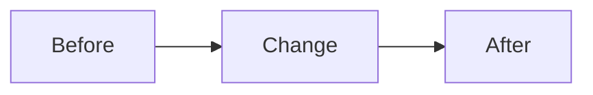

# Example PR Template

Use this only when the repo does not already provide a pull request template.

If the repo contains a PR template, prefer the repo template first and adapt the wording to match the author's style.

This file is a fallback example, not a mandatory structure.

Related: #123

## What Problem This Solves

<Describe the current user or maintainer problem in 1-2 short paragraphs. Focus on observable behavior, confusion, risk, cost, or missing capability.>

## Why This Change Was Made

<Explain chosen direction, constraints, compatibility notes, tradeoffs, and any relevant specs/docs. Keep implementation detail only when reviewers need it.>

## User Impact

- <Observable behavior change or reviewer-relevant outcome>
- <Compatibility, migration, or unchanged behavior that matters>
- <UX/API/operational impact, if any>

## Evidence

- `<command or check actually run>`: passed.
- <Focused test name/count, build target, CI state, manual scenario, screenshot capture, or review pass that actually happened.>
- <Known warning-only or pre-existing failure, if relevant.>

## Review Guide
- Review <core behavior or subsystem>
- Verify <risk area or edge case>
- Confirm <test, migration, API, or UX expectation>

## Demo
- <demo link, screenshot note, before/after table, CLI transcript, or repro steps>

### Before and after

| Surface | Before | After |
|---|---|---|
| <screen/flow> |  |  |

## Diagram

Closes #123

## Notes

- Remove sections that do not help
- Keep wording concise
- Prefer `What Problem This Solves`, `Why This Change Was Made`, `User Impact`, and `Evidence` for non-trivial PRs
- Use shorter `Summary` and `Validation` sections for tiny PRs when that is closer to repo style
- Include only evidence that actually happened
- Include `No issues found` only when the listed validation passed cleanly, if using shorter validation wording
- Include `## Demo` or screenshot tables only for meaningful user-facing verification
- Include `## Diagram` only when it improves understanding
- Use `Fixes`, `Closes`, or `Refs` only when relevant
