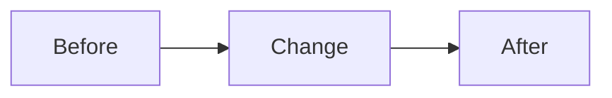

# Example PR Template

Use this only when the repo does not already provide a pull request template.

If the repo contains a PR template, prefer the repo template first and adapt the wording to match the author's style.

This file is a fallback example, not a mandatory structure.

## Summary
- <2-4 brief bullets covering the change and intended outcome>

## Validation
- <command or check actually run>
- No issues found

## Review Guide
- Review <core behavior or subsystem>
- Verify <risk area or edge case>
- Confirm <test, migration, API, or UX expectation>

## Demo
- <demo link, screenshot note, or repro steps>

## Diagram

Closes #123

## Notes

- Remove sections that do not help
- Keep wording concise
- Include `No issues found` only when the listed validation passed cleanly
- Include `## Demo` only for meaningful user-facing verification
- Include `## Diagram` only when it improves understanding
- Use `Fixes`, `Closes`, or `Refs` only when relevant
